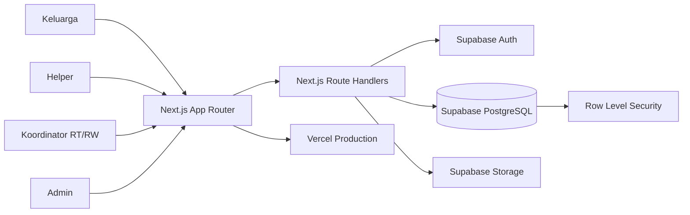
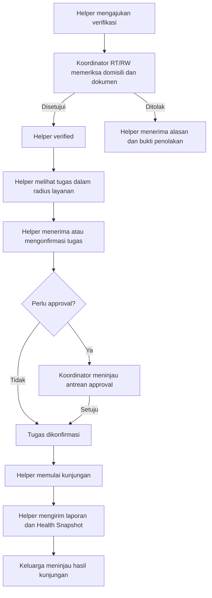
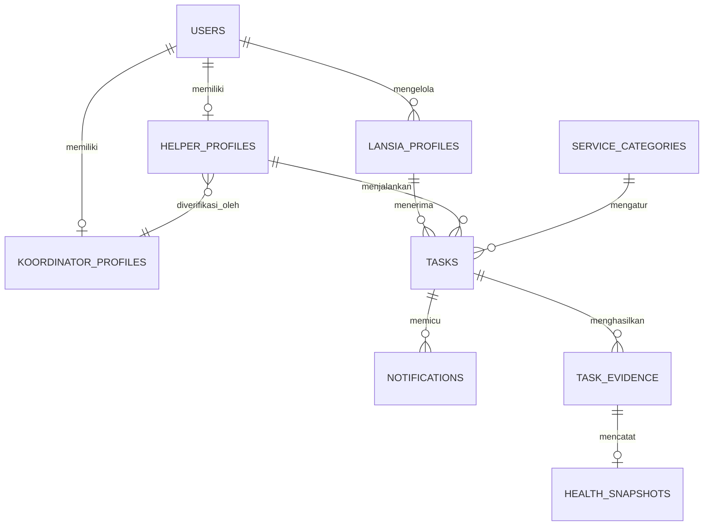

# Rangkul

<div align="center">

### Platform Pendampingan Lansia Berbasis Komunitas

[](https://merangkul.vercel.app)
[](https://github.com/Elnathz/rangkul)
[](#lisensi)

**Submission for ITECHNO CUP 2026 - Web Development**

**By Lumpur Lapindo Blukutuk Blukutuk**

</div>

Rangkul menghubungkan keluarga, lansia, Helper lokal, dan Koordinator RT/RW dalam satu alur pendampingan yang lebih dekat, terverifikasi, dan dapat dipantau. Platform ini dirancang untuk membantu keluarga yang tidak selalu dapat hadir langsung, sekaligus membuka pekerjaan pendampingan bagi warga sekitar melalui mekanisme komunitas yang bertanggung jawab.

## Daftar Isi

- [Tentang Proyek](#tentang-proyek)
- [Fitur Unggulan](#fitur-unggulan)
- [Demo dan Screenshot](#demo-dan-screenshot)
- [Teknologi](#teknologi)
- [Arsitektur Sistem](#arsitektur-sistem)
- [Instalasi dan Setup](#instalasi-dan-setup)
- [Penggunaan](#penggunaan)
- [API Documentation](#api-documentation)
- [Testing](#testing)
- [Tim Pengembang](#tim-pengembang)
- [Lisensi](#lisensi)

## Tentang Proyek

### Latar Belakang

Indonesia sedang memasuki fase masyarakat menua. Kementerian Kesehatan menyebutkan bahwa sekitar 12 persen atau 29 juta penduduk Indonesia merupakan lansia, dan proporsinya diproyeksikan meningkat hingga 20 persen pada 2045. Pada saat yang sama, data Survei Kesehatan Indonesia 2023 yang dirangkum Kementerian Kesehatan menunjukkan bahwa sebagian besar lansia masih mandiri, tetapi tetap ada kelompok yang membutuhkan bantuan ringan sampai total dalam aktivitas sehari-hari. Angka tersebut menunjukkan bahwa kebutuhan pendampingan lansia tidak hanya berkaitan dengan layanan medis, tetapi juga dengan kehadiran, perhatian, mobilitas, aktivitas harian, dan dukungan sosial.

Keluarga sering menjadi pihak pertama yang bertanggung jawab atas kebutuhan lansia. Namun, dalam praktiknya, anggota keluarga dapat tinggal di kota berbeda, memiliki jam kerja yang panjang, atau tidak dapat datang setiap kali lansia membutuhkan bantuan. Masalahnya bukan sekadar mencari seseorang untuk datang ke rumah. Keluarga juga perlu mengetahui siapa pendampingnya, apakah identitasnya dapat dipercaya, apakah ia benar-benar berada di sekitar lokasi lansia, dan apa yang terjadi selama kunjungan.

Di sisi lain, warga yang memiliki waktu, kepedulian, dan kemampuan untuk mendampingi belum memiliki jalur kerja lokal yang terstruktur. Rekrutmen tanpa pengawasan dapat menimbulkan risiko bagi lansia dan keluarga. Sebaliknya, proses yang terlalu terpusat dapat mengabaikan pengetahuan warga setempat tentang lingkungan, domisili, dan reputasi seseorang.

Badan Pusat Statistik menyediakan publikasi khusus tentang penduduk lanjut usia yang mencakup demografi, kesehatan, kondisi sosial, potensi ekonomi, serta akses terhadap perlindungan dan pemberdayaan. WHO juga menekankan bahwa penuaan penduduk membutuhkan sistem kesehatan dan perawatan jangka panjang yang lebih siap, termasuk layanan berbasis komunitas dan tingkat desa. Tantangan ini membutuhkan kolaborasi antara keluarga, warga lokal, dan struktur komunitas yang sudah dikenal masyarakat.

Sumber data:

- [Statistik Penduduk Lanjut Usia 2023, Badan Pusat Statistik](https://www.bps.go.id/id/publication/2023/12/29/5d308763ac29278dd5860fad/statisti)
- [Hari Lanjut Usia Nasional, Kementerian Kesehatan RI](https://ayosehat.kemkes.go.id/hari-lanjut-usia-nasional)
- [Ageing and health in South-East Asia, WHO](https://www.who.int/southeastasia/health-topics/ageing)
- [WHO policy brief tentang pembiayaan long-term care di Indonesia](https://www.who.int/indonesia/news/detail/06-06-2024-who-policy-brief-cites-long-term-care-investment-lessons-from-indonesia)

### Solusi yang Ditawarkan

Rangkul menawarkan model pendampingan hiperlokal. Keluarga tetap menjadi pengambil keputusan utama, Helper menjadi pendamping yang menjalankan tugas, dan Koordinator RT/RW menjadi lapisan pengawasan komunitas. Pembagian ini membuat proses pendampingan tidak berhenti pada pencocokan profil dan pemesanan, tetapi memiliki pihak yang dapat memverifikasi dan menindaklanjuti aktivitas di lapangan.

Alur solusi Rangkul bekerja sebagai berikut:

1. Keluarga mendaftarkan profil lansia, alamat, catatan kondisi, kebutuhan layanan, serta jadwal kunjungan.
2. Helper mendaftar menggunakan identitas dan domisili yang dapat diverifikasi. Helper yang belum terverifikasi tidak dapat menerima tugas secara bebas.
3. Koordinator RT/RW memeriksa Helper di wilayahnya, termasuk dokumen, domisili, dan kelayakan untuk menjadi pendamping. Koordinator juga dapat menolak pengajuan dengan alasan dan bukti yang tercatat.
4. Keluarga dapat mencari Helper berdasarkan wilayah dan radius layanan, atau melakukan booking direct kepada Helper tertentu.
5. Tugas berisiko, tugas Helper probation, dan kondisi tertentu masuk ke antrean persetujuan Koordinator sebelum dapat berjalan.
6. Koordinator memiliki direktori Helper terverifikasi dan dapat melihat status aktivitasnya, seperti siap menerima tugas, memiliki jadwal, atau sedang bertugas.
7. Helper memperoleh akses ke pekerjaan pendampingan di sekitar domisilinya. Dengan demikian, sistem ini membuka peluang penghasilan lokal bagi warga RT/RW yang memenuhi syarat, bukan sekadar menjadi katalog relawan.
8. Setelah tugas berjalan, keluarga memperoleh pembaruan status, sedangkan Helper dapat mengirim laporan kunjungan dan Health Snapshot. Data kesehatan diposisikan sebagai catatan pemantauan non-diagnostik, bukan pengganti pemeriksaan tenaga kesehatan.

Model Koordinator adalah pembeda utama Rangkul. RT/RW tidak hanya menjadi pihak administratif, tetapi menjadi pengawas yang membantu menjaga kepercayaan lokal dan membuka lapangan kerja yang lebih aman bagi warga di wilayahnya. Setiap akses tetap dibatasi oleh role, wilayah, dan Row Level Security Supabase agar data lansia, dokumen identitas, dan catatan kunjungan tidak menjadi informasi publik.

### Tujuan Proyek

- **Tujuan utama**: Membuat pendampingan lansia jarak dekat yang dapat dipercaya, dapat dipantau, dan mudah digunakan oleh keluarga.
- **Target pengguna**: Keluarga lansia, Helper lokal, Koordinator RT/RW, dan Admin platform.
- **Value proposition**: Menggabungkan kebutuhan keluarga, peluang kerja warga, dan pengawasan komunitas dalam satu alur digital.
- **Batasan layanan**: Rangkul berfokus pada pendampingan aktivitas harian dan dukungan sosial. Rangkul bukan layanan diagnosis atau pengganti tenaga medis.

## Fitur Unggulan

### Fitur Utama

| Fitur | Deskripsi | Keunggulan |
| --- | --- | --- |
| **Verifikasi hiperlokal** | Koordinator RT/RW memeriksa Helper berdasarkan wilayah domisili dan dokumen identitas. | Kepercayaan dibangun dari struktur komunitas yang mengenal wilayahnya. |
| **Job board berbasis radius** | Helper melihat tugas nyata di sekitar domisilinya dan menerima tugas melalui conditional update. | Mengurangi benturan penerimaan tugas dan memperluas akses kerja lokal. |
| **Booking direct** | Keluarga dapat mengajukan tugas langsung kepada Helper tertentu. | Helper yang dituju memperoleh notifikasi dan dapat mengonfirmasi dari dashboardnya. |
| **Approval bertingkat** | Tugas Helper probation, layanan berisiko, atau kondisi tertentu membutuhkan persetujuan Koordinator. | Keputusan penting tidak hanya bergantung pada satu pihak. |
| **Direktori Helper Koordinator** | Koordinator melihat Helper terverifikasi beserta status aktivitas tugasnya. | Pengawasan tidak berhenti pada verifikasi awal. |
| **State machine tugas** | Status tugas bergerak dari pengajuan sampai selesai melalui transisi yang terkontrol. | Mencegah tindakan ilegal dan konflik ketika beberapa pengguna berinteraksi bersamaan. |
| **Health Snapshot dan Memory Capsule** | Helper dapat mengisi indikator kondisi lansia dan cerita singkat kunjungan. | Keluarga memperoleh konteks perkembangan lansia, bukan hanya status selesai. |

### Fitur Tambahan

- **Layanan Tambahan**: Helper dapat mengajukan biaya tambahan kepada keluarga, lalu keluarga menyetujui atau menolaknya sebelum harga final berubah.
- **Notifikasi in-app**: Booking direct, perubahan tugas, dan informasi penting tampil di pusat notifikasi dengan indikator belum dibaca.
- **Bukti dan alasan penolakan**: Penolakan Helper dapat disertai catatan dan lampiran agar keputusan transparan.
- **Pratinjau dokumen dan foto**: Dokumen verifikasi dan foto lansia dapat dilihat melalui modal dengan kontrol zoom sesuai kewenangan pengguna.
- **Address normalization**: Alamat ditampilkan secara terpisah berdasarkan RT/RW, kelurahan, kecamatan, kabupaten/kota, dan provinsi jika datanya tersedia.
- **Audit dan RLS**: Data privat dibatasi oleh kebijakan akses Supabase dan tindakan sensitif dicatat untuk kebutuhan pelacakan.

## Demo dan Screenshot

### Live Demo

[Kunjungi Rangkul Production](https://merangkul.vercel.app)

Live production digunakan untuk mempresentasikan alur utama keluarga, Helper, Koordinator, dan Admin. Schema aplikasi berada di satu baseline `supabase/migrations/20260801121120_initial_schema.sql`, sedangkan data demo idempoten berada di `supabase/seed.sql` dan dijalankan lewat `npm run seed`.

### Screenshot Aplikasi

Screenshot produk belum disimpan sebagai asset repository. Untuk melihat tampilan terbaru, gunakan [live demo Rangkul](https://merangkul.vercel.app). Screenshot dapat ditambahkan ke folder `docs/screenshots/` tanpa mengubah struktur dokumentasi ini.

### Video Demo

Video demo belum dipublikasikan. Bagian ini dipertahankan dari template ITECHNO CUP dan dapat diisi setelah video presentasi final tersedia.

## Teknologi

### Tech Stack

#### Frontend

```text
Framework    : Next.js 16 App Router, React 19, TypeScript 5
UI Library   : Tailwind CSS 4, shadcn/ui, Radix UI, Lucide React
Form         : React Hook Form
Validation   : Zod 4
Map          : React Leaflet, Leaflet GeoSearch
```

#### Backend

```text
Runtime      : Node.js
Framework    : Next.js Route Handlers
Database     : Supabase PostgreSQL
Auth         : Supabase Auth
Storage      : Supabase Storage
Authorization: PostgreSQL Row Level Security
```

#### DevOps and Tools

```text
Deployment   : Vercel
Database Ops : Supabase CLI
CI/CD        : GitHub Actions
Testing      : Node.js test runner dengan TypeScript stripping
Quality      : ESLint, TypeScript compiler, Impeccable, Superpowers
```

### Alasan Pemilihan Teknologi

| Teknologi | Alasan pemilihan |
| --- | --- |
| **Next.js** | Menyatukan halaman server, client interaction, dan Route Handlers dalam satu aplikasi yang mudah dideploy ke Vercel. |
| **Supabase** | Menyediakan PostgreSQL, Auth, Storage, dan RLS untuk kebutuhan data privat serta workflow role-based. |
| **TypeScript** | Membantu menjaga kontrak data antara halaman, API, validasi, dan database tetap terlihat saat pengembangan. |
| **Zod** | Menyediakan validasi input yang konsisten di sisi client dan server. |
| **Tailwind CSS dan shadcn/ui** | Mempercepat pembuatan UI yang responsif, konsisten, dan dapat diakses. |
| **Leaflet** | Mendukung visualisasi lokasi dan radius layanan tanpa mengunci platform pada penyedia peta tertentu. |

### Dependencies Utama

```json
{
  "next": "16.2.12",
  "react": "19.2.4",
  "@supabase/ssr": "^0.12.4",
  "@supabase/supabase-js": "^2.111.0",
  "zod": "^4.4.3",
  "react-hook-form": "^7.84.0",
  "tailwindcss": "^4"
}
```

## Arsitektur Sistem

### System Architecture



### Alur Kepercayaan dan Pekerjaan



### Database Schema



Skema aktual dan aturan bisnis lengkap berada di [`docs/TDD_Rangkul.md`](docs/TDD_Rangkul.md). Semua data privat harus melewati autentikasi, validasi, constraint database, dan RLS.

### Folder Structure

```text
project-root/
├── src/
│   ├── app/
│   │   ├── (publik)/              # landing page dan halaman publik
│   │   ├── (keluarga)/            # alur keluarga dan profil lansia
│   │   ├── (helper)/              # verifikasi, job board, tugas, laporan
│   │   ├── (koordinator)/         # dashboard, approval, directory Helper
│   │   ├── (admin)/               # panel Admin
│   │   └── api/                   # Route Handlers dan kontrak API
│   ├── components/                # komponen UI dan alur role
│   ├── lib/                       # Supabase client, validasi, state helper
│   └── types/                     # generated database types
├── docs/
│   ├── TDD_Rangkul.md             # sumber kebenaran bisnis dan teknis
│   └── planning/                  # rencana per sprint
├── supabase/
│   ├── migrations/                # satu baseline schema final
│   ├── seed.sql                   # seed demo idempoten
│   └── config.toml                # konfigurasi Supabase CLI
├── tests/                         # regresi kontrak dan state machine
└── public/                        # asset publik
```

## Instalasi dan Setup

### Prerequisites

Pastikan tersedia:

- **Node.js** 20 atau lebih baru
- **npm** 10 atau lebih baru
- **Git**
- **Supabase CLI**
- **Docker Desktop** hanya jika ingin menjalankan Supabase secara lokal dengan `npx supabase start`

### Langkah Instalasi

#### 1. Clone Repository

```bash
git clone https://github.com/Elnathz/rangkul.git
cd rangkul
```

#### 2. Install Dependencies

```bash
npm install
```

#### 3. Setup Environment Variables

Salin `.env.example` menjadi `.env.local`, lalu isi kredensial project Supabase:

```env
NEXT_PUBLIC_SUPABASE_URL=https://your-project.supabase.co
NEXT_PUBLIC_SUPABASE_ANON_KEY=your-anon-or-publishable-key

# Hanya untuk operasi server atau script yang memang membutuhkan akses penuh.
# Jangan pernah mengekspos service role key ke browser.
SUPABASE_SERVICE_ROLE_KEY=your-service-role-key
```

#### 4. Setup Database

Untuk Supabase lokal, Docker wajib aktif:

```bash
npx supabase start
npx supabase db reset
```

Perintah seed lokal dapat dijalankan dengan `npm run seed`. Untuk project Cloud gunakan `npm run seed:cloud` setelah project di-link. Script mengecek migration yang belum diterapkan, lalu menjalankan `supabase db push` tanpa reset database. Migration yang sudah tercatat dilewati.

Untuk project Supabase remote tanpa Docker:

```bash
npx supabase login
npx supabase link --project-ref your-project-ref
npx supabase db push --include-all
```

Untuk menerapkan migration baru ke project remote yang sudah di-link, jalankan `npx supabase db push --linked`. Perintah ini tidak menjalankan reset database.

Periksa histori migration remote sebelum memakai `--include-all`. Jangan menghapus route atau kolom hanya untuk menyembunyikan error schema. Perubahan schema harus dibuat melalui migration yang idempoten dan diuji.

#### 5. Run Development Server

```bash
npm run dev
```

Aplikasi akan tersedia di `http://localhost:3000`.

## Penggunaan

### Menjalankan Aplikasi

```bash
# Development mode
npm run dev

# Production build
npm run build
npm run start

# Typecheck
npx tsc --noEmit

# Linting
npm run lint

# Test regresi yang tersedia saat ini
$testFiles = Get-ChildItem -LiteralPath tests -Filter '*.test.mjs' | Select-Object -ExpandProperty FullName
node --experimental-strip-types --test $testFiles
```

Test dijalankan dengan Node.js test runner melalui `npm run test`. Data demo lokal dapat di-reset melalui `npm run seed`, sedangkan migration demo juga disiapkan agar environment remote dapat menerima matriks data tanpa menjalankan reset lokal.

### User Guide

#### Untuk Keluarga

1. Registrasi atau login sebagai Keluarga.
2. Tambahkan profil lansia, alamat, catatan kondisi, dan kebutuhan pendampingan.
3. Cari Helper berdasarkan wilayah atau pilih Helper tertentu untuk booking direct.
4. Tinjau status tugas, notifikasi, rincian harga, dan layanan tambahan.
5. Setelah kunjungan, tinjau laporan dan catatan yang dikirim Helper.

#### Untuk Helper

1. Registrasi dan ajukan verifikasi dengan identitas, foto wajah, domisili, dan layanan yang tersedia.
2. Tunggu pemeriksaan Koordinator wilayah.
3. Setelah verified, lihat tugas yang berada dalam radius layanan.
4. Konfirmasi booking direct atau ajukan diri pada tugas marketplace yang tersedia.
5. Mulai tugas ketika status sudah memungkinkan, lalu kirim laporan kunjungan.

#### Untuk Koordinator

1. Ajukan akun Koordinator untuk wilayah RT/RW yang dikelola.
2. Setelah disetujui Admin, buka antrean verifikasi Helper.
3. Tinjau dokumen, domisili, dan kelengkapan Helper.
4. Setujui atau tolak dengan alasan dan bukti yang jelas.
5. Pantau direktori Helper terverifikasi dan status tugas aktif di wilayah.
6. Tinjau antrean tugas yang membutuhkan approval Koordinator.

#### Untuk Admin

1. Kelola pengajuan Koordinator dan kategori layanan.
2. Gunakan fallback verifikasi jika wilayah belum memiliki Koordinator aktif sesuai aturan TDD.
3. Tinjau audit dan data yang membutuhkan tindakan administratif.

## API Documentation

Kontrak manusia berada di [`docs/api-contract.md`](docs/api-contract.md). OpenAPI 3.1 yang dapat diimpor ke Postman, Bruno, Insomnia, Scalar, atau Swagger UI berada di [`docs/api/openapi.json`](docs/api/openapi.json). Mulai dari [`docs/api/README.md`](docs/api/README.md) untuk autentikasi, error, role, feature flag, dan inventaris domain.

### Base URL

```text
Development: http://localhost:3000/api
Production:  https://merangkul.vercel.app/api
```

### Endpoints

#### Authentication and User Profile

```http
POST /api/auth/register
POST /api/auth/login
GET  /api/users/me
PUT  /api/users/me
```

#### Lansia and Family

```http
GET    /api/lansia
POST   /api/lansia
GET    /api/lansia/:id
PUT    /api/lansia/:id
DELETE /api/lansia/:id
```

#### Helper and Verification

```http
POST  /api/helpers/apply
GET   /api/helper/profile
PATCH /api/helper/profile
GET   /api/koordinator/helpers
PATCH /api/helpers/:id/status
GET   /api/helpers
GET   /api/helpers/:id
POST  /api/storage/upload
```

#### Koordinator and Approval

```http
POST  /api/koordinator/apply
GET   /api/koordinator/profile
GET   /api/koordinator/helpers
PATCH /api/tasks/:id/koordinator-approve
GET   /api/admin/koordinator/queue
PUT   /api/admin/koordinator/:id/approve
PUT   /api/admin/koordinator/:id/reject
```

#### Booking and Tasks

```http
POST  /api/tasks
GET   /api/tasks/marketplace
PATCH /api/tasks/:id/accept
GET   /api/tasks/:id/applications
POST  /api/tasks/:id/applications
DELETE /api/tasks/:id/applications/me
PATCH /api/tasks/:id/applications/:application_id/select
PATCH /api/tasks/:id/start
POST  /api/tasks/:id/extra-service
PATCH /api/tasks/:id/extra-service/:eid
```

`POST /api/booking/task`, `POST /api/helper/apply`, dan route approve/reject lama tetap tersedia sebagai alias kompatibilitas. Client baru memakai route canonical di atas.

#### Notifications

```http
GET   /api/notifications
PATCH /api/notifications/:id/read
```

### Example Request

```javascript
const response = await fetch('/api/tasks', {
  method: 'POST',
  headers: { 'Content-Type': 'application/json' },
  body: JSON.stringify({
    lansia_id: 'uuid-lansia',
    service_category_id: 'uuid-kategori',
    jadwal_waktu: '2026-08-23T08:00:00.000Z',
    catatan: 'Tolong bantu mengingatkan jadwal minum obat pagi.',
    mode_penugasan: 'pelamar'
  })
});

const result = await response.json();
```

Mode `langsung` wajib membawa `helper_id`. Mode `pelamar` dan `cepat` harus tanpa `helper_id` dan hanya aktif ketika `SPRINT6_MATCHING_ENABLED=true`. Aturan role, response, dan lifecycle lengkap dirujuk dari [`docs/TDD_Rangkul.md`](docs/TDD_Rangkul.md), [`docs/api/booking.md`](docs/api/booking.md), dan dokumentasi API lain di folder [`docs/api`](docs/api).

## Testing

### Running Tests

```bash
# Typecheck
npx tsc --noEmit

# Semua test kontrak dan state machine
$testFiles = Get-ChildItem -LiteralPath tests -Filter '*.test.mjs' | Select-Object -ExpandProperty FullName
node --experimental-strip-types --test $testFiles

# Test RLS dua akun keluarga, jika Supabase lokal dan credential demo tersedia
$env:RUN_SUPABASE_INTEGRATION = "1"
$env:RLS_TEST_FAMILY_A_EMAIL = "..."
$env:RLS_TEST_FAMILY_A_PASSWORD = "..."
$env:RLS_TEST_FAMILY_B_EMAIL = "..."
$env:RLS_TEST_FAMILY_B_PASSWORD = "..."
npm run test -- tests/rls-integration.test.mjs

# Lint
npm run lint

# Production build
npm run build
```

### Test Coverage

Repository saat ini belum memasang reporter coverage khusus. Regresi yang tersedia mencakup 36 test untuk:

- state machine penerimaan dan mulai tugas Helper;
- job board berbasis data nyata dan booking direct;
- approval Koordinator dan aktivitas Helper;
- upload dokumen verifikasi dan image preview;
- layanan tambahan dan pembayaran demo;
- notifikasi, RLS contract, alamat wilayah, dan data seed.

Coverage line, branch, dan function dapat ditambahkan ketika test runner dengan coverage reporter ditetapkan oleh tim.

## Tim Pengembang

| Nama | Peran | GitHub |
| --- | --- | --- |
| **Farros Rifantiarno Ramadhani** | Project Lead dan Fullstack Developer | [@Elnathz](https://github.com/Elnathz) |
| **Mervin Fauzhan Atkly** | Frontend Developer | [@mervinfa](https://github.com/mervinfa) |

## Lisensi

Lisensi open source belum ditetapkan dalam repository ini. Sebelum digunakan di luar kebutuhan kompetisi, tambahkan file `LICENSE` dan sepakati lisensi proyek bersama seluruh anggota tim.

## Referensi Proyek

- [TDD Rangkul](docs/TDD_Rangkul.md)
- [Guidebook ITECHNO CUP](docs/GUIDEBOOK_ITechno.md)
- [Rencana Sprint](docs/planning)
- [Dokumentasi API](docs/api)
- [Template README ITECHNO CUP](Template%20README.md%20-%20ITECHNO%20CUP.md)

<div align="center">

**Made by Lumpur Lapindo Blukutuk Blukutuk for ITECHNO CUP 2026**

</div>
