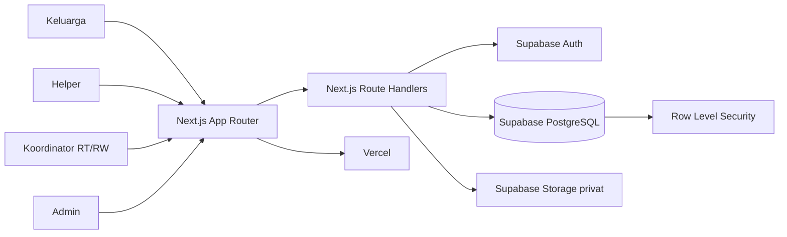
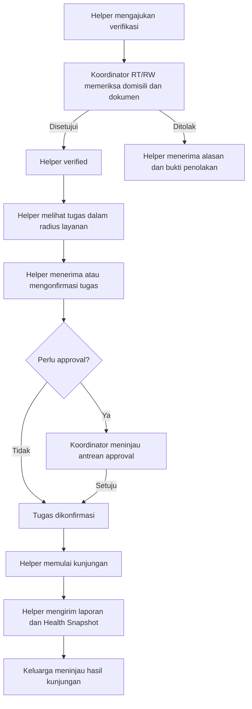
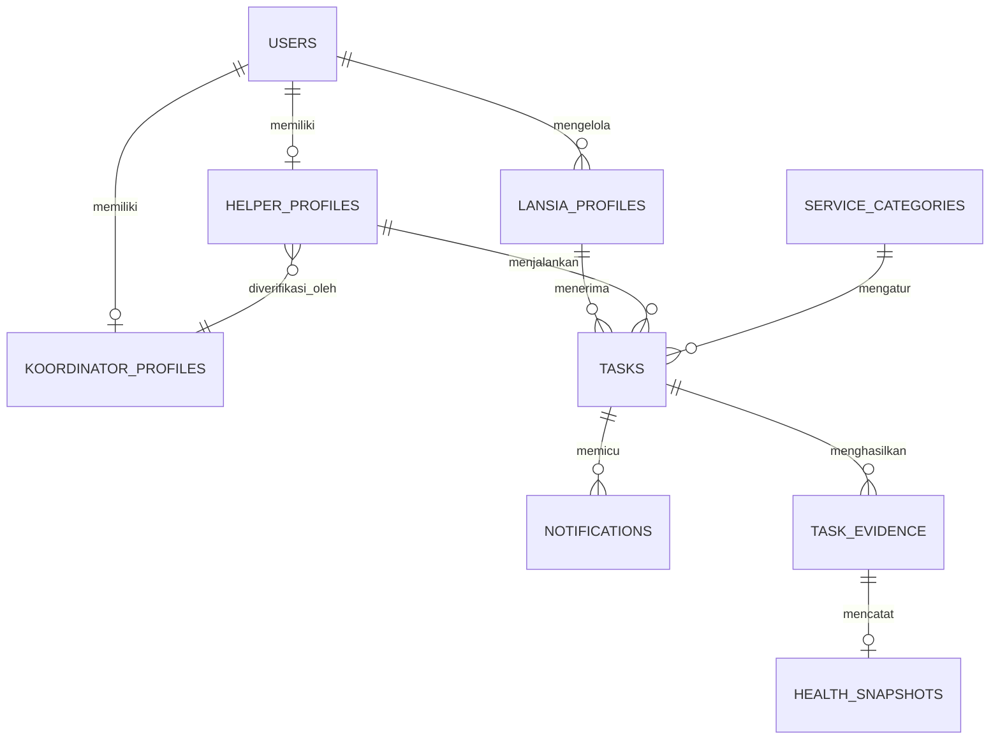

# Rangkul

<div align="center">

Pendampingan lansia berbasis komunitas yang menghubungkan keluarga, lansia, Helper lokal, dan Koordinator RT/RW dalam satu alur yang dapat dipercaya.

[](https://merangkul.vercel.app)
[](https://github.com/Elnathz/rangkul)
[](LICENSE)

Submission for ITECHNO CUP 2026, Web Development

</div>

## Daftar Isi

- [Tentang Proyek](#tentang-proyek)
- [Fitur Unggulan](#fitur-unggulan)
- [Demo & Screenshot](#demo--screenshot)
- [Teknologi](#teknologi)
- [Arsitektur Sistem](#arsitektur-sistem)
- [Instalasi & Setup](#instalasi--setup)
- [Penggunaan](#penggunaan)
- [API Documentation](#api-documentation)
- [Testing](#testing)
- [Keamanan dan Privasi](#keamanan-dan-privasi)
- [Data Demo dan Seeder](#data-demo-dan-seeder)
- [Tim Developer](#tim-developer)
- [Lisensi](#lisensi)
- [Referensi Proyek](#referensi-proyek)

## Tim Developer

| Nama | Peran | GitHub |
| --- | --- | --- |
| **Farros Rifantiarno Ramadhani** | Project Lead dan Fullstack Developer | [@Elnathz](https://github.com/Elnathz) |
| **Mervin Fauzhan Atkly** | Frontend Developer | [@mervinfa](https://github.com/mervinfa) |

## Tentang Proyek

### Latar Belakang

Indonesia sedang memasuki fase masyarakat menua. Kementerian Kesehatan menyebutkan bahwa sekitar 12 persen atau 29 juta penduduk Indonesia merupakan lansia, dan proporsinya diproyeksikan meningkat hingga 20 persen pada 2045. Pada saat yang sama, data Survei Kesehatan Indonesia 2023 yang dirangkum Kementerian Kesehatan menunjukkan bahwa sebagian besar lansia masih mandiri, tetapi tetap ada kelompok yang membutuhkan bantuan ringan sampai total dalam aktivitas sehari-hari. Angka tersebut menunjukkan bahwa kebutuhan pendampingan lansia tidak hanya berkaitan dengan layanan medis, tetapi juga dengan kehadiran, perhatian, mobilitas, aktivitas harian, dan dukungan sosial.

Keluarga sering menjadi pihak pertama yang bertanggung jawab atas kebutuhan lansia. Namun, dalam praktiknya, anggota keluarga dapat tinggal di kota berbeda, memiliki jam kerja yang panjang, atau tidak dapat datang setiap kali lansia membutuhkan bantuan. Masalahnya bukan sekadar mencari seseorang untuk datang ke rumah. Keluarga juga perlu mengetahui siapa pendampingnya, apakah identitasnya dapat dipercaya, apakah ia benar-benar berada di sekitar lokasi lansia, dan apa yang terjadi selama kunjungan.

Di sisi lain, warga yang memiliki waktu, kepedulian, dan kemampuan untuk mendampingi belum memiliki jalur kerja lokal yang terstruktur. Rekrutmen tanpa pengawasan dapat menimbulkan risiko bagi lansia dan keluarga. Sebaliknya, proses yang terlalu terpusat dapat mengabaikan pengetahuan warga setempat tentang lingkungan, domisili, dan reputasi seseorang.

Badan Pusat Statistik menyediakan publikasi khusus tentang penduduk lanjut usia yang mencakup demografi, kesehatan, kondisi sosial, potensi ekonomi, serta akses terhadap perlindungan dan pemberdayaan. WHO juga menekankan bahwa penuaan penduduk membutuhkan sistem kesehatan dan perawatan jangka panjang yang lebih siap, termasuk layanan berbasis komunitas dan tingkat desa. Tantangan ini membutuhkan kolaborasi antara keluarga, warga lokal, dan struktur komunitas yang sudah dikenal masyarakat.

Sumber data:

- [Statistik Penduduk Lanjut Usia 2023, Badan Pusat Statistik](https://www.bps.go.id/id/publication/2023/12/29/5d308763ac29278dd5860fad/statisti)
- [Hari Lanjut Usia Nasional, Kementerian Kesehatan RI](https://ayosehat.kemkes.go.id/hari-lanjut-usia-nasional)
- [Ageing and health in South-East Asia, WHO](https://www.who.int/southeastasia/health-topics/ageing)
- [WHO policy brief tentang pembiayaan long-term care di Indonesia](https://www.who.int/indonesia/news/detail/06-06-2024-who-policy-brief-cites-long-term-care-investment-lessons-from-indonesia)

### Solusi yang Ditawarkan

Rangkul menawarkan model pendampingan hiperlokal. Keluarga tetap menjadi pengambil keputusan utama, Helper menjadi pendamping yang menjalankan tugas, dan Koordinator RT/RW menjadi lapisan pengawasan komunitas. Pembagian ini membuat proses pendampingan tidak berhenti pada pencocokan profil dan pemesanan, tetapi memiliki pihak yang dapat memverifikasi dan menindaklanjuti aktivitas di lapangan.

Alur solusi Rangkul bekerja sebagai berikut:

1. Keluarga mendaftarkan profil lansia, alamat, catatan kondisi, kebutuhan layanan, serta jadwal kunjungan.
2. Helper mendaftar menggunakan identitas dan domisili yang dapat diverifikasi. Helper yang belum terverifikasi tidak dapat menerima tugas secara bebas.
3. Koordinator RT/RW memeriksa Helper di wilayahnya, termasuk dokumen, domisili, dan kelayakan untuk menjadi pendamping. Koordinator juga dapat menolak pengajuan dengan alasan dan bukti yang tercatat.
4. Keluarga dapat mencari Helper berdasarkan wilayah dan radius layanan, atau melakukan booking direct kepada Helper tertentu.
5. Tugas berisiko, tugas Helper probation, dan kondisi tertentu masuk ke antrean persetujuan Koordinator sebelum dapat berjalan.
6. Koordinator memiliki direktori Helper terverifikasi dan dapat melihat status aktivitasnya, seperti siap menerima tugas, memiliki jadwal, atau sedang bertugas.
7. Helper memperoleh akses ke pekerjaan pendampingan di sekitar domisilinya. Dengan demikian, sistem ini membuka peluang penghasilan lokal bagi warga RT/RW yang memenuhi syarat, bukan sekadar menjadi katalog relawan.
8. Setelah tugas berjalan, keluarga memperoleh pembaruan status, sedangkan Helper dapat mengirim laporan kunjungan dan Health Snapshot. Data kesehatan diposisikan sebagai catatan pemantauan non-diagnostik, bukan pengganti pemeriksaan tenaga kesehatan.

Model Koordinator adalah pembeda utama Rangkul. RT/RW tidak hanya menjadi pihak administratif, tetapi menjadi pengawas yang membantu menjaga kepercayaan lokal dan membuka lapangan kerja yang lebih aman bagi warga di wilayahnya. Setiap akses tetap dibatasi oleh role, wilayah, dan Row Level Security Supabase agar data lansia, dokumen identitas, dan catatan kunjungan tidak menjadi informasi publik.

### Tujuan Proyek

- **Tujuan utama**: Membuat pendampingan lansia jarak dekat yang dapat dipercaya, dapat dipantau, dan mudah digunakan oleh keluarga.
- **Target pengguna**: Keluarga lansia, Helper lokal, Koordinator RT/RW, dan Admin platform.
- **Value proposition**: Menggabungkan kebutuhan keluarga, peluang kerja warga, dan pengawasan komunitas dalam satu alur digital.
- **Batasan layanan**: Rangkul berfokus pada pendampingan aktivitas harian dan dukungan sosial. Rangkul bukan layanan diagnosis atau pengganti tenaga medis.

## Fitur Unggulan

### Fitur Utama

| Fitur | Deskripsi | Keunggulan |
| --- | --- | --- |
| **Verifikasi berbasis RT/RW** | Koordinator memeriksa Helper berdasarkan domisili, dokumen, layanan, dan reputasi lokal. RW atau Admin hanya menjadi fallback sesuai aturan wilayah. | Kepercayaan berasal dari komunitas yang mengenal warganya, bukan dari profil anonim. |
| **Katalog Helper berbasis radius** | Keluarga melihat Helper terverifikasi yang aktif, melayani kategori yang dipilih, dan berada dalam radius dari lokasi lansia. | Hasil pencarian relevan secara geografis dan memberi ekspektasi jarak yang jelas. |
| **Tiga mode penugasan** | Booking langsung untuk Helper tertentu, mode pelamar untuk memilih dari beberapa Helper, dan mode cepat untuk penugasan same-day yang memenuhi syarat. | Keluarga mendapat pilihan sesuai urgensi tanpa mengubah aturan keamanan dan harga tetap. |
| **Siklus kunjungan server-authoritative** | Pengajuan, konfirmasi, approval, check-in, laporan, pembayaran, reschedule, pembatalan, dan kedaluwarsa dikendalikan oleh state machine di server. | Mencegah penerimaan ganda, aksi ilegal, tugas yang sudah lewat waktu, dan konflik antar pengguna. |
| **Riwayat Rangkul** | Setiap laporan menyimpan lima indikator Health Snapshot, foto bukti, dan Cerita Hari Ini sebagai Memory Capsule, lalu menyajikan timeline dan tren. | Keluarga melihat perubahan keseharian lansia dari waktu ke waktu, bukan hanya status selesai. |
| **Pembayaran transparan dan terlindungi** | Harga kategori bersifat tetap, layanan tambahan perlu persetujuan, dana memakai alur escrow, dan pembagian normalnya 90% Helper, 7% platform, 3% Koordinator. | Biaya diketahui sejak awal dan setiap perubahan harga atau pelepasan dana punya jejak audit. |
| **Peluang penghasilan lokal** | Helper menerima bagian dari kunjungan yang selesai, sedangkan Koordinator memperoleh komisi dari transaksi di wilayahnya. Nilai pada halaman simulasi adalah perkiraan, bukan janji pendapatan. | Warga dapat melihat hubungan langsung antara layanan yang mereka jalankan, kontribusi komunitas, dan hasil yang diterima. |

### Fitur Tambahan

- **Layanan Tambahan**: Helper dapat mengajukan biaya tambahan kepada keluarga, lalu keluarga menyetujui atau menolaknya sebelum harga final berubah.
- **Persetujuan berbasis kondisi**: Booking pertama, Helper probation, Helper yang kembali aktif, riwayat sanksi, dan kategori berisiko tinggi dapat masuk antrean persetujuan Koordinator.
- **Notifikasi in-app**: Booking direct, perubahan tugas, pesan, dan informasi penting tampil di pusat notifikasi dengan indikator belum dibaca.
- **Chat berbasis tugas**: Percakapan hanya dapat dibaca peserta kunjungan yang sesuai.
- **Laporan, SOS, dan banding**: Laporan formal kedua dapat mengubah Helper menjadi `under_review`, SOS memberi jalur tanggap darurat, dan keputusan penting dapat ditinjau melalui banding.
- **Pembayaran dan Demo Wallet**: Midtrans Sandbox dan saldo demo mengikuti nominal server-authoritative, escrow, split 90% Helper, 7% Platform, dan 3% Koordinator.
- **Bukti dan alasan keputusan**: Penolakan Helper, laporan, banding, dan approval memiliki alasan serta audit log.
- **Pratinjau dokumen dan foto privat**: Dokumen verifikasi, avatar, dan bukti kunjungan divalidasi berdasarkan tipe file lalu disajikan melalui signed URL sesuai kewenangan.
- **Address normalization**: Alamat dipisahkan menjadi RT/RW, kelurahan, kecamatan, kabupaten/kota, dan provinsi bila tersedia.
- **Offline draft laporan**: Laporan dapat disimpan sebagai draf lokal dan dikirim ulang setelah koneksi pulih.
- **Penghapusan akun bertanggung jawab**: Akun dapat dihapus melalui alur yang menganonimkan data pribadi tanpa menghilangkan catatan transaksi yang diperlukan untuk audit.

## Demo & Screenshot

### Live Demo

[Kunjungi Rangkul Production](https://merangkul.vercel.app)

Gunakan akun demo di bagian [Data Demo dan Seeder](#data-demo-dan-seeder). Data tersebut dibuat khusus untuk presentasi dan pengujian, bukan untuk data produksi.

### Screenshot Aplikasi

Screenshot tidak di-embed agar dokumentasi tidak menampilkan gambar yang sudah kedaluwarsa. Setelah mengambil screenshot dari live demo atau lokal, simpan file sesuai path berikut:

| Tampilan | Path file yang digunakan |
| --- | --- |
| Landing page desktop | `docs/screenshots/landing-desktop-1440.png` |
| Landing page mobile | `docs/screenshots/landing-mobile-375.png` |
| Dashboard Keluarga | `docs/screenshots/dashboard-keluarga-1440.png` |
| Dashboard Helper | `docs/screenshots/dashboard-helper-1440.png` |
| Dashboard Koordinator | `docs/screenshots/dashboard-koordinator-1440.png` |
| Dashboard Admin | `docs/screenshots/dashboard-admin-1440.png` |
| Detail kunjungan | `docs/screenshots/detail-kunjungan-1440.png` |
| Riwayat Rangkul | `docs/screenshots/riwayat-rangkul-1440.png` |
| Peta wilayah demo | `docs/screenshots/peta-wilayah-demo-1440.png` |

Folder tujuan screenshot: `docs/screenshots/`. Repository saat ini sudah memiliki beberapa contoh capture desktop, tetapi nama path di atas menjadi konvensi agar screenshot baru mudah dicari dan diganti.

## Teknologi

### Tech Stack

#### Frontend

```text
Framework    : Next.js 16 App Router, React 19, TypeScript 5
UI Library   : Tailwind CSS 4, shadcn/ui, Radix UI, Lucide React
Form         : React Hook Form
Validation   : Zod 4
Map          : React Leaflet, Leaflet GeoSearch
Motion       : Framer Motion
```

#### Backend

```text
Runtime      : Node.js 22.6+
Framework    : Next.js Route Handlers
Database     : Supabase PostgreSQL
Auth         : Supabase Auth dan cookie session server
Storage      : Supabase Storage bucket privat
Authorization: PostgreSQL Row Level Security
```

#### DevOps and Tools

```text
Deployment   : Vercel
Database Ops : Supabase CLI
Testing      : Node.js test runner dengan TypeScript stripping
Quality      : ESLint, TypeScript compiler, contract tests
```

### Alasan Pemilihan Teknologi

| Teknologi | Alasan pemilihan |
| --- | --- |
| **Next.js** | Menyatukan halaman server, client interaction, dan Route Handlers dalam satu aplikasi yang mudah dideploy ke Vercel. |
| **Supabase** | Menyediakan PostgreSQL, Auth, Storage, dan RLS untuk kebutuhan data privat serta workflow role-based. |
| **TypeScript** | Menjaga kontrak data antara halaman, API, validasi, dan database tetap terlihat saat pengembangan. |
| **Zod** | Menyediakan validasi input yang konsisten di sisi client dan server. |
| **Tailwind CSS dan shadcn/ui** | Mempercepat pembuatan UI responsif, konsisten, keyboard-friendly, dan mudah dipelihara. |
| **Leaflet** | Mendukung visualisasi lokasi dan radius layanan tanpa mengunci platform pada penyedia peta tertentu. |

### Dependencies Utama

```json
{
  "next": "16.2.12",
  "react": "19.2.4",
  "@supabase/ssr": "^0.12.4",
  "@supabase/supabase-js": "^2.111.0",
  "zod": "^4.4.3",
  "react-hook-form": "^7.84.0",
  "framer-motion": "^13.1.1",
  "tailwindcss": "^4"
}
```

## Arsitektur Sistem

### System Architecture



### Alur Kepercayaan dan Pekerjaan



### Database Schema



Skema aktual, state machine, dan aturan bisnis lengkap berada di [`docs/TDD_Rangkul.md`](docs/TDD_Rangkul.md). Data privat selalu melewati autentikasi, validasi, constraint database, dan RLS.

### Folder Structure

```text
project-root/
├── src/
│   ├── app/
│   │   ├── (publik)/              # landing page dan halaman publik
│   │   ├── (keluarga)/            # alur keluarga dan profil lansia
│   │   ├── (helper)/              # verifikasi, katalog tugas, laporan
│   │   ├── (koordinator)/         # dashboard, approval, direktori Helper
│   │   ├── (admin)/               # panel Admin
│   │   └── api/                   # Route Handlers
│   ├── components/                # komponen UI dan alur role
│   ├── hooks/                     # hooks interaksi client
│   ├── lib/                       # Supabase client, validasi, state helper
│   └── types/                     # generated database types
├── docs/
│   ├── TDD_Rangkul.md             # sumber kebenaran bisnis dan teknis
│   ├── api/                       # dokumentasi endpoint dan OpenAPI
│   ├── demo/                      # akun, wilayah, dan walkthrough demo
│   └── screenshots/               # path capture aplikasi
├── scripts/
│   ├── seed.mjs                   # runner seed lokal/cloud
│   └── seed-assets.mjs            # sinkronisasi asset privat
├── supabase/
│   ├── migrations/                # migration SQL berurutan
│   ├── seed.sql                   # fixture data demo
│   └── config.toml                # konfigurasi Supabase CLI
├── tests/                         # regresi kontrak, state machine, dan keamanan
└── public/                        # asset statis non-sensitif
```

## Instalasi & Setup

### Prerequisites

Pastikan tersedia:

- **Node.js** 22.6 atau lebih baru
- **npm** 10 atau lebih baru
- **Git**
- **Supabase CLI** 2.111 atau lebih baru
- **Docker Desktop** hanya jika ingin menjalankan Supabase lokal dengan `npx supabase start`

### Langkah Instalasi

#### 1. Clone Repository

```bash
git clone https://github.com/Elnathz/rangkul.git
cd rangkul
```

#### 2. Install Dependencies

```bash
npm ci
```

#### 3. Setup Environment Variables

Salin `.env.example` menjadi `.env.local`, lalu isi kredensial project Supabase. `SUPABASE_SERVICE_ROLE_KEY` hanya untuk operasi server atau seed dan tidak boleh masuk browser.

```env
NEXT_PUBLIC_SUPABASE_URL=https://your-project.supabase.co
NEXT_PUBLIC_SUPABASE_PUBLISHABLE_KEY=your-publishable-key
SUPABASE_SERVICE_ROLE_KEY=your-service-role-key
SUPABASE_DEMO_PROJECT_REF=your-demo-project-ref
NEXT_PUBLIC_SITE_URL=http://localhost:3000
FLEXIBLE_ASSIGNMENT_ENABLED=false
```

Flag `FLEXIBLE_ASSIGNMENT_ENABLED` bersifat server-side. Nilai selain string `true` dianggap nonaktif. Saat nonaktif, mode Pelamar dan Cari Cepat tidak dibuka, tetapi route `/booking/new` tetap menampilkan langkah yang jelas untuk memilih Helper dari katalog.

#### 4. Setup Database

Untuk database lokal, Docker harus aktif karena Supabase CLI menjalankan PostgreSQL lokal melalui container:

```bash
npx supabase start
npx supabase db reset
npm run seed
```

Untuk project Supabase demo cloud tanpa Docker:

```bash
npx supabase login
npx supabase link --project-ref <demo-project-ref>
npx supabase migration list --linked
npm run seed:cloud
```

`npm run seed:cloud` memeriksa kesamaan `SUPABASE_DEMO_PROJECT_REF`, project yang terhubung, dan hostname `NEXT_PUBLIC_SUPABASE_URL` sebelum menjalankan SQL. Seeder bersifat idempoten, sehingga aman dijalankan ulang pada environment demo yang sama. Jangan memakai perintah reset lokal terhadap project cloud atau data produksi.

#### 5. Run Development Server

```bash
npm run dev
```

Aplikasi tersedia di `http://localhost:3000`.

## Penggunaan

### Menjalankan Aplikasi

```bash
# Development mode
npm run dev

# Production build lokal
npm run build
npm run start

# Typecheck
npm run typecheck

# Lint
npm run lint

# Semua test regresi
npm run test

# Test keamanan kontrak
npm run test:security
```

### User Guide

#### Untuk Keluarga

1. Registrasi atau login sebagai Keluarga.
2. Tambahkan profil lansia, alamat, catatan kondisi, dan kebutuhan pendampingan.
3. Cari Helper berdasarkan wilayah, radius, layanan, dan jadwal, lalu pilih Helper tertentu atau buat permintaan sesuai opsi yang tersedia.
4. Tinjau status tugas, notifikasi, rincian harga, pembayaran, dan layanan tambahan.
5. Setelah kunjungan selesai, tinjau laporan, Health Snapshot, dan Memory Capsule.

#### Untuk Helper

1. Registrasi dan ajukan verifikasi dengan identitas, foto, domisili, pengalaman, dan layanan yang tersedia.
2. Tunggu pemeriksaan Koordinator wilayah. Helper yang belum verified tidak muncul sebagai pilihan bebas.
3. Setelah verified, atur radius layanan dan ketersediaan, lalu lihat tugas yang masuk dalam jangkauan.
4. Konfirmasi booking atau ajukan diri pada tugas yang tersedia jika mode tersebut diaktifkan.
5. Mulai tugas ketika status mengizinkan, kirim bukti kunjungan, laporan, dan Health Snapshot.

#### Untuk Koordinator

1. Ajukan akun Koordinator untuk wilayah RT atau RW yang dikelola.
2. Setelah disetujui Admin, buka antrean verifikasi Helper dan approval kunjungan.
3. Tinjau dokumen, domisili, radius, layanan, dan pengalaman Helper.
4. Setujui atau tolak dengan alasan dan bukti yang jelas.
5. Pantau direktori Helper terverifikasi, laporan, kondisi darurat, dan komisi dari pembayaran yang dirilis.

#### Untuk Admin

1. Login melalui akun Admin yang telah dibuat untuk panel platform.
2. Kelola pengajuan Koordinator, kategori layanan, laporan, banding, status Helper, dan audit log.
3. Gunakan fallback verifikasi sesuai aturan wilayah ketika Koordinator yang sesuai tidak tersedia.
4. Kelola akun melalui jalur administratif dan jangan mengakses workspace role lain sebagai pengguna biasa.

## API Documentation

### Base URL

```text
Development: http://localhost:3000/api
Production:  https://merangkul.vercel.app/api
```

Dokumentasi endpoint lengkap, format response, status error, autentikasi, dan contoh payload tersedia di [`docs/api/README.md`](docs/api/README.md), [`docs/api/endpoints.md`](docs/api/endpoints.md), dan [`docs/api/openapi.json`](docs/api/openapi.json).

### Endpoints Inti

```http
POST   /api/auth/login
POST   /api/auth/register
GET    /api/users/me
DELETE /api/users/me/delete

GET    /api/lansia
POST   /api/lansia
GET    /api/lansia/:id
PATCH  /api/lansia/:id

GET    /api/helpers
GET    /api/helper/queue
POST   /api/helper/apply
POST   /api/storage/upload

POST   /api/booking/task
PATCH  /api/tasks/:id/accept
PATCH  /api/tasks/:id/start
POST   /api/tasks/:id/evidence
POST   /api/tasks/:id/extra-service

GET    /api/notifications
PATCH  /api/notifications/:id/read
POST   /api/payments/:task_id/demo-wallet/charge
POST   /api/payments/webhook
```

Semua mutation mengambil actor, ownership, nominal, status, dan scope dari server. Browser tidak menjadi sumber kebenaran untuk role, harga, split pembayaran, atau object path privat.

### Example Request

```javascript
const response = await fetch('/api/booking/task', {
  method: 'POST',
  headers: { 'Content-Type': 'application/json' },
  body: JSON.stringify({
    lansia_id: 'uuid-lansia',
    helper_id: 'uuid-helper-opsional',
    service_category_id: 'uuid-kategori',
    jadwal_waktu: '2026-08-23T08:00:00.000Z',
    catatan: 'Tolong bantu menemani aktivitas ringan sesuai catatan keluarga.'
  })
});

const result = await response.json();
```

Response sukses memakai `{ data }`. Response gagal memakai `{ error, message, fieldErrors? }`. Endpoint privat memerlukan session Supabase yang valid dan pemeriksaan role serta wilayah.

## Testing

### Running Tests

```bash
# Verifikasi lokal sebelum rilis
npm ci
npm run lint
npm run typecheck
npm run test
npm run test:security
npm run build
```

Perintah `npm run test` menjalankan seluruh file `tests/*.test.mjs` dengan Node.js test runner. Pemeriksaan terakhir repository menghasilkan 355 test, 341 pass, 0 fail, dan 14 skip. Lint menghasilkan 0 error. Typecheck dan build production juga lulus.

### Test Coverage

Regresi yang tersedia mencakup:

- state machine tugas, conditional update, expiry, dan race condition;
- booking direct, katalog radius, mode penugasan, dan approval Koordinator;
- RLS contract, role route authorization, ownership, dan scope wilayah;
- laporan, banding, suspend, audit, pembayaran demo, dan webhook signature;
- upload dokumen, signed URL, preview file, Health Snapshot, dan Memory Capsule;
- validasi input lansia, Helper, Koordinator, kategori layanan, dan file;
- keamanan SQL injection, XSS, CSRF origin, session, RBAC, anonimisasi akun, dan avatar privat.

Repository belum memakai reporter coverage khusus. Angka pass di atas adalah hasil test regresi dan contract test, bukan sertifikasi penetration test eksternal.

## Keamanan dan Privasi

Kontrol berikut sudah diterapkan dan diuji melalui regression atau security contract test:

| Area | Implementasi | Bukti pengujian |
| --- | --- | --- |
| SQL injection | Query memakai Supabase query builder atau RPC berparameter. Request tidak diinterpolasi ke query. | `tests/security-hardening-contract.test.mjs` memindai route API. |
| Cross-site scripting (XSS) | React mempertahankan escaping default. Source tidak memakai `dangerouslySetInnerHTML` atau assignment `innerHTML`. | Security contract test memindai seluruh source TypeScript. |
| CSRF | Proxy memeriksa `Origin`, `Referer`, dan `Sec-Fetch-Site` untuk mutation API. Origin berbeda menerima `403 csrf_origin_mismatch`. | Security contract test dan route proxy. |
| Validasi input | Zod di client dan server, allowlist field, constraint database, lalu RLS sebagai boundary terakhir. | Test validasi route, database contract, dan RLS contract. |
| Session dan RBAC | Supabase Auth cookie session dibaca server melalui `getUser()`. Route frontend dan API memiliki matriks role dan scope yang eksplisit. | `tests/role-route-authorization.test.mjs` dan regression API. |
| Data privat | Dokumen, foto, Health Snapshot, chat, dan audit dibatasi ownership atau wilayah. Bucket `dokumen` privat dan URL file berupa signed URL berumur pendek. | RLS contract serta private object path tests. |
| Penghapusan akun | Pengguna mengajukan penghapusan sendiri, Admin dapat menghapus akun lain, data langsung dianonimkan, histori minimum dipertahankan, dan Auth di-soft-delete. | Migration anonimisasi, route delete, dan security contract test. |
| Avatar dan upload file | Role dan tipe dokumen di-allowlist, path wajib milik actor, file dibatasi ukuran, MIME, extension, dan magic byte. | `tests/security-hardening-contract.test.mjs` dan storage validation tests. |
| Pembayaran | Nominal, order ID, gross amount, signature Midtrans, split, dan status final ditentukan server. | Payment integrity dan webhook tests. |

Jalankan pemeriksaan keamanan ringkas dengan:

```bash
npm run test:security
```

Perintah tersebut saat ini memverifikasi 6 kontrak keamanan. Hasil lulus berarti guard yang diuji ada dan tidak regresi pada source. Ini bukan pengganti penetration test manual, audit deployment, atau pengaturan HTTPS, secret, rate limit, dan observability di infrastruktur produksi.

## Data Demo dan Seeder

### Sumber dan jumlah data

Seeder utama berada di [`supabase/seed.sql`](supabase/seed.sql). Runner ada di [`scripts/seed.mjs`](scripts/seed.mjs), sinkronisasi empat file private ada di [`scripts/seed-assets.mjs`](scripts/seed-assets.mjs), dan peta titik demo ada di [`docs/demo/locations.geojson`](docs/demo/locations.geojson).

| Jenis data | Jumlah fixture |
| --- | ---: |
| Akun Keluarga | 5 |
| Akun Helper | 10 |
| Akun Koordinator | 6 |
| Akun Admin | 1 |
| Profil lansia | 5 |
| Area | 2 kelurahan |

Password seluruh akun demo adalah:

```text
Rangkul2026*
```

Login menerima username atau email. Password tersebut hanya untuk environment demo dan tidak boleh dipakai pada akun produksi.

### Pemetaan lokasi

| Area | Pembagian wilayah | Persona utama |
| --- | --- | --- |
| Kelurahan Pleburan, Kecamatan Semarang Selatan, Kota Semarang, Jawa Tengah | RW 05 dengan RT 01, RT 02, RT 03, RT 04, dan RT 05 | Ratna, Giorno, Andi, Wagiman |
| Kelurahan Kedungpane, Kecamatan Mijen, Kota Semarang, Jawa Tengah | RW 02 dengan RT 01 | Surya, Bu Sulastri, Bagus, Darmo |

Koordinat adalah titik fiktif untuk pengujian radius, bukan batas administratif resmi. File GeoJSON dapat dibuka di geojson.io atau aplikasi GIS untuk melihat sebaran marker.

### Akun yang direkomendasikan untuk presentasi

| Peran | Username | Nama | Wilayah atau fokus |
| --- | --- | --- | --- |
| Keluarga | `ratnakeluarga` | Ratna Wulandari | Pemilik Giorno di Pleburan RT 03/RW 05 |
| Helper | `andihelper` | Andi Sudarto | Verified, radius 5 km, Pleburan RT 03/RW 05, probation |
| Koordinator | `wagimankoordinator` | Wagiman Popo | Koordinator RT 03/RW 05 |
| Admin | `demoadmin` | Admin Demo Rangkul | Tata kelola platform global |

Keempat akun berada di satu skenario utama agar juri dapat mengikuti perpindahan konteks keluarga, Helper, dan Koordinator. Daftar lengkap 22 akun, alamat, koordinat, pengalaman Helper, profil lansia, dan skenario task tersedia di [`docs/demo/README.md`](docs/demo/README.md).

### Seluruh akun yang dibuat seeder

Tabel ini adalah daftar login fixture canonical yang dibuat `supabase/seed.sql`. Semua email memakai domain demo `rangkul.id` dan semua akun memakai password yang sama pada bagian sebelumnya.

#### Keluarga

| Username | Nama | Email | Wilayah akun | Skenario |
| --- | --- | --- | --- | --- |
| `ratnakeluarga` | Ratna Wulandari | `ratnakeluarga@rangkul.id` | Pleburan RT 02/RW 05 | Pemilik Giorno, booking dan Riwayat Rangkul |
| `mayakeluarga` | Maya Lestari | `mayakeluarga@rangkul.id` | Pleburan RT 03/RW 05 | Akun restricted, banding ditolak |
| `rintokeluarga` | Rinto Prabowo | `rintokeluarga@rangkul.id` | Pleburan RT 04/RW 05 | Saldo Demo Wallet Rp1.000 |
| `dewikeluarga` | Dewi Kartika | `dewikeluarga@rangkul.id` | Pleburan RT 05/RW 05 | Akun restricted, banding menunggu |
| `suryakeluarga` | Surya Wijaya | `suryakeluarga@rangkul.id` | Kedungpane RT 01/RW 02 | Skenario pembanding wilayah Mijen |

#### Helper

| Username | Nama | Email | Domisili dan radius | Status dan tier |
| --- | --- | --- | --- | --- |
| `fajarhelper` | Fajar Nugroho | `fajarhelper@rangkul.id` | Pleburan RT 01/RW 05, 2 km | verified, tersedia, terpercaya |
| `rinihelper` | Rini Kurniasih | `rinihelper@rangkul.id` | Pleburan RT 02/RW 05, 2 km | verified, tersedia, terpercaya |
| `dewihelper` | Dewi Anggraini | `dewihelper@rangkul.id` | Pleburan RT 02/RW 05, 2 km | verified, tersedia, probation |
| `andihelper` | Andi Sudarto | `andihelper@rangkul.id` | Pleburan RT 03/RW 05, 5 km | verified, tersedia, probation |
| `dedihelper` | Dedi Setiawan | `dedihelper@rangkul.id` | Pleburan RT 03/RW 05, 3 km | verified, tersedia, terpercaya |
| `arifhelper` | Arif Pratama | `arifhelper@rangkul.id` | Pleburan RT 03/RW 05, 3 km | verified, tersedia, probation, 4 tugas bersih |
| `sarihelper` | Sari Wulandari | `sarihelper@rangkul.id` | Pleburan RT 04/RW 05, 4 km | verified, tersedia, terpercaya |
| `linahelper` | Lina Kurniawan | `linahelper@rangkul.id` | Pleburan RT 04/RW 05, 4 km | under review, tidak tersedia, probation |
| `yusufhelper` | Yusuf Maulana | `yusufhelper@rangkul.id` | Pleburan RT 05/RW 05, 5 km | verified, tersedia, terpercaya, fallback Admin |
| `bagushelper` | Bagus Santoso | `bagushelper@rangkul.id` | Kedungpane RT 01/RW 02, 5 km | verified, tersedia, terpercaya |

#### Koordinator

| Username | Nama | Email | Tingkat dan cakupan |
| --- | --- | --- | --- |
| `budikoordinator` | Budi Santoso | `budikoordinator@rangkul.id` | RT, Pleburan RT 01/RW 05 |
| `sulikoordinator` | Suli Hartini | `sulikoordinator@rangkul.id` | RT, Pleburan RT 02/RW 05 |
| `wagimankoordinator` | Wagiman Popo | `wagimankoordinator@rangkul.id` | RT, Pleburan RT 03/RW 05 |
| `aguskoordinator` | Agus Salim | `aguskoordinator@rangkul.id` | RT, Pleburan RT 04/RW 05 |
| `rahmatkoordinator` | Rahmat Hidayat | `rahmatkoordinator@rangkul.id` | RW, seluruh Pleburan RW 05 |
| `darmokoordinator` | Darmo Prasetyo | `darmokoordinator@rangkul.id` | RT, Kedungpane RT 01/RW 02 |

#### Admin

| Username | Nama | Email | Scope |
| --- | --- | --- | --- |
| `demoadmin` | Admin Demo Rangkul | `demoadmin@rangkul.id` | Operasional platform global |

Seeder tidak menghapus akun lain yang sudah ada di project Supabase cloud. Karena itu jumlah akun yang terlihat di cloud dapat lebih besar daripada 22 akun fixture canonical di atas. Untuk demo yang bersih, gunakan database lokal hasil `npx supabase db reset` atau project demo cloud yang memang disediakan khusus untuk fixture.

### Detail profil dan pengalaman

- Giorno berusia 77 tahun, masih mandiri untuk aktivitas dasar, tetapi lebih nyaman bila ada teman berbicara dan pengingat rutinitas. Catatan keluarga membatasi pendamping pada aktivitas ringan dan pelaporan perubahan yang terlihat.
- Mbah Demo Dua membutuhkan pendampingan ringan ketika berjalan dari kursi ke teras dan pengingat jadwal makan atau minum.
- Mbah Demo Tiga masih beraktivitas sendiri, tetapi kadang lupa urutan jadwal makan dan membutuhkan bantuan membuka panggilan video.
- Mbah Demo Empat menikmati koran pagi dan cerita tentang kebun. Pendamping membantu mengambil bacaan dari rak rendah dan menulis ringkasan.
- Bu Sulastri senang menyiram tanaman, tetapi lebih cepat lelah setelah berdiri lama. Pendamping menyiapkan kursi dan air yang sudah disediakan keluarga tanpa membuat kesimpulan medis.
- Andi Sudarto beberapa tahun membantu keluarga sekitar Pleburan mengantar kebutuhan harian dan menemani penggunaan ponsel. Ia terbiasa mengonfirmasi permintaan sebelum berangkat dan mengirim kabar setelah kunjungan.
- Helper lain memiliki pengalaman berbeda, mulai dari relawan karang taruna, mendampingi orang tua, membantu belanja, menemani membaca, hingga menangani penggunaan ponsel sederhana. Status `probation`, `terpercaya`, dan `under_review` sengaja dibuat agar proses trust dapat dipresentasikan.

Data kondisi lansia adalah konteks non-diagnostik dari keluarga dan pengamatan pendamping. Seeder tidak membuat klaim diagnosis, resep, atau kredensial klinis fiktif.

### Asset privat demo

Empat file berikut disinkronkan ke bucket `dokumen` yang harus tetap privat:

| Jenis | Object path |
| --- | --- |
| Identitas lansia | `demo/identitas_lansia/identitas-lansia-demo.png` |
| Hubungan keluarga | `demo/hubungan_keluarga/hubungan-keluarga-demo.pdf` |
| Dokumen Koordinator | `demo/dokumen_koordinator/dokumen-koordinator-demo.pdf` |
| Bukti kunjungan | `demo/foto_bukti/bukti-kunjungan-demo.jpg` |

Preview file memakai signed URL dari server. Jangan mengubah bucket menjadi public.

### Menjalankan ulang data demo

Untuk database lokal:

```bash
npx supabase db reset
npm run seed
node scripts/seed-assets.mjs
```

Untuk Supabase cloud demo tanpa Docker:

```bash
npx supabase link --project-ref <demo-project-ref>
npx supabase migration list --linked
npm run seed:cloud
npm run seed:cloud
```

Perintah cloud dijalankan dua kali untuk membuktikan idempotensi. Runner menolak target yang tidak cocok dengan `SUPABASE_DEMO_PROJECT_REF` atau hostname Supabase. `db reset` adalah operasi database lokal dan tidak boleh diarahkan ke project cloud yang berisi data pengguna. Untuk cloud, gunakan migration yang sudah di-link lalu seed idempoten pada project demo yang benar.

Seeder memperbarui status, lokasi, kategori, task marker, laporan, banding, wallet demo, notifikasi, chat, dan fixture pembayaran. Setiap task fixture memakai marker stabil agar dapat dipulihkan tanpa UUID manual.

Panduan walkthrough lengkap ada di [`docs/demo/README.md`](docs/demo/README.md).

## Lisensi

Rangkul dirilis di bawah [MIT License](LICENSE). Lisensi ini mengizinkan penggunaan, penyalinan, modifikasi, penggabungan, publikasi, distribusi, sublicense, dan penjualan salinan perangkat lunak dengan tetap menyertakan pemberitahuan hak cipta dan lisensi.

## Referensi Proyek

- [TDD Rangkul](docs/TDD_Rangkul.md)
- [Panduan Demo](docs/demo/README.md)
- [Dokumentasi API](docs/api/README.md)
- [Peta lokasi demo](docs/demo/locations.geojson)
- [Template README ITECHNO CUP](<Template%20README.md%20-%20ITECHNO%20CUP.md>)
