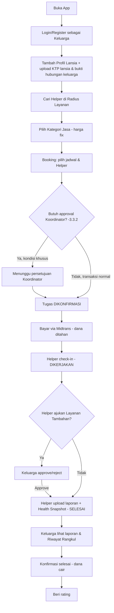
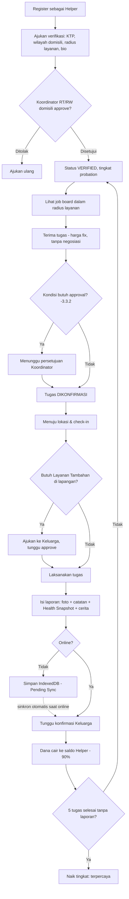
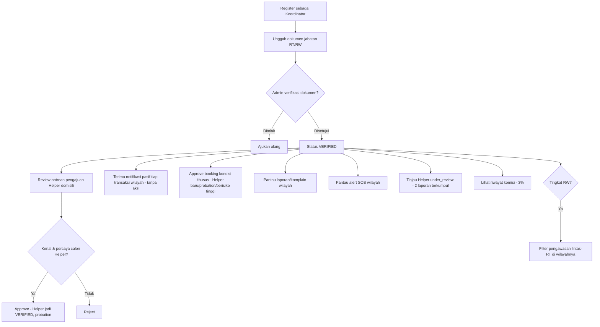
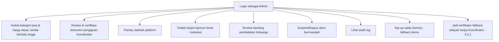
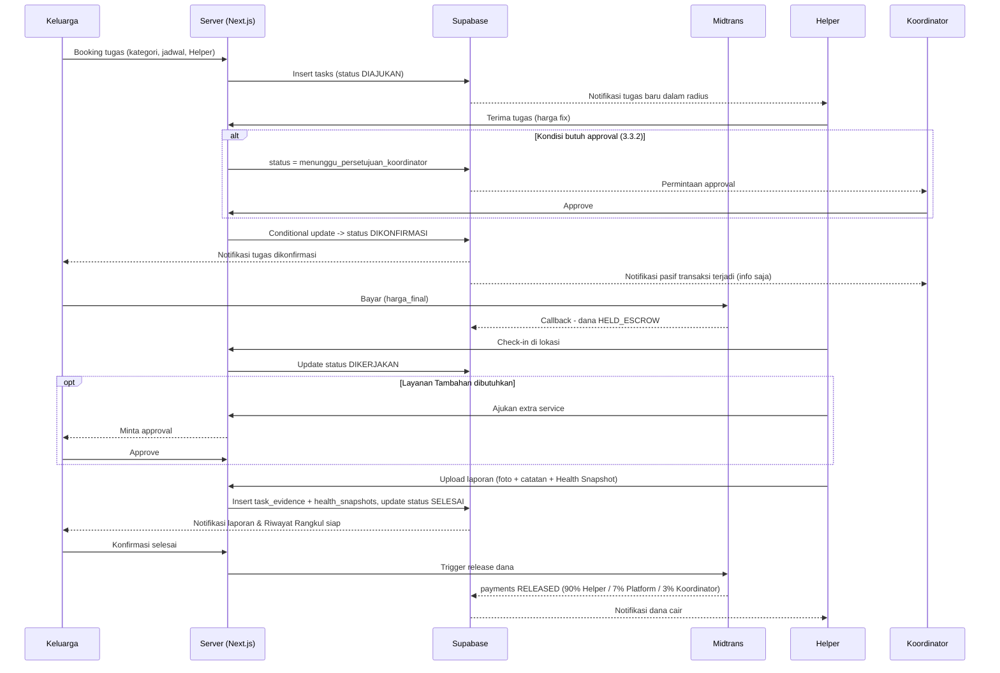

# Technical Design Document — Rangkul

> **Amendment 23 Agustus 2026, Sprint 3:** Implementasi pembayaran memakai Midtrans Sandbox sebagai provider nyata. Checkout dibuat server-side, webhook settlement wajib memvalidasi signature SHA-512, dan pembagian 90/7/3 dilakukan oleh RPC database setelah konfirmasi selesai. `held_escrow` adalah status settlement internal Rangkul, bukan klaim bahwa Rangkul menjadi penyelenggara escrow berizin. Saldo dummy dan endpoint `charge-dummy` tidak menjadi bagian dari implementasi Sprint 3.

**Platform Pendampingan Lansia Berbasis Kepercayaan Komunitas**

ITechno Cup 2026 — Kategori Web Development (Mahasiswa)
Tema: Adaptive Innovation for a Future-Ready Digital Society
Subtema: Smart Sustainable Digital Solution for Inclusive Society
SDG yang diangkat: SDG 11 (Kota & Komunitas Berkelanjutan) — SDG 8 (Pekerjaan Layak & Pertumbuhan Ekonomi)

**Versi Dokumen:** 5.0 (final, konsolidasi satu dokumen) | **Status:** Revisi pasca-diskusi mendalam soal skalabilitas verifikasi wilayah, model persetujuan transaksi, dan wow factor | **Tanggal:** 29 Juli 2026

> **Ringkasan revisi v4.0 → v5.0**
>
> - Ganti nama produk **Titip Rindu → Rangkul** ("Merangkul Jarak, Menjaga yang Tersayang")
> - Ganti istilah role **"Verifikator" → "Koordinator Komunitas"** (tugasnya lebih dari verifikasi: investigasi, mediasi SOS, suspend, banding)
> - **Model wilayah Koordinator**: tetap RT/RW (bukan naik ke kelurahan) — Koordinator memverifikasi Helper di RT/RW domisilinya sendiri (tetap personal & hyperlocal), Helper punya `radius_layanan_km` terpisah untuk menjangkau permintaan di luar RT-nya. RW jadi verifikator fallback kalau RT setempat tidak ada/tidak aktif.
> - **Model persetujuan transaksi diubah total**: dari potensi *approval per booking* menjadi **verifikasi orang, bukan verifikasi pekerjaan** (analog SIM) — Koordinator dapat notifikasi pasif di setiap transaksi (bukan gate), approval eksplisit hanya untuk kondisi tertentu (§3.3).
> - **Model harga diubah ke FIX PRICE** — dihapus opsi Helper mengusulkan penyesuaian ±25%. Sebagai gantinya: **Layanan Tambahan** yang diajukan Helper di lapangan tetap butuh persetujuan eksplisit Keluarga sebelum dikerjakan.
> - **Suspend otomatis diubah dari "1 rating bintang" menjadi "2 laporan (reports) terkumpul"** — lebih tahan dari false-positif rating asal pencet.
> - **Fitur unggulan baru: Riwayat Rangkul** (gabungan Health Snapshot + tren + Memory Capsule) — jurnal kondisi lansia dari waktu ke waktu, tampil di profil lansia. Fitur komunitas curhat terbuka **tidak dimasukkan** ke scope.
> - **Offline Behaviour** ditambahkan sebagai bagian formal (§3.13) — IndexedDB + antrean sinkronisasi otomatis saat koneksi kembali.
> - **Fallback wilayah baru tanpa Koordinator aktif**: Admin Platform jadi verifikator sementara (`verified_by_admin_fallback`).
> - **Kategori jasa diperjelas** — ditambah "Bantuan Teknologi", dan "Kontrol Kesehatan (antar ke faskes)" ditandai eksplisit sebagai kategori **berisiko tinggi**.
> - **Filter pengawasan untuk Koordinator level RW** — bisa melihat aktivitas per RT/keluarga di bawah cakupannya.
> - **Seeder data** didetailkan penuh sebagai bagian tersendiri (§19).
> - Panel Admin **dipertahankan sebagai fitur UI penuh** (bukan disederhanakan ke akses database manual) — konteks kompetisi, dinilai langsung oleh juri saat demo.
> - §3.12 "Keputusan yang Masih Perlu Disepakati Tim" — seluruh poin di versi sebelumnya **sudah dikunci final** di versi ini (lihat §3 masing-masing sub-bagian).

---

## Daftar Isi

1. [Ringkasan Produk &amp; Latar Belakang](#1-ringkasan-produk--latar-belakang)
2. [Tech Stack &amp; Justifikasi](#2-tech-stack--justifikasi)
3. [Aturan Bisnis &amp; Keputusan Desain](#3-aturan-bisnis--keputusan-desain)
4. [Functional Requirements](#4-functional-requirements)
5. [User Flow](#5-user-flow)
6. [Skema Database](#6-skema-database)
7. [API Design](#7-api-design)
8. [Security Design &amp; Flow](#8-security-design--flow)
9. [Struktur Halaman &amp; Rute](#9-struktur-halaman--rute)
10. [Sequence Diagram](#10-sequence-diagram)
11. [Risk Analysis](#11-risk-analysis)
12. [Non-Functional Requirements](#12-non-functional-requirements)
13. [Development Guideline](#13-development-guideline)
14. [Rencana Sprint &amp; Milestone](#14-rencana-sprint--milestone)
15. [Ruang Lingkup MVP](#15-ruang-lingkup-mvp)
16. [Keamanan &amp; Privasi](#16-keamanan--privasi)
17. [Kesesuaian dengan Guidebook ITechno Cup 2026](#17-kesesuaian-dengan-guidebook-itechno-cup-2026)
18. [Skill AI untuk Development (Claude Code)](#18-skill-ai-untuk-development-claude-code)
19. [Data Seeder](#19-data-seeder)

---

## 1. Ringkasan Produk & Latar Belakang

### 1.1 Masalah

Indonesia memasuki fase populasi menua — proporsi lansia mencapai 11,97% dari total penduduk (SUPAS BPS 2025). Sekitar 1,71 juta lansia tinggal sendirian, dan pola ini terkait erat dengan migrasi kerja: 19,2 juta orang Indonesia hidup merantau, 67% di antaranya hanya pulang kampung maksimal sekali setahun. Dampaknya nyata — skrining Kemenkes 2024 mencatat prevalensi depresi pada lansia mencapai 64,4%, dan kasus-kasus lansia yang baru diketahui bermasalah setelah terlambat masih terus terjadi.

Perlu dicatat: masalah ini tidak hanya dialami anak yang merantau jauh. Cucu, saudara, atau bahkan anak yang tinggal satu kota tapi sibuk bekerja menghadapi kesulitan yang sama. Karena itu produk ini menyasar **Keluarga** secara luas, bukan hanya anak rantau.

### 1.2 Solusi

Rangkul memungkinkan **Keluarga** memesan kunjungan terjadwal dari pendamping lokal terverifikasi untuk orang tua/lansia mereka — mulai dari sekadar cek kondisi, antar obat, hingga menemani mengobrol. Setiap kunjungan menghasilkan laporan (foto + catatan kondisi) yang dikirim kembali ke Keluarga, dan terkumpul menjadi **Riwayat Rangkul** — jurnal kondisi lansia dari waktu ke waktu (§3.12).

**Tagline:** *Merangkul Jarak, Menjaga yang Tersayang.*

### 1.3 Peran Pengguna

| Peran                               | Deskripsi Singkat                                                                                                                                                                                                                                                                                                                                                                           |
| ----------------------------------- | ------------------------------------------------------------------------------------------------------------------------------------------------------------------------------------------------------------------------------------------------------------------------------------------------------------------------------------------------------------------------------------------- |
| **Keluarga**                  | Memesan & membayar kunjungan, mengelola profil lansia (dengan verifikasi identitas, §3.11), menerima laporan & Riwayat Rangkul, memberi rating, chat dengan Helper.                                                                                                                                                                                                                        |
| **Helper** (Pendamping Lokal) | Mengajukan verifikasi di RT/RW domisilinya, menerima tugas kunjungan sesuai radius layanan, melapor hasil kunjungan (termasuk Health Snapshot), menerima pembayaran.                                                                                                                                                                                                                        |
| **Koordinator Komunitas**     | Ketua RT/RW (atau RW sebagai fallback jika RT tidak aktif). Self-register dengan dokumen pendukung jabatan, diverifikasi Admin (§3.3). Memverifikasi Helper di wilayahnya, menerima notifikasi pasif setiap transaksi, memberi approval eksplisit hanya pada kondisi tertentu, menindaklanjuti laporan, menerima komisi. Koordinator level RW punya filter pengawasan lintas-RT (§3.3.4). |
| **Admin**                     | Staf internal Rangkul. Memverifikasi dokumen Koordinator baru, menjadi verifikator fallback untuk wilayah tanpa Koordinator aktif, mengelola akun & kategori jasa, memantau statistik platform, menindaklanjuti eskalasi laporan berat & banding, melihat audit log.                                                                                                                        |
| **Lansia**                    | Penerima manfaat langsung. Tidak wajib menggunakan aplikasi.                                                                                                                                                                                                                                                                                                                                |

### 1.4 Catatan Kejujuran Kompetitif

Wajib disebutkan di README/pitch:

Tim menyadari eksistensi Care24/Homecare24 (segmen medis profesional) dan Temanika (marketplace pendampingan serba-guna). Diferensiasi Rangkul terletak pada model kepercayaan berbasis struktur komunitas nyata (RT/RW) dan fokus tunggal pada satu masalah, bukan klaim "belum ada yang mengerjakan ini".

| Kompetitor                    | Model Mereka                                                                                                                             | Perbedaan Rangkul                                                                                                                                                                                                           |
| ----------------------------- | ---------------------------------------------------------------------------------------------------------------------------------------- | --------------------------------------------------------------------------------------------------------------------------------------------------------------------------------------------------------------------------- |
| Care24 / Homecare24           | Perawat & caregiver bersertifikat medis, harga premium, untuk kebutuhan kesehatan serius.                                                | Non-medis, pendampingan sehari-hari, harga terjangkau.                                                                                                                                                                      |
| Temanika                      | Marketplace pendampingan serba-guna (lansia cuma 1 dari 6 kategori). Verifikasi terpusat (KTP + selfie + background check tim internal). | Fokus tunggal masalah lansia-Keluarga. Verifikasi berbasis kepercayaan komunitas lokal (RT/RW), plus Riwayat Rangkul yang mengubah tiap kunjungan jadi data kondisi lansia berkelanjutan — bukan transaksi sekali booking. |
| SIDAYA (Kemendukbangga/BKKBN) | Sistem informasi & pendaftaran program pemerintah.                                                                                       | Marketplace layanan langsung, bukan sistem administrasi program.                                                                                                                                                            |

---

## 2. Tech Stack & Justifikasi

| Layer              | Pilihan                                                                | Alasan                                                                                                                                                                                                  |
| ------------------ | ---------------------------------------------------------------------- | ------------------------------------------------------------------------------------------------------------------------------------------------------------------------------------------------------- |
| Frontend           | Next.js + TypeScript + Tailwind CSS + Shadcn UI                        | App Router untuk routing berbasis peran, TypeScript menekan bug runtime, Tailwind + Shadcn UI mempercepat & menstandarkan UI (§13).                                                                    |
| Validasi           | **Zod** + React Hook Form                                        | 4 lapis validasi: Zod (client) → React Hook Form (UX form) → validasi server (route handler) → constraint Supabase (database). Skema Zod idealnya diturunkan sinkron dari tipe skema database (§6). |
| Backend / Database | Supabase (PostgreSQL + Auth + Storage + Row Level Security + Realtime) | Auth & Storage bawaan menghemat waktu. RLS menegakkan akses data di level database. Realtime dipakai untuk chat & notifikasi live (§2.2).                                                              |
| Deployment         | Vercel (Hobby, gratis)                                                 | Direkomendasikan guidebook kompetisi. Auto-deploy per push, preview per branch.                                                                                                                         |
| Payment Gateway    | Midtrans (mode Sandbox untuk demo)                                     | Split/escrow bawaan untuk pembagian dana. Dilengkapi jalur cadangan Saldo Demo untuk kebutuhan penjurian (§3.4).                                                                                       |
| Offline Storage    | **IndexedDB** (bukan localStorage)                               | Menyimpan draf laporan kunjungan + foto sementara saat Helper offline, kapasitas jauh lebih besar dan mendukung data terstruktur (§3.13).                                                              |

> **Catatan AI:** dihapus dari tech stack karena tidak dibutuhkan untuk MVP. Guidebook §4.1 poin 7 hanya _mengizinkan_ AI kalau dipakai, bukan mewajibkannya (detail §17.4). Fitur "Riwayat Rangkul" (§3.12) dan klasifikasi darurat (§3.6) sengaja dirancang berbasis input manual terstruktur, bukan model AI — lebih murah dibangun, lebih akuntabel, nol risiko etis tambahan.

### 2.1 Catatan Operasional Penting: Supabase Free Tier

| Batasan                | Nilai                          | Mitigasi                                                  |
| ---------------------- | ------------------------------ | --------------------------------------------------------- |
| Database storage       | 500 MB                         | Cukup untuk skala pilot/MVP kompetisi.                    |
| File storage           | 1 GB                           | Kompres foto/dokumen sebelum upload (client-side resize). |
| Monthly Active Users   | 50.000                         | Jauh di atas kebutuhan demo.                              |
| Auto-pause             | Setelah 7 hari tanpa aktivitas | GitHub Actions heartbeat 2x/minggu — detail §2.3.       |
| Proyek aktif bersamaan | 2 project                      | Gunakan 1 project untuk development+demo.                 |

**Checklist wajib sebelum submission:** Pastikan GitHub Actions heartbeat sudah aktif dan teruji minimal 3 hari sebelum deadline.

### 2.2 Skills & Komponen Teknis Wajib

| Kebutuhan Fitur                                                    | Skill / Komponen Teknis                                                       | Keterangan                                                                   |
| ------------------------------------------------------------------ | ----------------------------------------------------------------------------- | ---------------------------------------------------------------------------- |
| Chat real-time & notifikasi live                                   | **Supabase Realtime**                                                   | Dipakai di`/pesan`, `/notifikasi`, notifikasi pasif Koordinator (§3.3). |
| Booking & anti race-condition                                      | Conditional update via Supabase client / RPC function Postgres                | §3.2 — jangan pola baca-lalu-tulis.                                        |
| Auto-expired tugas, reminder H-1, reschedule, akumulasi pembatalan | **Supabase Scheduled Edge Function** / `pg_cron`                      | Satu job terjadwal untuk beberapa pengecekan berbasis waktu.                 |
| Pembayaran & escrow                                                | **Midtrans Snap/Core API** + verifikasi signature webhook (HMAC SHA512) | Validasi signature sebelum memproses payload webhook.                        |
| Verifikasi dokumen (Helper, Koordinator, identitas lansia)         | Supabase Storage bucket private + signed URL                                  | Dokumen sensitif tidak boleh diakses lewat URL publik permanen.              |
| Validasi input API                                                 | **Zod** di setiap route handler                                         | Konsisten dengan §8.                                                        |
| Kompres foto/dokumen sebelum upload                                | `browser-image-compression` / Canvas API                                    | Menjaga limit storage 1 GB (§2.1).                                          |
| Draf laporan offline                                               | **IndexedDB** (`idb` library) + event listener `online`/`offline` | §3.13 — bukan Background Sync API native (dukungan browser tidak seragam). |
| CI & mencegah Supabase auto-pause                                  | **GitHub Actions**                                                      | Detail §2.3.                                                                |
| Component library & konsistensi UI                                 | **Shadcn UI** + Tailwind CSS                                            | §13.                                                                        |

### 2.3 CI/CD & Heartbeat GitHub Actions

Deployment sesungguhnya dilakukan otomatis oleh integrasi native Vercel↔GitHub — GitHub Actions dipakai untuk dua hal lain:

**A. Heartbeat — mencegah Supabase auto-pause**

```yaml
name: Supabase Heartbeat
on:
    schedule:
        - cron: "0 3 * * 1,4" # Senin & Kamis, 03:00 UTC (~10:00 WIB)
    workflow_dispatch:
jobs:
    ping:
        runs-on: ubuntu-latest
        steps:
            - name: Ping Supabase REST endpoint
              run: |
                  STATUS=$(curl -s -o /dev/null -w "%{http_code}" \
                    -H "apikey: ${{ secrets.SUPABASE_ANON_KEY }}" \
                    "${{ secrets.SUPABASE_URL }}/rest/v1/service_categories?select=id&limit=1")
                  echo "Supabase response status: $STATUS"
                  if [ "$STATUS" -ge 400 ]; then exit 1; fi
```

**B. CI — quality gate sebelum merge**

```yaml
name: CI
on:
    push:
        branches: [main, develop]
    pull_request:
        branches: [main]
jobs:
    build-and-check:
        runs-on: ubuntu-latest
        steps:
            - uses: actions/checkout@v4
            - uses: actions/setup-node@v4
              with:
                  node-version: 20
            - run: npm ci
            - run: npm run lint
            - run: npm run typecheck
            - run: npm run build
```

Job CI **tidak** melakukan deploy — hanya memastikan build tidak rusak sebelum Vercel otomatis men-deploy. Simpan `SUPABASE_URL`/`SUPABASE_ANON_KEY` sebagai GitHub repo secrets. Uji `workflow_dispatch` heartbeat minimal 3 hari sebelum deadline.

---

## 3. Aturan Bisnis & Keputusan Desain

### 3.1 State Machine Kunjungan

Rating tidak dimodelkan sebagai state wajib — bisa muncul kapan saja setelah SELESAI.

| Status       | Dipicu Oleh                                               | Bukti yang Dibutuhkan                                                                                                                                                                                                             |
| ------------ | --------------------------------------------------------- | --------------------------------------------------------------------------------------------------------------------------------------------------------------------------------------------------------------------------------- |
| DIAJUKAN     | Keluarga membuat pesanan                                  | Tidak ada. Berlaku maksimal**1 jam** (§3.2).                                                                                                                                                                               |
| DIKONFIRMASI | Helper menerima tugas                                     | Constraint unik di database agar tidak ada dua Helper menerima tugas sama. Jika tugas termasuk kategori yang butuh approval eksplisit (§3.3.2), status sementara`menunggu_persetujuan_koordinator` sebelum resmi DIKONFIRMASI. |
| DIKERJAKAN   | Helper check-in di lokasi                                 | Timestamp otomatis + lokasi opsional.                                                                                                                                                                                             |
| SELESAI      | Helper submit laporan (termasuk Health Snapshot, §3.12)  | Foto bukti + catatan kondisi + skor Health Snapshot.                                                                                                                                                                              |
| DIBATALKAN   | Keluarga (sebelum DIKERJAKAN) atau sistem (timeout 1 jam) | Alasan wajib diisi.                                                                                                                                                                                                               |

### 3.2 Batas Waktu Penerimaan Tugas & Penanganan Race Condition

**Batas waktu:** Tugas DIAJUKAN harus mencapai DIKONFIRMASI dalam maksimal **1 jam**. Scheduled job (§2.2) memeriksa tugas yang lewat `created_at + 1 jam` dan otomatis mengubahnya ke DIBATALKAN ("Kedaluwarsa"), Keluarga dinotifikasi untuk booking ulang.

**Race condition:** Conditional update (`UPDATE tasks SET status='DIKONFIRMASI', helper_id=X WHERE id=Y AND status='DIAJUKAN'`), cek jumlah baris berubah. Jangan pola baca-lalu-tulis.

### 3.3 Verifikasi Wilayah, Helper, & Model Persetujuan Transaksi

Ini bagian paling krusial dari desain Rangkul — direvisi total dari draf sebelumnya setelah disimulasikan terhadap skenario nyata.

#### 3.3.1 Model Wilayah: RT/RW tetap dipertahankan sebagai USP

RT/RW **tidak** dinaikkan ke level kelurahan. Alasan: ketua RT benar-benar mengenal warga di sekitarnya secara personal dan menaruh reputasi nyata saat menjamin seseorang — ini fondasi kepercayaan yang membedakan Rangkul dari verifikasi KTP+selfie terpusat ala kompetitor (§1.4). Menaikkan verifikasi ke kelurahan akan mengencerkan pembeda ini.

Solusi skala: pisahkan **"siapa yang memvouch Helper"** dari **"wilayah mana Helper boleh ambil tugas"**.

- Helper diverifikasi oleh Koordinator di RT/RW **domisilinya sendiri** (`koordinator_id` di `helper_profiles`, tetap hyperlocal & personal).
- Helper punya `radius_layanan_km` — jarak maksimal dari domisilinya yang bersedia dijangkau untuk mengambil tugas.
- Keluarga tetap bisa menemukan Helper dari RT sebelah selama masuk radius layanannya — verifikasi tetap dari Koordinator RT asal Helper, tidak perlu re-verifikasi oleh Koordinator RT lansia.
- **RW sebagai fallback**: jika RT di suatu wilayah tidak punya Koordinator aktif, Koordinator RW setempat boleh mengambil peran ini (`koordinator_profiles.tingkat` = `rt` atau `rw`).
- **Fallback wilayah benar-benar baru** (belum ada RT/RW yang mendaftar sama sekali): Admin Platform menjadi verifikator sementara (`helper_profiles.verified_by_admin_fallback = true`) sampai wilayah tersebut punya Koordinator Komunitas sendiri. Ditandai jelas di profil Helper sebagai "diverifikasi sementara oleh Admin" agar transparan ke Keluarga.

#### 3.3.2 Model Persetujuan: verifikasi orang, bukan verifikasi tiap transaksi

Skenario yang harus dihindari: Keluarga butuh Helper mendesak (mis. lansia jatuh, target 1 jam), tapi transaksi tertahan karena menunggu Koordinator yang sedang tidak sempat membuka aplikasi. Kalau ini terjadi, Koordinator jadi bottleneck operasional dan Rangkul gagal justru di momen paling krusial.

**Analoginya seperti SIM**: polisi tidak mengizinkan setiap kali seseorang ingin mengendarai mobil — cukup memastikan sekali bahwa orang itu layak. Koordinator bekerja serupa: memverifikasi Helper sekali di awal (identitas valid, dikenal komunitas, layak). Setelah lolos, transaksi berikutnya **tidak butuh approval berulang**.

**Yang tetap terjadi di setiap transaksi**: notifikasi pasif ke Koordinator wilayah ("Helper Andi sedang menjalankan tugas di rumah Bu Siti") — tidak butuh aksi apa pun, tapi kalau suatu hari ada masalah, Koordinator sudah tahu transaksi itu memang terjadi.

**Approval eksplisit hanya diwajibkan pada kondisi berikut** (status sementara `menunggu_persetujuan_koordinator`):

| Kondisi                                                                          | Alasan                                                                    |
| -------------------------------------------------------------------------------- | ------------------------------------------------------------------------- |
| Booking pertama yang diterima seorang Helper baru                                | Belum ada rekam jejak transaksi sama sekali.                              |
| Helper berstatus`probation` (§3.3.3)                                          | Masih dalam masa observasi.                                               |
| Helper baru kembali aktif setelah lama vakum (>60 hari tanpa tugas)              | Kondisi/keandalan bisa berubah selama vakum.                              |
| Helper pernah kena sanksi (`suspend_reason` terisi sebelumnya)                 | Riwayat pelanggaran butuh pengawasan ekstra sebelum dipercaya penuh lagi. |
| Kategori tugas ditandai**berisiko tinggi** (§3.4.1, mis. antar ke faskes) | Implikasi keselamatan lebih besar, terlepas dari status Helper.           |

Untuk kondisi di luar tabel ini, transaksi berjalan otomatis tanpa menunggu siapa pun.

#### 3.3.3 Tingkat Kepercayaan Helper (Trust Tier)

`helper_profiles.tingkat_kepercayaan`:

| Tingkat        | Syarat                                                               | Konsekuensi                                                                                                                                                                                                      |
| -------------- | -------------------------------------------------------------------- | ---------------------------------------------------------------------------------------------------------------------------------------------------------------------------------------------------------------- |
| `probation`  | Default saat Helper baru VERIFIED                                    | Setiap booking butuh approval Koordinator (§3.3.2).**Tidak ditampilkan** untuk tugas dengan target waktu mendesak (< 3 jam dari sekarang) — mencegah skenario darurat justru terjebak menunggu approval. |
| `terpercaya` | Otomatis naik setelah**5 tugas SELESAI** tanpa laporan/suspend | Transaksi berjalan otomatis (kecuali kategori berisiko tinggi, §3.3.2), termasuk boleh menerima tugas mendesak.                                                                                                 |

#### 3.3.4 Status Helper & Koordinator

| Status Helper        | Kondisi                                                                                                      |
| -------------------- | ------------------------------------------------------------------------------------------------------------ |
| PENDING_VERIFICATION | Baru mengajukan diri, menunggu review Koordinator wilayah domisilinya.                                       |
| VERIFIED             | Disetujui, status awal`probation` (§3.3.3).                                                               |
| UNDER_REVIEW         | Terkumpul**2 laporan (reports)** — otomatis, tidak bisa menerima tugas baru sampai ditinjau (§3.10). |
| SUSPENDED            | Terbukti melanggar setelah investigasi Koordinator/Admin.                                                    |

| Status Koordinator   | Kondisi                                                                 |
| -------------------- | ----------------------------------------------------------------------- |
| PENDING_VERIFICATION | Baru mendaftar, dokumen jabatan menunggu review Admin.                  |
| VERIFIED             | Dokumen disetujui Admin, bisa mulai memverifikasi Helper di wilayahnya. |
| REJECTED             | Dokumen ditolak Admin (bisa mengajukan ulang).                          |
| SUSPENDED            | Dinonaktifkan Admin karena pelanggaran.                                 |

**Filter pengawasan RW**: Koordinator dengan `tingkat = rw` mendapat halaman tambahan `/koordinator/pengawasan` — filter aktivitas berdasarkan RT dan keluarga di bawah cakupan RW-nya (§9), untuk visibilitas lintas-RT tanpa mengambil alih otoritas approval RT masing-masing.

### 3.4 Pembayaran, Harga, & Escrow

**Catatan regulasi:** Menahan dana milik pengguna lain termasuk aktivitas yang diatur Bank Indonesia. Rangkul tidak membangun sistem penahanan dana sendiri — escrow sepenuhnya memakai fitur split/hold Midtrans.

#### 3.4.1 Model Harga: Fix Price, bukan negosiasi

Harga **ditentukan di awal, tidak bisa diubah Helper di tengah jalan**. Alasan: kalau Keluarga melihat harga Rp100.000 lalu di checkout berubah jadi Rp125.000 karena Helper "mengusulkan penyesuaian", itu terasa seperti dark pattern yang bisa dipertanyakan juri secara telak.

Setiap kategori jasa (`service_categories`, daftar final §6) punya `harga_dasar` tetap, ditentukan Admin. Booking wajib memilih salah satu kategori — tidak ada opsi teks bebas.

**Kategori berisiko tinggi**: "Kontrol Kesehatan (antar ke faskes)" ditandai `is_high_risk = true` — selalu butuh approval Koordinator (§3.3.2) apa pun tingkat kepercayaan Helper.

**Layanan Tambahan (extra service)** — kalau di lapangan ternyata dibutuhkan lebih dari kesepakatan awal (mis. rumah lebih berantakan dari dugaan, perlu beli obat tambahan), Helper **mengajukan** via `POST /api/tasks/:id/extra-service` (nama item + biaya tambahan) — task berstatus `menunggu_persetujuan_keluarga`, Helper **tidak melanjutkan** sampai Keluarga approve. Keluarga tetap pemegang kendali penuh atas harga akhir, tidak pernah dikagetkan di akhir.

Biaya layanan tambahan minimal Rp1.000.

#### 3.4.2 Alur Pembayaran

Keluarga membayar `harga_final` (harga_dasar + total layanan tambahan yang disetujui) → dana `HELD_ESCROW` di Midtrans → Helper mengerjakan tugas → Keluarga konfirmasi selesai → dana cair:

| Penerima            | Persentase    |
| ------------------- | ------------- |
| Helper              | **90%** |
| Platform            | **7%**  |
| Koordinator wilayah | **3%**  |

Yang berhak menandai "selesai & dibayar" adalah Keluarga. Auto-release jika Keluarga tidak merespons dalam 3x24 jam. Pembayaran online-only (bukan tunai paralel) supaya komisi Koordinator & platform fee bisa ditegakkan dan diverifikasi. Setiap event pembayaran dicatat di `transaction_logs`.

**Komisi Koordinator** dihitung dari transaksi yang berhasil diselesaikan di wilayahnya — bukan dari jumlah persetujuan Helper baru — supaya tidak ada insentif "asal setuju" yang melemahkan kualitas verifikasi.

**Cadangan saat demo — Saldo Dummy:** Admin bisa top-up "saldo dummy" ke akun Keluarga tertentu lewat `/admin/demo-wallet` (tabel `demo_wallets`), khusus kebutuhan demo/judging. Jika Midtrans gagal/timeout, muncul opsi "Bayar dengan Saldo Demo" di `/pembayaran/{task_id}` — tetap melewati state machine escrow yang sama, hanya tidak memanggil API Midtrans. Didokumentasikan transparan sebagai "demo safety net", bukan metode pembayaran produksi.

### 3.5 Data Lansia — Soft Delete

Saat Keluarga menghapus profil lansia, data pribadi disembunyikan (soft delete), namun riwayat transaksi teragregasi milik Helper tetap dipertahankan.

### 3.6 Sistem Darurat (SOS)

Dipicu Helper. Tombol darurat menampilkan `tel:` quick-dial ke 112/RS terdekat (bukan panggilan otomatis oleh sistem). Notifikasi push+SMS ke Keluarga & Koordinator wilayah, status "aktif" sampai di-acknowledge. Keluarga punya jalur terpisah "laporkan kekhawatiran" untuk kasus tidak darurat tapi mencurigakan.

### 3.7 Fitur Reschedule

**Booking ≥ 24 jam (H-1) sebelum jadwal:**

- Notifikasi konfirmasi otomatis H-1 ke Keluarga.
- Reschedule bebas selama status DIAJUKAN/DIKONFIRMASI, minimal **3 jam** sebelum jadwal, maksimal **2 kali** per tugas.

**Booking same-day (< 24 jam):**

- Konfirmasi instan saat booking dibuat (checkbox kepastian lansia ada di rumah).
- Reschedule hanya boleh minimal **2 jam** sebelum jadwal, dan hanya jika Helper belum check-in.
- Kurang dari 2 jam & Helper sudah DIKONFIRMASI → harus dibatalkan (bukan reschedule), tunduk pada aturan kompensasi §3.8.

**Implementasi:** `tasks.jadwal_waktu_asli` (histori), `tasks.reschedule_count` (default 0, maks 2).

### 3.8 Kompensasi Pembatalan oleh Keluarga

Jika Keluarga membatalkan tugas yang **sudah DIKONFIRMASI** dan dananya **sudah HELD_ESCROW**:

- **Helper menerima 50%** dari `harga_final` sebagai kompensasi.
- **Keluarga menerima refund 50%** sisanya.
- Platform dan Koordinator **tidak mengambil bagian** pada skenario ini.
- Jika pembatalan terjadi sebelum dana HELD_ESCROW, tidak ada kewajiban kompensasi.
- Dicatat sebagai `payments.status = 'dibatalkan_kompensasi'`.
- Tetap dihitung dalam akumulasi pembatalan Keluarga (§3.9).

### 3.9 Pembatasan Pembatalan Berulang & Banding

- Pembatalan ke-1 dan ke-2: tidak ada konsekuensi tambahan selain kompensasi §3.8 (jika berlaku).
- **Lebih dari 2 kali pembatalan**: akun Keluarga otomatis `restricted` — tidak bisa membuat booking baru.
- Pemulihan lewat banding ke Admin di `/banding`, ditinjau di `/admin/banding`.
- Implementasi: `users.account_status` (`active`/`restricted`/`suspended`) + tabel `appeals`.

### 3.10 Sistem Laporan & Suspend Otomatis Helper

Diubah dari trigger rating 1 bintang (rawan false-positive — bisa salah pencet atau dendam pribadi) menjadi trigger berbasis **laporan formal**:

- Keluarga mengirim laporan formal (`POST /api/reports`) terhadap Helper — bukan sekadar rating rendah.
- **2 laporan terkumpul** terhadap Helper yang sama → otomatis `helper_profiles.status = 'under_review'`.
- Helper berstatus `under_review` **tidak bisa menerima tugas baru** dan wajib menunggu tindak lanjut — Koordinator wilayahnya meninjau dulu (§3.3.2 alur laporan), hasil akhir (lepas status atau eskalasi ke suspend) tetap lewat keputusan manual, bukan otomatis, supaya tidak ada Helper dijatuhkan hanya karena 2 keluhan yang belum tentu benar.
- Rating tetap ditampilkan sebagai sinyal kualitas di profil Helper, tapi **tidak lagi memicu suspend otomatis** — hanya laporan formal yang punya bobot itu.
- Suspend penuh (`SUSPENDED`) hanya lewat investigasi Koordinator/Admin setelah status `under_review`.

### 3.11 Verifikasi Identitas Lansia saat Registrasi

- Saat menambah profil lansia pertama kali, Keluarga wajib mengunggah: (1) foto/scan KTP lansia, dan (2) bukti hubungan keluarga (KK atau surat keterangan dari kelurahan/RT).
- Tersimpan di `lansia_profiles.dokumen_identitas_lansia_url` dan `dokumen_hubungan_keluarga_url` (bucket private + signed URL).
- Tidak diverifikasi manual di muka (supaya tidak jadi bottleneck pendaftaran) — tapi wajib diunggah, dan Admin/Koordinator bisa membukanya saat menindaklanjuti laporan/kecurigaan.

### 3.12 Riwayat Rangkul — Fitur Unggulan (Wow Factor)

Ini identitas utama Rangkul yang membedakannya dari sekadar "marketplace booking pendamping". Menggabungkan tiga elemen ChatGPT yang terpisah (Digital Twin/Health Snapshot, Trend Insight, Memory Capsule) menjadi **satu sistem data terpadu**, bukan tiga fitur berdiri sendiri.

**Cara kerja:** setiap kali Helper submit laporan SELESAI (§3.1), form laporan wajib menyertakan:

1. **Health Snapshot** — 5 indikator dinilai cepat skala 1–5 oleh Helper: Energi, Mobilitas, Mood, Nafsu Makan, Kualitas Tidur (mis. tampil sebagai emoji-scale di UI, bukan angka mentah, supaya cepat diisi Helper di lapangan).
2. **Cerita Hari Ini** (Memory Capsule) — satu kolom teks singkat bebas, mis. "Hari ini Ibu cerita soal masa kecilnya di Solo."

**Ditampilkan di profil lansia** (`/lansia/{id}/riwayat`) sebagai:

- Timeline kronologis tiap kunjungan (foto + cerita + skor).
- Grafik tren per indikator dari waktu ke waktu (mis. "Mobilitas turun 15% selama 3 minggu terakhir").
- **Badge peringatan otomatis** (rule-based, bukan AI): jika rata-rata skor turun pada **3 kunjungan berturut-turut**, tampilkan badge "Perlu Perhatian" + saran menaikkan frekuensi kunjungan. Murni aturan `IF` di atas data yang sudah terkumpul — tidak mengklaim diagnosis medis apa pun, hanya menyoroti pola untuk keputusan Keluarga.

Fitur komunitas curhat terbuka (ide awal Keluarga saling berbagi cerita) **sengaja tidak dimasukkan** — butuh moderasi konten serius yang tidak realistis dikerjakan & dijaga aman oleh tim 3 orang dalam sisa waktu yang ada, dan produk pemenang biasanya diingat karena satu fitur inti yang sangat kuat, bukan banyak fitur setengah jadi. Resonansi emosionalnya tetap dihadirkan lewat copywriting halaman Riwayat Rangkul, bukan lewat forum terbuka.

### 3.13 Offline Behaviour

Helper bisa berada di lokasi dengan sinyal buruk saat harus submit laporan. Alur (mirip pola draft pesan WhatsApp):

```
Helper isi form laporan (Health Snapshot + cerita + foto)
        ↓
Disimpan ke IndexedDB, status lokal "Pending Sync" (🟡)
        ↓
   [Jika offline]
        ↓
Tetap bisa diedit, tambah foto, submit lokal — tidak hilang
        ↓
   [Saat koneksi kembali]
        ↓
Event listener `online` memicu proses sinkronisasi otomatis:
upload foto → upload data → update database → status "Submitted" (🟢)
```

**Catatan implementasi:** memakai IndexedDB (bukan `localStorage`, kapasitasnya terlalu kecil untuk data terstruktur + foto) dikombinasikan dengan event listener `online`/`offline` browser standar + antrean retry manual — **bukan** Background Sync API native, karena dukungan lintas browser untuk API tersebut tidak seragam. Hasil akhir yang dilihat pengguna (indikator 🟡/🟢, sinkron otomatis saat online) tetap sama, implementasinya lebih portable.

### 3.14 Status Keputusan Bisnis

Seluruh keputusan terbuka dari draf sebelumnya telah dikunci pada revisi ini:

| Keputusan                | Status                                                   |
| ------------------------ | -------------------------------------------------------- |
| Window reschedule        | Dikunci §3.7 (3 jam H-1+, 2 jam same-day)               |
| Model harga              | Dikunci §3.4.1 (fix price + extra service, bukan ±25%) |
| Klasifikasi darurat      | Dikunci §3.6                                            |
| Model approval transaksi | Dikunci §3.3.2                                          |
| Verifikasi wilayah       | Dikunci §3.3.1                                          |
| Trigger suspend Helper   | Dikunci §3.10                                           |

---

## 4. Functional Requirements

Prioritas MoSCoW: **Must** (wajib MVP), **Should** (penting, bisa menyusul), **Could** (nice-to-have).

### 4.1 Autentikasi & Akun

| ID         | Requirement                                                                                                          | Prioritas |
| ---------- | -------------------------------------------------------------------------------------------------------------------- | --------- |
| FR-AUTH-01 | Registrasi dengan pilih peran Keluarga, Helper, atau Koordinator Komunitas                                           | Must      |
| FR-AUTH-02 | Login email/phone + password via Supabase Auth                                                                       | Must      |
| FR-AUTH-03 | JWT berisi klaim`user_id` + `role`, dipakai untuk otorisasi tiap request API                                     | Must      |
| FR-AUTH-04 | Reset password via email                                                                                             | Should    |
| FR-AUTH-05 | Koordinator self-register dengan wajib unggah dokumen jabatan (RT/RW); akun aktif setelah diverifikasi Admin (§3.3) | Must      |
| FR-AUTH-06 | Akun Admin dibuat manual (seed di Supabase), tidak ada UI registrasi publik                                          | Must      |

### 4.2 Manajemen Profil Lansia (Keluarga)

| ID        | Requirement                                                                        | Prioritas |
| --------- | ---------------------------------------------------------------------------------- | --------- |
| FR-LAN-01 | Tambah profil lansia, wajib disertai KTP lansia + bukti hubungan keluarga (§3.11) | Must      |
| FR-LAN-02 | Edit profil lansia yang sudah ada                                                  | Must      |
| FR-LAN-03 | Soft delete profil lansia                                                          | Must      |
| FR-LAN-04 | Satu akun Keluarga bisa kelola lebih dari satu profil lansia                       | Should    |
| FR-LAN-05 | Dokumen identitas lansia dapat direview Admin/Koordinator saat ada laporan         | Should    |

### 4.3 Pencarian & Profil Helper

| ID        | Requirement                                                                             | Prioritas |
| --------- | --------------------------------------------------------------------------------------- | --------- |
| FR-HLP-01 | Katalog Helper terverifikasi, filter per wilayah (dalam radius layanan) & kategori jasa | Must      |
| FR-HLP-02 | Lihat detail profil Helper: bio, rating, jumlah tugas selesai, tingkat kepercayaan      | Must      |
| FR-HLP-03 | Pengajuan verifikasi Helper (KTP, wilayah domisili, radius layanan, bio)                | Must      |
| FR-HLP-04 | Koordinator approve/reject Helper di wilayah domisilinya                                | Must      |
| FR-HLP-05 | Helper`probation` tidak ditampilkan untuk booking bertarget < 3 jam (§3.3.3)         | Must      |
| FR-HLP-06 | Helper otomatis naik ke`terpercaya` setelah 5 tugas SELESAI tanpa laporan             | Must      |

### 4.4 Kategori & Jasa Helper

| ID        | Requirement                                                                                                 | Prioritas |
| --------- | ----------------------------------------------------------------------------------------------------------- | --------- |
| FR-SVC-01 | Admin kelola daftar kategori jasa final (nama, estimasi durasi, harga dasar, status berisiko tinggi — §6) | Must      |
| FR-SVC-02 | Keluarga wajib pilih salah satu kategori jasa saat booking (tidak ada teks bebas)                           | Must      |
| FR-SVC-03 | Helper dapat mengajukan Layanan Tambahan di lapangan (§3.4.1), tugas pause sampai disetujui                | Must      |
| FR-SVC-04 | Keluarga approve/reject usulan Layanan Tambahan                                                             | Must      |

### 4.5 Booking & Siklus Hidup Tugas

| ID        | Requirement                                                                                                                    | Prioritas |
| --------- | ------------------------------------------------------------------------------------------------------------------------------ | --------- |
| FR-TSK-01 | Keluarga booking kunjungan (pilih Helper, kategori, jadwal)                                                                    | Must      |
| FR-TSK-02 | Helper terima tugas via conditional update (anti race-condition)                                                               | Must      |
| FR-TSK-03 | Tugas otomatis DIBATALKAN (expired) jika tak diterima dalam 1 jam                                                              | Must      |
| FR-TSK-04 | Helper check-in saat tiba (status DIKERJAKAN)                                                                                  | Must      |
| FR-TSK-05 | Helper submit laporan (foto + catatan + Health Snapshot) → status SELESAI                                                     | Must      |
| FR-TSK-06 | Keluarga bisa batalkan tugas sebelum DIKERJAKAN (wajib isi alasan)                                                             | Must      |
| FR-TSK-07 | Riwayat status tugas terlihat jelas oleh Keluarga & Helper                                                                     | Should    |
| FR-TSK-08 | Keluarga dapat reschedule sesuai aturan §3.7, maks 2x                                                                         | Must      |
| FR-TSK-09 | Sistem menghitung akumulasi pembatalan Keluarga; >2 kali otomatis`restricted` (§3.9)                                        | Must      |
| FR-TSK-10 | Booking yang butuh approval Koordinator (§3.3.2) berstatus sementara`menunggu_persetujuan_koordinator` sebelum DIKONFIRMASI | Must      |
| FR-TSK-11 | Koordinator menerima notifikasi pasif untuk setiap transaksi di wilayahnya (§3.3.2), tanpa perlu aksi                         | Must      |

### 4.6 Pembayaran & Escrow

| ID        | Requirement                                                                                     | Prioritas |
| --------- | ----------------------------------------------------------------------------------------------- | --------- |
| FR-PAY-01 | Keluarga bayar via Midtrans, dana ditahan (HELD_ESCROW)                                         | Must      |
| FR-PAY-02 | Keluarga konfirmasi selesai → dana cair 90% Helper / 7% Platform / 3% Koordinator              | Must      |
| FR-PAY-03 | Auto-release dana jika Keluarga tidak respons dalam 3x24 jam                                    | Must      |
| FR-PAY-04 | Setiap event pembayaran tercatat di`transaction_logs`                                         | Must      |
| FR-PAY-05 | Helper lihat riwayat penghasilan & status pencairan                                             | Should    |
| FR-PAY-06 | Koordinator lihat riwayat komisi per wilayah                                                    | Should    |
| FR-PAY-07 | Admin dapat top-up saldo dummy ke akun Keluarga untuk kebutuhan demo/judging                    | Should    |
| FR-PAY-08 | Sistem menyediakan jalur "Bayar dengan Saldo Demo" sebagai fallback saat Midtrans gagal/timeout | Should    |
| FR-PAY-09 | Pembatalan tugas DIKONFIRMASI dengan dana HELD_ESCROW otomatis split 50/50 (§3.8)              | Must      |

### 4.7 Bukti Kunjungan & Riwayat Rangkul

| ID        | Requirement                                                                                 | Prioritas |
| --------- | ------------------------------------------------------------------------------------------- | --------- |
| FR-EVD-01 | Upload foto bukti + catatan kondisi (wajib sebelum status SELESAI)                          | Must      |
| FR-EVD-02 | Timestamp otomatis saat submit bukti                                                        | Must      |
| FR-EVD-03 | Keluarga lihat laporan kunjungan lengkap                                                    | Must      |
| FR-RWT-01 | Helper isi Health Snapshot (5 indikator skala 1–5) di setiap laporan (§3.12)              | Must      |
| FR-RWT-02 | Helper isi kolom "Cerita Hari Ini" (Memory Capsule) di setiap laporan                       | Must      |
| FR-RWT-03 | Halaman`/lansia/{id}/riwayat` menampilkan timeline kronologis + grafik tren per indikator | Must      |
| FR-RWT-04 | Badge "Perlu Perhatian" otomatis muncul jika skor rata-rata turun 3 kunjungan berturut      | Should    |

### 4.8 Rating & Chat

| ID        | Requirement                                                                                                  | Prioritas |
| --------- | ------------------------------------------------------------------------------------------------------------ | --------- |
| FR-RAT-01 | Keluarga beri rating + komentar setelah status SELESAI (opsional, tidak memblokir alur)                      | Must      |
| FR-RAT-02 | Rating ditampilkan di profil Helper sebagai sinyal kualitas,**tidak** memicu suspend otomatis (§3.10) | Must      |
| FR-MSG-01 | Chat antara Keluarga–Helper per tugas                                                                       | Must      |
| FR-MSG-02 | Status pesan terbaca (`read_at`)                                                                           | Should    |
| FR-MSG-03 | Halaman inbox menampilkan seluruh percakapan aktif, live via Supabase Realtime                               | Should    |

### 4.9 Notifikasi

| ID        | Requirement                                                            | Prioritas |
| --------- | ---------------------------------------------------------------------- | --------- |
| FR-NOT-01 | Notifikasi in-app untuk perubahan status tugas, pesan baru, pembayaran | Must      |
| FR-NOT-02 | Notifikasi SOS ke Keluarga & Koordinator wilayah (push + SMS)          | Must      |
| FR-NOT-03 | Tandai notifikasi sudah dibaca                                         | Should    |
| FR-NOT-04 | Halaman`/notifikasi` terpusat, live via Supabase Realtime            | Must      |

### 4.10 Darurat & Komplain

| ID        | Requirement                                                                                      | Prioritas |
| --------- | ------------------------------------------------------------------------------------------------ | --------- |
| FR-SOS-01 | Tombol darurat Helper:`tel:` quick-dial + notifikasi persisten sampai di-acknowledge           | Must      |
| FR-RPT-01 | Keluarga laporkan Helper/kejadian bermasalah (laporan formal, §3.10)                            | Must      |
| FR-RPT-02 | Koordinator/Admin tindak lanjuti laporan; 2 laporan terkumpul → Helper otomatis`under_review` | Must      |

### 4.11 Help Center

| ID        | Requirement                   | Prioritas |
| --------- | ----------------------------- | --------- |
| FR-HLC-01 | Halaman FAQ & tutorial        | Should    |
| FR-HLC-02 | Form lapor bug & kontak admin | Should    |

### 4.12 Panel Admin

| ID        | Requirement                                                                            | Prioritas |
| --------- | -------------------------------------------------------------------------------------- | --------- |
| FR-ADM-01 | Hapus akun pengguna                                                                    | Must      |
| FR-ADM-02 | Suspend Helper                                                                         | Must      |
| FR-ADM-03 | Lihat statistik platform (jumlah tugas, GMV, dll)                                      | Should    |
| FR-ADM-04 | Kelola kategori jasa (termasuk tandai kategori berisiko tinggi)                        | Must      |
| FR-ADM-05 | Lihat audit log seluruh aksi sensitif                                                  | Should    |
| FR-ADM-06 | Review & verifikasi dokumen pengajuan Koordinator baru (approve/reject)                | Must      |
| FR-ADM-07 | Top-up saldo dummy ke akun Keluarga (fallback demo)                                    | Should    |
| FR-ADM-08 | Menjadi verifikator fallback untuk Helper di wilayah tanpa Koordinator aktif (§3.3.1) | Must      |
| FR-ADM-09 | Meninjau Helper`under_review` (2 laporan terkumpul) dan memutuskan tindak lanjut     | Must      |

### 4.13 Banding

| ID        | Requirement                                                                               | Prioritas |
| --------- | ----------------------------------------------------------------------------------------- | --------- |
| FR-APL-01 | Keluarga ajukan banding ke Admin jika akun di-restrict karena pembatalan berulang (§3.9) | Must      |
| FR-APL-02 | Admin review & putuskan banding (setujui/tolak)                                           | Must      |

### 4.14 Offline Behaviour

| ID        | Requirement                                                                                 | Prioritas |
| --------- | ------------------------------------------------------------------------------------------- | --------- |
| FR-OFF-01 | Draf laporan (Health Snapshot, cerita, foto) tersimpan lokal di IndexedDB saat offline      | Must      |
| FR-OFF-02 | Indikator status sinkronisasi (🟡 belum tersinkron / 🟢 sudah terkirim) tampil di UI Helper | Must      |
| FR-OFF-03 | Sinkronisasi otomatis terpicu saat koneksi kembali (event`online`)                        | Must      |

---

## 5. User Flow

### 5.1 Alur Keluarga



### 5.2 Alur Helper



### 5.3 Alur Koordinator Komunitas



### 5.4 Alur Admin



---

## 6. Skema Database

### `users`

| Kolom          | Tipe         | Keterangan                                              |
| -------------- | ------------ | ------------------------------------------------------- |
| id             | uuid, PK     |                                                         |
| email, phone   | text, unique |                                                         |
| password_hash  | text         | Dikelola Supabase Auth                                  |
| full_name      | text         |                                                         |
| role           | enum         | `keluarga` / `helper` / `koordinator` / `admin` |
| account_status | enum         | `active` / `restricted` / `suspended`             |
| created_at     | timestamptz  |                                                         |

### `lansia_profiles`

| Kolom                         | Tipe                  | Keterangan              |
| ----------------------------- | --------------------- | ----------------------- |
| id                            | uuid, PK              |                         |
| keluarga_id                   | uuid, FK users        |                         |
| nama, alamat                  | text                  |                         |
| umur                          | int                   |                         |
| lat, lng                      | numeric               |                         |
| catatan_kondisi               | text                  |                         |
| tingkat_mobilitas             | text                  |                         |
| kebutuhan_khusus              | text                  |                         |
| dokumen_identitas_lansia_url  | text                  | Bucket private (§3.11) |
| dokumen_hubungan_keluarga_url | text                  | Bucket private (§3.11) |
| deleted_at                    | timestamptz, nullable | Soft delete             |

### `helper_profiles`

| Kolom                           | Tipe                                    | Keterangan                                                                 |
| ------------------------------- | --------------------------------------- | -------------------------------------------------------------------------- |
| id                              | uuid, PK                                |                                                                            |
| user_id                         | uuid, FK users                          |                                                                            |
| ktp_url, bio                    | text                                    |                                                                            |
| foto_wajah_url                  | text, nullable                         | Satu-satunya foto profil Helper yang sudah diverifikasi Koordinator        |
| wilayah_domisili                | text                                    | RT/RW tempat diverifikasi                                                  |
| radius_layanan_km               | numeric                                 | Jangkauan pengambilan tugas (§3.3.1)                                      |
| koordinator_id                  | uuid, FK koordinator_profiles, nullable |                                                                            |
| verified_by_admin_fallback      | boolean, default false                  | Wilayah tanpa Koordinator aktif (§3.3.1)                                  |
| status                          | enum                                    | `pending_verification` / `verified` / `under_review` / `rejected` / `suspended` |
| tingkat_kepercayaan             | enum, default`probation`              | `probation` / `terpercaya` (§3.3.3)                                   |
| tugas_selesai_berturut          | int, default 0                          | Reset ke 0 jika kena laporan; naik`terpercaya` di angka 5                |
| suspend_reason                  | text, nullable                          |                                                                            |
| rating_avg, total_tugas_selesai | numeric, int                            |                                                                            |
| saldo_tersedia                  | numeric                                 |                                                                            |

### `helper_photo_change_requests`

| Kolom                           | Tipe                                    | Keterangan                                                                 |
| ------------------------------- | --------------------------------------- | -------------------------------------------------------------------------- |
| id                              | uuid, PK                                |                                                                            |
| helper_id                       | uuid, FK helper_profiles                | Helper yang mengajukan perubahan foto                                      |
| foto_wajah_url                  | text                                    | Foto baru yang menunggu pemeriksaan                                       |
| status                          | text                                    | `pending` / `approved` / `rejected`                                      |
| diajukan_at, ditinjau_at        | timestamptz                             | Waktu pengajuan dan pemeriksaan                                           |
| ditinjau_oleh                   | uuid, FK users, nullable                | Koordinator yang memproses pengajuan                                      |
| alasan                          | text, nullable                          | Catatan keputusan                                                         |

### `koordinator_profiles`

| Kolom                              | Tipe                        | Keterangan                                                             |
| ---------------------------------- | --------------------------- | ---------------------------------------------------------------------- |
| id                                 | uuid, PK                    |                                                                        |
| user_id                            | uuid, FK users              |                                                                        |
| wilayah                            | text                        |                                                                        |
| tingkat                            | enum                        | `rt` / `rw` (§3.3.1)                                              |
| dokumen_url                        | text                        | Dokumen pendukung jabatan                                              |
| status                             | enum                        | `pending_verification` / `verified` / `rejected` / `suspended` |
| diverifikasi_oleh, diverifikasi_at | uuid, timestamptz, nullable | Admin                                                                  |
| saldo_komisi                       | numeric                     |                                                                        |

### `service_categories`

| Kolom                 | Tipe     | Keterangan                                  |
| --------------------- | -------- | ------------------------------------------- |
| id                    | uuid, PK |                                             |
| nama, deskripsi       | text     |                                             |
| estimasi_durasi_menit | int      |                                             |
| harga_dasar           | numeric  | Fix price, ditentukan Admin (§3.4.1)       |
| is_high_risk          | boolean  | Selalu butuh approval Koordinator (§3.3.2) |
| is_active             | boolean  |                                             |

**Kategori final (§3.4.1 & catatan 12 diskusi):**

| Kategori                                         | Durasi   | Harga Dasar | Berisiko Tinggi? |
| ------------------------------------------------ | -------- | ----------- | ---------------- |
| Antar Obat                                       | 30 menit | Rp35.000    | Tidak            |
| Pengingat Obat                                   | 30 menit | Rp25.000    | Tidak            |
| Belanja Kebutuhan                                | 60 menit | Rp40.000    | Tidak            |
| Menemani Mengobrol                               | 60 menit | Rp50.000    | Tidak            |
| Membersihkan Rumah Ringan                        | 90 menit | Rp70.000    | Tidak            |
| Bantuan Teknologi (video call dgn keluarga, dll) | 45 menit | Rp30.000    | Tidak            |
| Kontrol Kesehatan (antar ke faskes)              | 90 menit | Rp120.000   | **Ya**     |

### `tasks`

| Kolom                                  | Tipe                        | Keterangan                                                                                                                                                 |
| -------------------------------------- | --------------------------- | ---------------------------------------------------------------------------------------------------------------------------------------------------------- |
| id                                     | uuid, PK                    |                                                                                                                                                            |
| keluarga_id, lansia_id, helper_id      | uuid, FK                    | `helper_id` nullable sampai DIKONFIRMASI                                                                                                                 |
| service_category_id                    | uuid, FK service_categories |                                                                                                                                                            |
| jadwal_waktu, jadwal_waktu_asli        | timestamptz, nullable       |                                                                                                                                                            |
| reschedule_count                       | int, default 0              | Maks 2                                                                                                                                                     |
| status                                 | enum                        | `diajukan` / `menunggu_persetujuan_koordinator` / `dikonfirmasi` / `dikerjakan` / `menunggu_persetujuan_keluarga` / `selesai` / `dibatalkan` |
| harga_dasar                            | numeric                     | Snapshot kategori saat booking                                                                                                                             |
| harga_final                            | numeric, nullable           | harga_dasar + layanan tambahan disetujui                                                                                                                   |
| dibatalkan_oleh, alasan_batal          | uuid, text, nullable        |                                                                                                                                                            |
| confirmed_at, started_at, completed_at | timestamptz, nullable       |                                                                                                                                                            |
| created_at                             | timestamptz                 |                                                                                                                                                            |

### `task_extra_services`

| Kolom                     | Tipe           | Keterangan                                 |
| ------------------------- | -------------- | ------------------------------------------ |
| id                        | uuid, PK       |                                            |
| task_id                   | uuid, FK tasks |                                            |
| deskripsi, biaya_tambahan | text, numeric  | Diajukan Helper (§3.4.1)                  |
| status                    | enum           | `menunggu` / `disetujui` / `ditolak` |

### `task_evidence`

| Kolom                     | Tipe                   | Keterangan                                |
| ------------------------- | ---------------------- | ----------------------------------------- |
| id                        | uuid, PK               |                                           |
| task_id                   | uuid, FK tasks, unique |                                           |
| foto_url, catatan_kondisi | text                   |                                           |
| sync_status               | enum                   | `pending_sync` / `submitted` (§3.13) |

### `health_snapshots`

Inti dari fitur Riwayat Rangkul (§3.12).

| Kolom                                                                | Tipe                     | Keterangan                               |
| -------------------------------------------------------------------- | ------------------------ | ---------------------------------------- |
| id                                                                   | uuid, PK                 |                                          |
| task_id                                                              | uuid, FK tasks, unique   |                                          |
| lansia_id                                                            | uuid, FK lansia_profiles | Denormalisasi untuk query timeline cepat |
| skor_energi, skor_mobilitas, skor_mood, skor_nafsu_makan, skor_tidur | int (1-5)                |                                          |
| cerita_hari_ini                                                      | text                     | Memory Capsule                           |
| created_at                                                           | timestamptz              |                                          |

### `ratings`

| Kolom                  | Tipe                   | Keterangan                                           |
| ---------------------- | ---------------------- | ---------------------------------------------------- |
| id                     | uuid, PK               |                                                      |
| task_id                | uuid, FK tasks, unique |                                                      |
| rating_value, komentar | int, text              | Sinyal kualitas saja, tidak trigger suspend (§3.10) |

### `payments`

| Kolom                                         | Tipe                   | Keterangan                                                                                             |
| --------------------------------------------- | ---------------------- | ------------------------------------------------------------------------------------------------------ |
| id                                            | uuid, PK               |                                                                                                        |
| task_id                                       | uuid, FK tasks, unique |                                                                                                        |
| payment_method                                | enum                   | `midtrans` / `dummy_saldo`                                                                         |
| jumlah_total                                  | numeric                | =`harga_final`                                                                                       |
| helper_share, platform_fee, koordinator_share | numeric                | 90/7/3 normal, 50/0/0 jika kompensasi pembatalan (§3.8)                                               |
| status                                        | enum                   | `pending` / `held_escrow` / `released` / `refunded` / `disputed` / `dibatalkan_kompensasi` |
| gateway_ref                                   | text                   | Kosong jika`payment_method = dummy_saldo`                                                            |
| released_at                                   | timestamptz, nullable  |                                                                                                        |

### `transaction_logs`

| Kolom      | Tipe              | Keterangan                                                          |
| ---------- | ----------------- | ------------------------------------------------------------------- |
| id         | uuid, PK          |                                                                     |
| payment_id | uuid, FK payments |                                                                     |
| event_type | enum              | `created` / `held` / `released` / `refunded` / `disputed` |
| payload    | jsonb             |                                                                     |
| created_at | timestamptz       |                                                                     |

### `messages`

| Kolom                  | Tipe                     | Keterangan |
| ---------------------- | ------------------------ | ---------- |
| id                     | uuid, PK                 |            |
| sender_id, receiver_id | uuid, FK users           |            |
| task_id                | uuid, FK tasks, nullable |            |
| message                | text                     |            |
| created_at, read_at    | timestamptz, nullable    |            |

### `notifications`

| Kolom       | Tipe           | Keterangan                                                                               |
| ----------- | -------------- | ---------------------------------------------------------------------------------------- |
| id          | uuid, PK       |                                                                                          |
| user_id     | uuid, FK users |                                                                                          |
| title, body | text           |                                                                                          |
| type        | enum           | `task` / `payment` / `emergency` / `message` / `system` / `koordinator_info` |
| is_read     | boolean        |                                                                                          |
| created_at  | timestamptz    |                                                                                          |

### `emergency_alerts`

| Kolom                            | Tipe                        | Keterangan                                   |
| -------------------------------- | --------------------------- | -------------------------------------------- |
| id                               | uuid, PK                    |                                              |
| task_id                          | uuid, FK tasks              |                                              |
| triggered_by                     | uuid, FK users              |                                              |
| status                           | enum                        | `active` / `acknowledged` / `resolved` |
| acknowledged_by, acknowledged_at | uuid, timestamptz, nullable |                                              |

### `reports`

| Kolom                           | Tipe                     | Keterangan                                |
| ------------------------------- | ------------------------ | ----------------------------------------- |
| id                              | uuid, PK                 |                                           |
| reported_helper_id, reporter_id | uuid, FK users           |                                           |
| alasan                          | text                     |                                           |
| status                          | enum                     | `menunggu` / `ditindak` / `selesai` |
| ditindak_oleh                   | uuid, FK users, nullable | Koordinator atau Admin                    |

> **Trigger otomatis:** setiap insert baru ke `reports` untuk `reported_helper_id` yang sama, hitung total laporan aktif. Jika mencapai 2 → update `helper_profiles.status = 'under_review'` (§3.10). Implementasi via Postgres trigger function, bukan logika aplikasi, supaya konsisten meski ada request bersamaan.

### `appeals`

| Kolom                      | Tipe                        | Keterangan                                 |
| -------------------------- | --------------------------- | ------------------------------------------ |
| id                         | uuid, PK                    |                                            |
| user_id                    | uuid, FK users              | Keluarga yang mengajukan banding (§3.9)   |
| alasan                     | text                        |                                            |
| status                     | enum                        | `menunggu` / `disetujui` / `ditolak` |
| direview_oleh, direview_at | uuid, timestamptz, nullable | Admin                                      |
| created_at                 | timestamptz                 |                                            |

### `audit_logs`

| Kolom                  | Tipe                     | Keterangan                                                                                                            |
| ---------------------- | ------------------------ | --------------------------------------------------------------------------------------------------------------------- |
| id                     | uuid, PK                 |                                                                                                                       |
| actor_id               | uuid, FK users, nullable |                                                                                                                       |
| action                 | text                     | mis.`suspend_helper`, `approve_koordinator`, `topup_demo_wallet`, `resolve_appeal`, `assign_admin_fallback` |
| entity_type, entity_id | text, uuid               |                                                                                                                       |
| metadata               | jsonb                    |                                                                                                                       |
| created_at             | timestamptz              |                                                                                                                       |

### `demo_wallets`

| Kolom      | Tipe           | Keterangan |
| ---------- | -------------- | ---------- |
| id         | uuid, PK       |            |
| user_id    | uuid, FK users |            |
| saldo      | numeric        |            |
| updated_at | timestamptz    |            |

> Murni untuk kebutuhan demo/judging (§3.4) — bukan bagian dari alur uang sungguhan.

---

## 7. API Design

### Auth

```
POST   /api/auth/register
POST   /api/auth/login
POST   /api/auth/logout
POST   /api/auth/refresh
POST   /api/auth/forgot-password
```

### Users

```
GET    /api/users/me
PATCH  /api/users/me
```

### Lansia

```
POST   /api/lansia                (wajib dokumen identitas + hubungan keluarga, §3.11)
GET    /api/lansia
GET    /api/lansia/:id
GET    /api/lansia/:id/riwayat    (timeline + tren Health Snapshot, §3.12)
PATCH  /api/lansia/:id
DELETE /api/lansia/:id            (soft delete)
```

### Helper

```
POST   /api/helpers/apply         (sertakan wilayah_domisili + radius_layanan_km)
GET    /api/helpers?wilayah=&kategori=&radius=
GET    /api/helpers/:id
PATCH  /api/helpers/:id/status    (koordinator: verify/reject/suspend)
```

### Koordinator

```
POST   /api/koordinator/apply         (self-register + dokumen, §3.3)
GET    /api/koordinator/commissions
GET    /api/koordinator/pengawasan    (khusus tingkat=rw, filter per RT/keluarga, §3.3.4)
GET    /api/koordinator/helpers        (Helper verified di wilayah Koordinator + snapshot tugas aktif)
```

### Kategori Jasa

```
GET    /api/categories
POST   /api/categories            (admin only)
PATCH  /api/categories/:id        (admin only, termasuk toggle is_high_risk)
```

### Tasks

**Contoh detail — `POST /api/tasks`**

Request:

```json
{
  "helper_id": "uuid",
  "lansia_id": "uuid",
  "service_category_id": "uuid",
  "jadwal_waktu": "2026-08-20T09:00:00+07:00",
  "catatan": "string, opsional"
}
```

Response `201`:

```json
{
  "task_id": "uuid",
  "status": "diajukan",
  "harga_dasar": 50000,
  "expired_at": "2026-08-20T08:00:00+07:00"
}
```

Error `409` — Helper tidak tersedia di radius/kategori diminta:

```json
{ "error": "helper_unavailable", "message": "Helper tidak melayani kategori atau wilayah ini" }
```

**Endpoint lengkap:**

```
POST   /api/tasks                          (keluarga booking, respons termasuk payment_url draft — diisi setelah DIKONFIRMASI)
GET    /api/tasks                          (list, filter per role)
GET    /api/tasks/:id
PATCH  /api/tasks/:id/accept               (helper terima langsung, conditional update, §3.2)
PATCH  /api/tasks/:id/koordinator-approve  (khusus kondisi §3.3.2, oleh koordinator_id terkait)
PATCH  /api/tasks/:id/reschedule           (§3.7)
PATCH  /api/tasks/:id/start                (helper check-in)
POST   /api/tasks/:id/extra-service        (helper ajukan Layanan Tambahan, §3.4.1)
PATCH  /api/tasks/:id/extra-service/:eid   (keluarga approve/reject)
POST   /api/tasks/:id/evidence             (helper submit laporan + Health Snapshot, §3.12)
PATCH  /api/tasks/:id/complete             (keluarga konfirmasi selesai)
PATCH  /api/tasks/:id/cancel               (keluarga batalkan; sistem hitung kompensasi §3.8, update akumulasi §3.9)
POST   /api/tasks/:id/rating               (§4.8 — sinyal kualitas saja)
```

### Payment

```
POST   /api/payments/:task_id/charge          (inisiasi Midtrans)
POST   /api/payments/:task_id/charge-dummy    (fallback Saldo Demo)
POST   /api/payments/webhook                  (callback Midtrans)
GET    /api/payments/:task_id
```

**Event Flow pembayaran:**

```
POST /payment/create → Midtrans → Webhook → verifikasi signature HMAC SHA512
    → payments.status = held_escrow → transaction_logs (event: held)
    → notifications ke Helper & Koordinator (info pasif)
```

### Messages

```
GET    /api/messages/conversations
GET    /api/messages/:task_id
POST   /api/messages
PATCH  /api/messages/:id/read
```

### Notifications

```
GET    /api/notifications
PATCH  /api/notifications/:id/read
```

### Emergency

```
POST   /api/emergency
PATCH  /api/emergency/:id/acknowledge
```

**Event Flow SOS:**

```
POST /emergency → emergency_alerts (status: active)
    → notifications push+SMS ke Keluarga & Koordinator wilayah
    → tetap "active" sampai PATCH /acknowledge
```

### Reports

```
POST   /api/reports               (trigger DB otomatis hitung akumulasi, §6)
GET    /api/reports               (koordinator/admin)
PATCH  /api/reports/:id
```

### Banding (Appeals)

```
POST   /api/appeals                (keluarga ajukan banding, §3.9)
GET    /api/admin/appeals
PATCH  /api/admin/appeals/:id      (admin setujui/tolak)
```

### Admin

```
GET    /api/admin/stats
GET    /api/admin/users
DELETE /api/admin/users/:id
GET    /api/admin/koordinator/pengajuan
PATCH  /api/admin/koordinator/:id/status   (approve/reject dokumen, §3.3)
PATCH  /api/admin/helpers/:id/suspend
PATCH  /api/admin/helpers/:id/assign-fallback   (jadi verifikator fallback, §3.3.1)
POST   /api/admin/demo-wallet/topup
GET    /api/admin/audit-logs
```

---

## 8. Security Design & Flow

### 8.1 Alur Keamanan Login → Data

```mermaid
flowchart LR
    A[User Login] --> B[Supabase Auth verifikasi kredensial]
    B --> C["Issue JWT (user_id + role)"]
    C --> D[Request ke API dengan JWT di header]
    D --> E[Middleware verifikasi signature & expiry JWT]
    E --> F[Zod validasi payload request]
    F --> G[Role check di application layer]
    G --> H[Query ke Supabase]
    H --> I["RLS Policy cek auth.uid() vs baris data"]
    I --> J[Data dikembalikan hanya yang diizinkan]
```



### 8.2 Kontrol Keamanan

| Kontrol                                     | Implementasi                                                                                                    |
| ------------------------------------------- | --------------------------------------------------------------------------------------------------------------- |
| Validasi input                              | **Zod** di client (React Hook Form) + server (route handler) — 4 lapis bersama constraint Supabase (§2) |
| XSS Protection                              | React auto-escape output; sanitasi eksplisit untuk konten user-generated (chat, cerita Memory Capsule)          |
| CSRF Token                                  | Token pada form/aksi berbasis cookie session (SSR)                                                              |
| SQL Injection Prevention                    | Selalu lewat Supabase client / query builder berparameter                                                       |
| Rate Limiter                                | Endpoint sensitif: login, register, booking                                                                     |
| HTTPS                                       | Default Vercel                                                                                                  |
| JWT Expiration                              | Access token pendek + refresh token rotation                                                                    |
| CSP Header                                  | Diatur di`next.config`                                                                                        |
| Webhook Signature                           | Payload Midtrans divalidasi HMAC SHA512 sebelum diproses                                                        |
| Dokumen sensitif (KTP, KK, dokumen jabatan) | Supabase Storage bucket private + signed URL                                                                    |
| Row Level Security                          | Aktif di setiap tabel data pribadi — diuji eksplisit sebelum submission                                        |

---

## 9. Struktur Halaman & Rute

### Auth

| Rute          | Pengguna | Fungsi                                                                                                        |
| ------------- | -------- | ------------------------------------------------------------------------------------------------------------- |
| `/`         | Publik   | Landing page — "Merangkul Jarak, Menjaga yang Tersayang".                                                    |
| `/login`    | Guest    | Masuk ke sistem.                                                                                              |
| `/register` | Guest    | Pendaftaran, pilih peran Keluarga, Helper, atau Koordinator Komunitas (dengan unggah dokumen jabatan, §3.3). |

### Bersama (semua peran login)

| Rute            | Fungsi                                        |
| --------------- | --------------------------------------------- |
| `/notifikasi` | Pusat notifikasi, live via Supabase Realtime. |

### Keluarga

| Rute                         | Fungsi                                                                         |
| ---------------------------- | ------------------------------------------------------------------------------ |
| `/beranda`                 | Dashboard.                                                                     |
| `/lansia/tambah`           | Tambah profil lansia + dokumen identitas & hubungan keluarga (§3.11).         |
| `/lansia/{id}/edit`        | Edit profil lansia.                                                            |
| `/lansia/{id}/riwayat`     | **Riwayat Rangkul** — timeline, grafik tren, badge peringatan (§3.12). |
| `/cari-helper`             | Katalog Helper dalam radius layanan + filter kategori jasa.                    |
| `/booking/{helper_id}`     | Penjadwalan kunjungan, harga fix ditampilkan jelas (§3.4.1).                  |
| `/kunjungan`               | Riwayat status tugas.                                                          |
| `/kunjungan/{id}`          | Detail: foto bukti, chat, reschedule, approve Layanan Tambahan, rating.        |
| `/kunjungan/{id}/laporkan` | Laporkan Helper/kejadian bermasalah (§3.10).                                  |
| `/pembayaran/{task_id}`    | Status escrow, opsi fallback Saldo Demo.                                       |
| `/pesan`                   | Inbox percakapan lintas tugas.                                                 |
| `/banding`                 | Form banding jika akun`restricted` (§3.9).                                  |

### Helper

| Rute                    | Fungsi                                                                                                                |
| ----------------------- | --------------------------------------------------------------------------------------------------------------------- |
| `/helper/dashboard`   | Status verifikasi, tingkat kepercayaan, ringkasan tugas, penghasilan.                                                 |
| `/helper/verifikasi`  | Pengajuan diri: KTP, wilayah domisili, radius layanan, bio.                                                           |
| `/helper/tugas`       | Job board dalam radius layanan.                                                                                       |
| `/helper/tugas/{id}`  | Terima tugas (harga fix), check-in, ajukan Layanan Tambahan, chat, tombol SOS.                                        |
| `/helper/laporan`     | Formulir laporan: foto + catatan + Health Snapshot + Cerita Hari Ini, dengan indikator sinkronisasi offline (§3.13). |
| `/helper/penghasilan` | Riwayat transaksi & saldo.                                                                                            |
| `/helper/pesan`       | Inbox percakapan.                                                                                                     |

### Koordinator Komunitas

| Rute                         | Fungsi                                                                                           |
| ---------------------------- | ------------------------------------------------------------------------------------------------ |
| `/koordinator/dashboard`   | Ringkasan Helper aktif, pengajuan baru, notifikasi transaksi pasif wilayah.                      |
| `/koordinator/pengajuan`   | Antrean verifikasi Helper baru domisilinya.                                                      |
| `/koordinator/persetujuan` | Antrean booking yang butuh approval eksplisit (§3.3.2).                                         |
| `/koordinator/helper`      | Directory Helper verified di wilayah Koordinator dengan status aktivitas tugas.                  |
| `/koordinator/helper/{id}` | Detail profil & rekam jejak Helper.                                                              |
| `/koordinator/laporan`     | Antrean laporan/komplain, termasuk Helper`under_review` (2 laporan).                           |
| `/koordinator/darurat`     | Alert SOS aktif.                                                                                 |
| `/koordinator/komisi`      | Riwayat komisi wilayah.                                                                          |
| `/koordinator/pengawasan`  | **Khusus tingkat RW** — filter aktivitas per RT & keluarga di bawah cakupannya (§3.3.4). |

### Admin

| Rute                             | Fungsi                                                                          |
| -------------------------------- | ------------------------------------------------------------------------------- |
| `/admin/dashboard`             | Statistik platform.                                                             |
| `/admin/users`                 | Kelola akun.                                                                    |
| `/admin/koordinator/pengajuan` | Review & verifikasi dokumen pengajuan Koordinator baru (§3.3).                 |
| `/admin/helpers`               | Suspend Helper, rekam jejak lintas wilayah, tinjau`under_review`.             |
| `/admin/helpers/fallback`      | Tetapkan diri sebagai verifikator fallback wilayah tanpa Koordinator (§3.3.1). |
| `/admin/categories`            | Kelola kategori jasa, harga dasar, status berisiko tinggi.                      |
| `/admin/reports`               | Eskalasi laporan berat.                                                         |
| `/admin/banding`               | Review banding pembatalan.                                                      |
| `/admin/demo-wallet`           | Top-up saldo dummy.                                                             |
| `/admin/audit-logs`            | Audit log.                                                                      |

### Help Center

| Rute                   | Fungsi                 |
| ---------------------- | ---------------------- |
| `/help`              | Landing pusat bantuan. |
| `/help/faq`          | FAQ.                   |
| `/help/tutorial`     | Panduan per peran.     |
| `/help/lapor-bug`    | Form laporan bug.      |
| `/help/kontak-admin` | Form kontak Admin.     |

---

## 10. Sequence Diagram



---

## 11. Risk Analysis

| Risiko                                                      | Dampak | Kemungkinan    | Mitigasi                                                                                                                    |
| ----------------------------------------------------------- | ------ | -------------- | --------------------------------------------------------------------------------------------------------------------------- |
| Helper menipu / berperilaku buruk                           | Tinggi | Rendah–Sedang | Verifikasi komunitas RT/RW, rating, laporan, suspend                                                                        |
| Foto bukti palsu / diambil bukan di lokasi                  | Sedang | Sedang         | Timestamp otomatis + lokasi GPS opsional                                                                                    |
| Lansia tidak ada di rumah saat kunjungan                    | Rendah | Sedang         | Reminder H-1 / konfirmasi instan same-day, reschedule (§3.7)                                                               |
| Koneksi internet Helper terputus di lokasi                  | Sedang | Sedang         | IndexedDB + sinkronisasi otomatis saat online (§3.13)                                                                      |
| Dua Helper terima tugas bersamaan                           | Tinggi | Rendah         | Conditional update di database (§3.2)                                                                                      |
| Keluarga tidak konfirmasi penyelesaian tugas                | Sedang | Sedang         | Auto-release setelah 3x24 jam (§3.4)                                                                                       |
| Koordinator jadi bottleneck / lambat merespons              | Tinggi | Sedang         | Model notifikasi-pasif, approval hanya kondisi khusus (§3.3.2) — bukan gate di setiap transaksi                           |
| Helper probation dapat tugas mendesak, approval telat       | Tinggi | Rendah         | Helper probation tidak ditampilkan untuk booking bertarget < 3 jam (§3.3.3)                                                |
| RT tidak punya Koordinator aktif — onboarding wilayah baru | Sedang | Sedang         | RW sebagai fallback, Admin sebagai fallback terakhir (§3.3.1)                                                              |
| Kebocoran data pribadi lansia                               | Tinggi | Rendah         | RLS ketat, akses terbatas, audit log                                                                                        |
| Supabase auto-pause saat dinilai juri                       | Tinggi | Sedang         | Heartbeat GitHub Actions (§2.3)                                                                                            |
| Midtrans sandbox gagal/limit saat demo                      | Sedang | Rendah         | Jalur cadangan Saldo Demo (§3.4)                                                                                           |
| SOS dipicu iseng/disalahgunakan                             | Sedang | Rendah         | Log setiap trigger, review Koordinator                                                                                      |
| Akun Keluarga dibuat bukan oleh kerabat lansia sungguhan    | Tinggi | Rendah         | Wajib unggah KTP lansia + bukti hubungan keluarga (§3.11)                                                                  |
| Laporan dipakai tidak adil untuk menjatuhkan Helper         | Sedang | Rendah         | Butuh 2 laporan terkumpul (bukan 1 rating), status`under_review` tetap butuh review manual sebelum suspend penuh (§3.10) |
| Keluarga membatalkan berulang untuk mengganggu Helper       | Sedang | Rendah         | Restriksi otomatis setelah >2 pembatalan, wajib banding ke Admin (§3.9)                                                    |
| Harga berubah sepihak di tengah transaksi                   | Sedang | Rendah         | Fix price, Layanan Tambahan wajib approval eksplisit Keluarga (§3.4.1)                                                     |

---

## 12. Non-Functional Requirements

| Aspek                      | Target                                                   |
| -------------------------- | -------------------------------------------------------- |
| Availability               | 99% selama periode penilaian                             |
| Response time API          | < 2 detik untuk operasi standar                          |
| Ukuran upload foto/dokumen | Maksimal 10 MB, dikompres client-side                    |
| Concurrent users           | Minimal 500 pengguna simultan                            |
| Browser                    | Chrome, Edge, Firefox versi terbaru                      |
| Mobile                     | Fully responsive, mobile-first                           |
| Aksesibilitas dasar        | Kontras warna memadai, ukuran font terbaca, alt text     |
| Offline resilience         | Draf laporan tidak hilang saat koneksi terputus (§3.13) |

---

## 13. Development Guideline

### 13.1 Design Tokens (Warna & Tipografi)

| Token   | Light Mode  | Dark Mode   |
| ------- | ----------- | ----------- |
| Primary | `#90CAF9` | `#0D47A1` |

- **Heading/Display:** Plus Jakarta Sans (dipakai untuk judul halaman, nama kategori, angka besar di dashboard — karakter geometris-nya cocok dengan nada "merangkul" yang hangat tapi tetap modern).
- **Body:** Instrument Sans (dipakai untuk paragraf, label form, isi chat — dipilih karena keterbacaannya tinggi, penting mengingat sebagian konten dibaca lansia/keluarga yang lebih tua).
- Terapkan sebagai CSS variable di `globals.css` (mis. `--color-primary`, `--font-display`, `--font-body`) dan referensikan lewat `tailwind.config` supaya konsisten dipakai lintas komponen Shadcn UI, bukan di-hardcode ulang per halaman.
- Pastikan rasio kontras primary-on-background tetap memenuhi WCAG AA di kedua mode (§12 aksesibilitas dasar) — terutama karena `#90CAF9` cukup terang untuk dipakai sebagai teks di atas latar putih; gunakan varian dark (`#0D47A1`) untuk teks/ikon interaktif di light mode, dan `#90CAF9` untuk aksen di atas latar gelap.

### 13.2 Guideline Umum

- Tidak ada gaya penulisan atau emoji khas AI generik di UI copy.
- Gunakan icon set yang konsisten (Lucide, lewat Shadcn UI).
- Gunakan **Shadcn UI** sebagai component library utama di atas Tailwind CSS.
- Setiap fitur baru mengikuti pola state machine & conditional update di §3, jangan menambah state ad-hoc tanpa update dokumen ini.
- Semua form wajib pakai skema Zod yang sinkron dengan tipe skema database (§6), jangan validasi manual ad-hoc.
- Karya harus dibangun custom (Next.js), bukan template instan — sesuai Guidebook §4.1 poin 4 (§17.3).
- Lihat §18 untuk skill AI yang disarankan dipasang untuk menjaga konsistensi implementasi selama sprint.
- Lihat wireframe lengkap (semua rute §9) di file terpisah `Rangkul_Wireframe.html` untuk referensi visual saat implementasi.

---

## 14. Rencana Sprint, Milestone, dan Pembagian Frontend–Backend

### 14.0 Prinsip Kerja Dua Workstream

Rangkul tidak boleh dikerjakan sebagai dua produk terpisah: satu tim membuat semua halaman, tim lain membuat semua backend, lalu disambungkan pada minggu terakhir. Pola itu hampir pasti menghasilkan UI yang terlihat selesai tetapi alur inti gagal saat live demo.

Pembagian yang dipakai adalah:

| Workstream                                   | Pemilik utama                       | Bertanggung jawab atas                                                                                                                                                          |
| -------------------------------------------- | ----------------------------------- | ------------------------------------------------------------------------------------------------------------------------------------------------------------------------------- |
| **Frontend / Product Experience (FE)** | 1 orang                             | Halaman, komponen, desain responsif, form, validasi UX, state loading/error/empty, integrasi API di browser, alur pengguna tiap peran, offline draft UI, dan QA visual.         |
| **Backend / Platform (BE)**            | 1 orang                             | Supabase Auth, migrasi database, RLS, Storage privat, route handler/API, RPC/transaction, scheduled job, Realtime, seed data, payment adapter, audit log, dan QA keamanan/data. |
| **Integrasi & QA**                     | Bergilir; wajib dikerjakan keduanya | Kontrak API, review pull request, pengujian alur end-to-end, perbaikan bug lintas layer, reset seed demo, dan skrip live demo.                                                  |

Jika tim terdiri dari **dua orang**, orang FE dan BE bergantian menjadi reviewer/integrator setiap sprint. Jika tim terdiri dari **tiga orang**, orang ketiga tidak membuat fitur yang berdiri sendiri; ia menjadi **Integration & QA owner**: menyambungkan fitur, menulis test, menyiapkan seed, merapikan UI, dan menjaga demo tetap stabil.

> **Aturan keras:** sebuah fitur belum dianggap selesai jika baru ada di halaman atau baru ada di database. Fitur baru selesai jika satu alur pengguna berjalan dari UI → API → database/RLS → UI kembali dengan data seed.

### 14.1 Koreksi Scope Sebelum Mulai

TDD ini memuat terlalu banyak fitur untuk dikerjakan paralel tanpa urutan yang ketat. Nilai lomba datang dari alur yang benar-benar hidup, bukan jumlah menu. Urutan prioritas berikut mengikat seluruh sprint.

| Prioritas                                   | Harus benar-benar berjalan saat demo                                                                                                                                                                                                                                        | Tidak boleh menjadi blocker                                                           |
| ------------------------------------------- | --------------------------------------------------------------------------------------------------------------------------------------------------------------------------------------------------------------------------------------------------------------------------- | ------------------------------------------------------------------------------------- |
| **P0 — alur pemenang**               | Auth 3 peran publik + Admin seed; profil lansia; verifikasi Helper/Koordinator; katalog Helper; booking; accept/approval; check-in; laporan + Health Snapshot; Riwayat Rangkul; Demo Ledger pembayaran; laporan formal 2x →`under_review`; panel Admin inti; seed reset. | Landing page kompleks, SMS, chat realtime, filter RW detail, dashboard komisi detail. |
| **P1 — memperkuat demo**             | Layanan Tambahan; reschedule/cancel; notifikasi in-app; chat per tugas; SOS`tel:` + alert in-app; offline draft laporan.                                                                                                                                                  | Midtrans live/split/escrow, SMS, auto-release 3x24 jam di produksi.                   |
| **P2 — hanya jika P0 dan P1 stabil** | Midtrans sandbox yang sudah diverifikasi, badge tren otomatis, filter pengawasan RW, inbox realtime penuh, Help Center lengkap.                                                                                                                                             | Fitur baru yang tidak muncul dalam skrip demo.                                        |

**Keputusan teknis yang menghindari kegagalan demo:**

1. **Payment core adalah Demo Ledger yang nyata dan teruji**, bukan Midtrans. Buat interface `PaymentProvider`; `DemoWalletProvider` adalah provider wajib untuk seluruh alur `pending → held_escrow → released/refunded`. `MidtransProvider` hanya *time-boxed spike* maksimal dua hari pada Sprint 3. Jika sandbox, webhook, atau skema split tidak terbukti berjalan dalam batas itu, feature flag Midtrans dimatikan dan demo tetap memakai Saldo Demo secara transparan. Jangan menjadikan klaim escrow gateway sebagai titik kegagalan proyek.
2. **SOS MVP adalah `tel:` quick-dial dan notifikasi in-app persisten.** SMS dipindahkan ke P2 karena membutuhkan provider, biaya, dan pengujian nomor sungguhan. Ini menyelesaikan konflik antara FR-NOT-02 yang sekarang `Must` dan §15 yang menyebut SMS sebagai fitur jika waktu tersisa.
3. **Autentikasi MVP menggunakan email + password.** Admin tidak mendaftar lewat UI; Admin selalu akun seed. Telepon/OTP hanya ditambahkan bila konfigurasi Supabase benar-benar siap, bukan dikerjakan paralel tanpa kebutuhan demo.
4. **Radius layanan membutuhkan koordinat Helper.** Tambahkan `domisili_lat`, `domisili_lng`, dan `is_available` ke `helper_profiles`; tanpa itu katalog “dalam radius” pada §3.3.1 tidak bisa dihitung secara jujur.
5. **Offline hanya menyimpan draf lokal.** Foto baru diunggah ketika koneksi kembali. Setiap submit memakai `client_submission_id` unik agar sinkronisasi ulang tidak menggandakan bukti/laporan.

### 14.2 Kontrak Integrasi yang Wajib Dibuat di Sprint 0

Frontend boleh mulai memakai mock, tetapi mock tidak boleh dibuat sembarangan. Sebelum suatu layar dibuat, Backend menuliskan kontraknya di `docs/api-contract.md` dan menghasilkan tipe database dari Supabase.

| Artefak bersama                      | Owner awal                    | Isi minimum                                                                             | Selesai saat                                                     |
| ------------------------------------ | ----------------------------- | --------------------------------------------------------------------------------------- | ---------------------------------------------------------------- |
| `docs/api-contract.md`             | BE, direview FE               | Endpoint, request, response sukses, error, role yang boleh akses, dan contoh data seed. | FE dapat membuat mock yang bentuknya sama dengan API asli.       |
| `src/types/database.ts`            | BE                            | Tipe hasil generate dari schema Supabase.                                               | Dipakai FE; tidak ada tipe tabel ditulis manual dua kali.        |
| `src/lib/validations/*`            | BE menulis aturan, FE memakai | Zod schema untuk auth, lansia, Helper, booking, evidence, report.                       | Validasi form dan route handler memakai source yang sama.        |
| `src/lib/constants/task-status.ts` | BE, direview FE               | Semua status task, label UI, dan transisi yang diizinkan.                               | Tidak ada string status ad-hoc di komponen.                      |
| Data mock / seeder                   | BE                            | Identitas akun demo, Helper, lansia, kategori, task, payment, report.                   | FE bisa menguji seluruh state kosong, aktif, error, dan selesai. |

**Definition of Ready (DoR) sebelum FE mengintegrasikan fitur:**

- Endpoint, contoh payload, dan minimal satu error sudah ada di kontrak.
- Status dan role yang berhak melakukan aksi sudah jelas.
- BE menyediakan migration + seed atau mock response yang identik.

**Definition of Done (DoD) untuk setiap fitur:**

- FE: form tervalidasi, mobile responsive, ada loading/error/empty state, dan tidak mengizinkan aksi yang melanggar role/status.
- BE: Zod server-side, RLS/policy diuji, perubahan state atomik bila menyangkut task atau saldo, serta audit log untuk aksi sensitif.
- Integrasi: skenario sukses dan satu skenario gagal diuji di preview deployment menggunakan akun seed.

### 14.3 Aturan Git, Review, dan Ritme Integrasi

| Aturan                      | Keputusan                                                                                                                                                                                                                                 |
| --------------------------- | ----------------------------------------------------------------------------------------------------------------------------------------------------------------------------------------------------------------------------------------- |
| Branch utama                | `main` selalu dapat di-deploy; `develop` adalah branch integrasi harian.                                                                                                                                                              |
| Branch kerja                | `dev-eln` adalah area kerja Eln; `dev-mervin` adalah area kerja Mervin. Keduanya branch kerja aktif per orang, bukan branch deployment.                                                                                               |
| Alur merge                  | `dev-eln` dan `dev-mervin` membuat Pull Request ke `develop`; `develop` membuat Pull Request ke `main` setelah alur demo diuji. Tidak ada push langsung ke `main`.                                                            |
| Pull request                | Tidak merge sendiri untuk perubahan lintas layer. FE meninjau PR BE yang mengubah response/status; BE meninjau PR FE yang memanggil endpoint baru.                                                                                        |
| Merge                       | Hanya jika`lint`, `typecheck`, `build`, dan test terkait lulus. Preview Vercel digunakan untuk cek manual.                                                                                                                          |
| Integrasi terjadwal         | Minimal dua kali per sprint:**akhir Hari 2** (kontrak + happy path awal) dan **akhir Hari 5** (fitur tersambung). Jangan menunggu akhir minggu.                                                                               |
| Sinkronisasi branch pribadi | Sebelum mulai kerja setiap hari, Eln dan Mervin menarik perubahan terbaru dari`develop` ke branch masing-masing. Setelah PR mereka masuk `develop`, keduanya langsung menyinkronkan ulang branch pribadi agar tidak menumpuk konflik. |
| Stand-up                    | 15 menit setiap hari: “selesai”, “blokir”, “endpoint/UI apa yang harus tersedia besok”.                                                                                                                                             |
| WIP limit                   | Masing-masing workstream maksimal dua tiket aktif. Selesaikan satu alur sebelum membuka tiga halaman baru.                                                                                                                                |

Struktur branch yang dipakai:

```text
main          # versi paling stabil / deployment lomba
develop       # versi gabungan yang sedang diuji
dev-eln       # area kerja Eln
dev-mervin    # area kerja Mervin
```

Alur kerja wajib:

```text
dev-eln ─────┐
             ├── Pull Request + review ──> develop ──> Pull Request + E2E test ──> main
dev-mervin ──┘
```

> **Catatan:** pola branch per orang boleh untuk tim kecil seperti Rangkul, tetapi branch `dev-eln` dan `dev-mervin` tidak boleh dibiarkan menyimpang terlalu lama. Integrasi dua kali per sprint adalah batas minimum; bila keduanya mengubah domain yang sama, integrasikan pada hari itu juga.

#### 14.3.1 Aturan Commit Wajib

Setiap commit harus menjelaskan **jenis perubahan**, **domain/fitur yang dikerjakan**, dan **ringkasan singkat**. Jangan gunakan commit seperti `update`, `fix`, `coba`, `final beneran`, atau `perbaikan` tanpa konteks.

Format judul:

```text
<type>(<scope>): <deskripsi singkat dalam bentuk kata kerja>
```

Untuk fitur baru, formatnya **wajib**:

```text
feat(<nama-fitur>): <deskripsi singkat>
```

Contoh commit yang benar:

```text
feat(auth): add role-based registration

- Add Keluarga, Helper, and Koordinator role selection
- Validate registration fields with Zod
- Redirect each role to its correct dashboard after login
```

Contoh lain:

```text
feat(booking): add helper booking flow

- Add service category and schedule selection
- Show fixed-price summary before submission
- Handle helper_unavailable error state
```

```text
fix(task): prevent duplicate helper acceptance

- Move task acceptance to atomic RPC transaction
- Return 409 when the task has already been accepted
- Add concurrency regression test
```

Tipe yang boleh dipakai:

| Type         | Dipakai untuk                               | Contoh                                       |
| ------------ | ------------------------------------------- | -------------------------------------------- |
| `feat`     | Fitur baru yang terlihat/dapat digunakan.   | `feat(riwayat): add health trend chart`    |
| `fix`      | Perbaikan bug atau state salah.             | `fix(payment): prevent double release`     |
| `refactor` | Merapikan struktur tanpa mengubah perilaku. | `refactor(api): centralize error response` |
| `test`     | Menambah atau memperbaiki test.             | `test(task): cover expired booking rule`   |
| `docs`     | Dokumentasi/TDD/README.                     | `docs(tdd): detail sprint ownership`       |
| `chore`    | Setup, dependency, CI, atau konfigurasi.    | `chore(ci): add typecheck workflow`        |

Ketentuan tambahan:

- Judul commit maksimal sekitar 72 karakter, memakai bahasa Inggris yang konsisten, dan tanpa titik di akhir.
- Untuk perubahan lebih dari satu hal kecil, beri satu baris kosong setelah judul lalu isi body dalam bullet `-` yang menjelaskan detail perubahan.
- Satu commit hanya boleh berisi satu domain logis. Jangan mencampur `auth`, desain landing page, dan payment dalam satu commit.
- Commit yang mengubah database wajib menyebut migration/schema pada body commit.
- Sebelum membuat PR, branch harus bersih: tidak ada file `.env`, secret, file build, atau perubahan percobaan yang ikut ter-commit.

### 14.4 Milestone Per Sprint

#### Sprint 0 — Fondasi yang Tidak Boleh Diulang

**Tanggal:** 29 Juli–3 Agustus 2026
**Tujuan:** aplikasi bisa login sebagai role yang benar, schema dasar aman, dan kedua workstream bisa mengembangkan fitur tanpa saling menunggu.

| Area                     | Tugas detail                                                                                                                                                                                                                                                                                                                                                                                                                                                                                                                                                                                                                                                                                                                            | Hasil yang harus dapat didemokan                                                                                                       |
| ------------------------ | --------------------------------------------------------------------------------------------------------------------------------------------------------------------------------------------------------------------------------------------------------------------------------------------------------------------------------------------------------------------------------------------------------------------------------------------------------------------------------------------------------------------------------------------------------------------------------------------------------------------------------------------------------------------------------------------------------------------------------------- | -------------------------------------------------------------------------------------------------------------------------------------- |
| **Frontend**       | 1. Inisialisasi Next.js, TypeScript, Tailwind, Shadcn UI, font, design token, dan responsive layout. 2. Buat route group publik, Keluarga, Helper, Koordinator, dan Admin. 3. Buat komponen fondasi:`AppShell`, sidebar per role, `PageHeader`, form field, upload field, state loading/error/empty, konfirmasi dialog. 4. Bangun `/`, `/login`, `/register`; pendaftaran publik hanya Keluarga, Helper, Koordinator. 5. Redirect berbasis role dan dashboard placeholder. 6. Buat API client yang bisa ditukar antara mock dan API asli.                                                                                                                                                                                     | Login akun seed mengantar pengguna ke dashboard sesuai peran; tampilan mobile tidak rusak; form register menampilkan error yang benar. |
| **Backend**        | 1. Buat project Supabase development,`.env.example`, dan aturan secret. 2. Migration awal: enum role/status, `users`, `service_categories`, `audit_logs`, `demo_wallets`, `demo_wallet_ledger`; trigger Auth → profile. 3. Tambahkan kolom pendukung: `helper_profiles.domisili_lat`, `domisili_lng`, `is_available`; `tasks.expires_at`; `task_evidence.client_submission_id`. 4. Buat bucket private untuk KTP/KK/dokumen jabatan dan policy signed URL. 5. Terapkan RLS fondasi per role; semua tabel baru default-nya deny. 6. Buat endpoint/me, register, session, dan middleware role. 7. Buat seeder kategori, Admin, serta tiga akun demo publik. 8. Aktifkan CI, migration check, build, dan heartbeat. | Admin dibuat dari seed; user tidak dapat membaca data milik user lain; kategori jasa dan akun seed muncul di database.                 |
| **Integrasi & QA** | 1. Tulis`docs/api-contract.md`. 2. Sepakati format error tunggal: `{ error, message, fieldErrors? }`. 3. Uji register/login/logout untuk tiga role publik + login Admin seed. 4. Buat board pekerjaan dan tandai owner FE/BE/integrasi.                                                                                                                                                                                                                                                                                                                                                                                                                                                                                             | Preview deployment hidup; semua orang dapat masuk memakai akun seed; tidak ada secret di repository.                                   |

**Quality gate Sprint 0:** `npm run lint`, `npm run typecheck`, dan `npm run build` lulus di CI; RLS dasar diuji dengan dua akun berbeda; dokumentasi cara menjalankan seed tersedia.

---

#### Sprint 1 — Identitas, Verifikasi, dan Katalog Helper

**Tanggal:** 4–10 Agustus 2026
**Tujuan:** Keluarga punya lansia terverifikasi, Helper bisa mendaftar, Koordinator/Admin dapat memverifikasi, lalu Keluarga melihat Helper yang memang layak dipilih.

| Area                     | Tugas detail                                                                                                                                                                                                                                                                                                                                                                                                                                                                                                                                                                                                                                                        | Ketergantungan                                       | Hasil yang harus dapat didemokan                                                                                             |
| ------------------------ | ------------------------------------------------------------------------------------------------------------------------------------------------------------------------------------------------------------------------------------------------------------------------------------------------------------------------------------------------------------------------------------------------------------------------------------------------------------------------------------------------------------------------------------------------------------------------------------------------------------------------------------------------------------------- | ---------------------------------------------------- | ---------------------------------------------------------------------------------------------------------------------------- |
| **Backend**        | 1. Migration`lansia_profiles`, `helper_profiles`, `koordinator_profiles`, serta relasi kategori layanan Helper. 2. Endpoint CRUD lansia + soft-delete; validasi kepemilikan keluarga. 3. Upload private dengan signed URL dan validasi tipe/ukuran file. 4. Endpoint apply Helper/Koordinator, approve/reject oleh pihak tepat, dan fallback Admin. 5. Query katalog hanya untuk Helper `verified`, aktif, melayani kategori, dan masuk radius; gunakan data koordinat seed yang konsisten. 6. RLS: Keluarga hanya data lansianya; dokumen tidak pernah public; Koordinator hanya Helper domisilinya. 7. Tambahkan audit log untuk approve/reject/fallback. | Sprint 0 migration, role middleware, bucket private. | Aksi approve yang dilakukan Koordinator salah wilayah mendapat`403`; signed URL dokumen tidak dapat dibuka oleh user lain. |
| **Integrasi & QA** | 1. Hari 2: sambungkan form lansia dan Helper application ke API asli. 2. Hari 5: sambungkan antrean Koordinator/Admin dan katalog. 3. Uji tiga skenario: wilayah dengan RT aktif, fallback RW, fallback Admin. 4. Siapkan minimal lima Helper terpercaya pada seed.                                                                                                                                                                                                                                                                                                                                                                                                 | FE dan BE selesai masing-masing per Hari 5.          | Alur verifikasi dari UI sampai status database tidak memakai edit manual database.                                           |

**Quality gate Sprint 1:** katalog tidak pernah membocorkan KTP/bukti hubungan; satu akun keluarga tidak dapat mengakses lansia akun lain; semua state verifikasi punya label UI yang jelas.

---

#### Sprint 2 — Alur Kunjungan Inti dan Riwayat Data Dasar

**Tanggal:** 11–17 Agustus 2026
**Tujuan:** menyelesaikan “jantung” Rangkul sebelum membangun chat, pembayaran gateway, atau dashboard tambahan. Alur minimal harus sudah hidup: booking → Helper menerima → approval bila perlu → check-in → laporan → Keluarga melihat hasil.

| Area                     | Tugas detail                                                                                                                                                                                                                                                                                                                                                                                                                                                                                                                                                                                                                                                                              | Ketergantungan                                                        | Hasil yang harus dapat didemokan                                                                                                              |
| ------------------------ | ----------------------------------------------------------------------------------------------------------------------------------------------------------------------------------------------------------------------------------------------------------------------------------------------------------------------------------------------------------------------------------------------------------------------------------------------------------------------------------------------------------------------------------------------------------------------------------------------------------------------------------------------------------------------------------------- | --------------------------------------------------------------------- | --------------------------------------------------------------------------------------------------------------------------------------------- |
| **Frontend**       | 1.`/booking/{helper_id}`: pilih lansia, kategori, jadwal, ringkasan harga fix, dan alasan batas waktu. 2. Keluarga: daftar/detail kunjungan, timeline status, cancel/reschedule UI. 3. Helper: job board, detail tugas, accept, check-in, dan form laporan dasar. 4. Koordinator: antrean approval kondisi khusus. 5. Form laporan memuat foto, catatan, lima indikator Health Snapshot, Cerita Hari Ini. 6. Buat komponen status tunggal untuk semua role agar label/aksi konsisten. 7. Integrasikan error `409` saat task telah diambil Helper lain.                                                                                                                                | Kontrak`tasks`, daftar status, dan endpoint accept tersedia Hari 2. | Dua browser dapat mencoba mengambil task yang sama; hanya satu mendapat sukses. Keluarga melihat laporan yang dikirim Helper.                 |
| **Backend**        | 1. Migration`tasks`, `task_evidence`, `health_snapshots`, `ratings`, `notifications` dasar. 2. Buat state machine server-side dan RPC/transaction: create, accept atomik, approve Koordinator, start, submit evidence, cancel, reschedule. 3. Simpan `expires_at` saat booking; buat scheduled job/route internal untuk membatalkan task kedaluwarsa. 4. Terapkan aturan approval probation, Helper pertama, vakum, riwayat sanksi, dan kategori berisiko tinggi. 5. Terapkan validasi reschedule, limit dua kali, serta kontrol cancel sebelum `dikerjakan`. 6. Buat query laporan/Health Snapshot per lansia. 7. Tulis test untuk transisi ilegal dan concurrency accept. | Data Helper verified, kategori, lansia dari Sprint 1.                 | State hanya berubah lewat transisi yang sah; user yang bukan pemilik task tidak dapat cancel/reschedule; task kadaluarsa tidak dapat diambil. |
| **Integrasi & QA** | 1. Hari 2: booking → accept untuk Helper terpercaya. 2. Hari 5: jalankan golden path dan satu path probation yang menunggu approval Koordinator. 3. Uji tanggal same-day vs H-1, task expired, dua Helper accept bersamaan, dan submit laporan.                                                                                                                                                                                                                                                                                                                                                                                                                                          | Semua endpoint tugas.                                                 | Satu skrip demo 4–5 menit sudah dapat memperlihatkan pembeda kepercayaan komunitas dan Health Snapshot, walau pembayaran masih Demo Ledger.  |

**Quality gate Sprint 2:** tidak ada status task yang diubah langsung dari client; race condition accept punya test; laporan hanya dapat dibuat oleh Helper yang ditugaskan dan hanya sekali per task.

---

#### Sprint 3 — Pembayaran Demo yang Konsisten, Trust & Safety, dan Komunikasi

**Tanggal:** 18–24 Agustus 2026
**Tujuan:** menyambungkan konsekuensi bisnis alur inti tanpa mempertaruhkan demo pada gateway pihak ketiga.

| Area                     | Tugas detail                                                                                                                                                                                                                                                                                                                                                                                                                                                                                                                                                                                                                                                                                                                                                                                            | Ketergantungan                                            | Hasil yang harus dapat didemokan                                                                                                                  |
| ------------------------ | ------------------------------------------------------------------------------------------------------------------------------------------------------------------------------------------------------------------------------------------------------------------------------------------------------------------------------------------------------------------------------------------------------------------------------------------------------------------------------------------------------------------------------------------------------------------------------------------------------------------------------------------------------------------------------------------------------------------------------------------------------------------------------------------------------- | --------------------------------------------------------- | ------------------------------------------------------------------------------------------------------------------------------------------------- |
| **Frontend**       | 1.`/pembayaran/{task_id}`: bayar dengan Saldo Demo, status dana ditahan, konfirmasi selesai, refund/kompensasi. 2. Detail tugas: ajukan/approve/reject Layanan Tambahan. 3. Keluarga: form laporan formal; Helper mendapat status `under_review` dan tidak bisa menerima task baru. 4. Chat per task dan inbox sederhana; notifikasi in-app. 5. Tombol SOS Helper: dialog konfirmasi, `tel:`, status alert, dan acknowledge UI untuk Keluarga/Koordinator. 6. Tampilkan alasan aksi dinonaktifkan, bukan hanya tombol abu-abu.                                                                                                                                                                                                                                                                    | Payment contract dan notification events tersedia Hari 2. | Keluarga membayar dari saldo dummy; setelah selesai saldo terbagi 90/7/3. Dua laporan mengubah Helper menjadi`under_review`.                    |
| **Backend**        | 1. Implementasikan`DemoWalletProvider` dan ledger immutable: hold, release 90/7/3, kompensasi cancel 50/50, refund, dan audit event. 2. Implementasikan `task_extra_services` secara transaksional; task pause sampai Keluarga memutuskan. 3. Tambahkan `reports`, trigger database 2 laporan aktif → `under_review`, dan endpoint review Koordinator/Admin. 4. Implementasikan `messages`, `emergency_alerts`, event notifikasi, serta Realtime minimal untuk chat/notifikasi. 5. Buat scheduled job auto-release versi demo. 6. Lakukan *spike* Midtrans sandbox paling lama dua hari, di branch terisolasi. Hanya merge bila create payment + signature webhook terbukti. 7. Jika spike gagal, hidupkan feature flag `PAYMENT_PROVIDER=demo` dan lanjutkan tanpa menunda alur lain. | State machine dan task selesai dari Sprint 2.             | Ledger tidak pernah menghasilkan saldo negatif/dobel; cancel dan release tidak bisa dipanggil dua kali; webhook yang signature-nya salah ditolak. |
| **Integrasi & QA** | 1. Hari 2: Demo Ledger end-to-end. 2. Hari 5: extra service, report 2x, alert SOS, dan notifikasi. 3. Simulasikan network/API error saat pembayaran dan pastikan UI tidak menampilkan dana “cair” sebelum server sukses. 4. Putuskan final: Midtrans dipakai atau tidak, lalu hapus UI yang menyesatkan.                                                                                                                                                                                                                                                                                                                                                                                                                                                                                              | Semua event payment/report.                               | Jalur pembayaran demo stabil dan transparan; tidak ada klaim gateway produksi jika yang dipakai adalah Saldo Demo.                                |

**Quality gate Sprint 3:** semua perubahan saldo dibuat di server/transaction; user tidak dapat mengubah nominal dari browser; `under_review` benar-benar memblokir accept task; SMS tidak diklaim berjalan jika belum ada provider teruji.

---

#### Sprint 4 — Wow Factor, Admin, Offline Draft, dan Kesiapan Demo

**Tanggal:** 25–31 Agustus 2026
**Tujuan:** membuat **Riwayat Rangkul** menjadi momen demo yang diingat juri, menutup celah administrasi, lalu menstabilkan keamanan dan data seed.

| Area                     | Tugas detail                                                                                                                                                                                                                                                                                                                                                                                                                                                                                                                                                                                                        | Ketergantungan                                                       | Hasil yang harus dapat didemokan                                                                                                                            |
| ------------------------ | ------------------------------------------------------------------------------------------------------------------------------------------------------------------------------------------------------------------------------------------------------------------------------------------------------------------------------------------------------------------------------------------------------------------------------------------------------------------------------------------------------------------------------------------------------------------------------------------------------------------- | -------------------------------------------------------------------- | ----------------------------------------------------------------------------------------------------------------------------------------------------------- |
| **Frontend**       | 1.`/lansia/{id}/riwayat`: timeline kunjungan, foto, Cerita Hari Ini, lima tren indikator, dan copy yang tegas bahwa ini bukan diagnosis medis. 2. Badge `Perlu Perhatian` bila aturan tren terpenuhi. 3. Panel Admin inti: user, kategori, Koordinator pending, Helper `under_review`, fallback, banding, demo wallet, audit log. 4. Koordinator: laporan, darurat, komisi ringkas; filter RW hanya bila P0 stabil. 5. Offline draft laporan memakai IndexedDB: simpan, edit, indikator pending sync, retry setelah online. 6. Rapikan empty/error state, mobile layout, aksesibilitas, dan skeleton loading. | Query riwayat/admin API selesai Hari 2; laporan format sudah stabil. | Juri dapat melihat empat kunjungan seed dan memahami tren lansia dalam kurang dari 30 detik; Helper dapat menyimpan draf ketika mode offline disimulasikan. |
| **Backend**        | 1. Query timeline/tren Health Snapshot dan fungsi rule-based untuk badge. 2. Implementasikan endpoint Admin/banding/audit yang ada di P0; setiap aksi sensitif menulis`audit_logs`. 3. Finalisasi trust tier: lima tugas bersih → `terpercaya`; laporan reset counter sesuai aturan. 4. Tambahkan idempotency pada upload/sinkronisasi evidence. 5. Tulis/cek scheduled job: expire, auto-release demo, dan reminder hanya bila benar-benar diperlukan. 6. Audit RLS per tabel dengan matriks role. 7. Finalisasi `npm run seed` untuk seluruh skenario demo dan endpoint reset lokal bila aman.             | Task, report, payment, role policy dari Sprint 0–3.                 | Reset seed menghasilkan data yang konsisten; role yang tidak berwenang tidak dapat membaca dokumen, chat, Health Snapshot, atau audit log.                  |
| **Integrasi & QA** | 1. Jalankan matriks alur untuk Keluarga, Helper, Koordinator RT, Koordinator RW, dan Admin. 2. Lakukan dry run demo menggunakan database seed dari nol. 3. Buat daftar bug P0/P1; fitur P2 berhenti dikerjakan jika masih ada bug P0. 4. Freeze perubahan schema besar setelah Hari 5.                                                                                                                                                                                                                                                                                                                              | Semua workstream.                                                    | Demo dapat dijalankan ulang tanpa edit manual Supabase; Riwayat Rangkul dan mekanisme trust tampil konsisten.                                               |

**Quality gate Sprint 4:** audit RLS lulus; tidak ada dokumen sensitif dalam bucket public; seed menghasilkan semua status penting; demo path dapat selesai tanpa Midtrans, SMS, atau data real.

---

#### Sprint 5 — Hardening, Dokumentasi, dan Submission

**Tanggal:** 1–6 September 2026
**Tujuan:** berhenti menambah fitur. Fokus pada bukti bahwa Rangkul stabil, dapat dinilai, dan mudah dipahami juri.

| Area                     | Tugas detail                                                                                                                                                                                                                                                                                                                                                        | Hasil yang harus selesai                                                                       |
| ------------------------ | ------------------------------------------------------------------------------------------------------------------------------------------------------------------------------------------------------------------------------------------------------------------------------------------------------------------------------------------------------------------- | ---------------------------------------------------------------------------------------------- |
| **Frontend**       | 1. Uji seluruh resolusi mobile/desktop dan alur role. 2. Perbaiki loading, error, empty, disabled state, dan copy. 3. Ambil screenshot README dan siapkan akun/link demo. 4. Rekam demo cadangan bila koneksi acara buruk.                                                                                                                                          | Tidak ada halaman penting kosong/404; demo visual rapi; form tidak membingungkan.              |
| **Backend**        | 1. Jalankan migration pada environment bersih. 2. Jalankan seed berkali-kali secara aman. 3. Uji RLS, API error, cron/job, dan fitur ledger. 4. Rotasi/review secret, cek webhook/feature flag, dan pastikan Supabase heartbeat hidup. 5. Verifikasi observability/log error dasar.                                                                                 | Migration, seed, build, dan CI lulus; environment demo tidak bergantung pada laptop developer. |
| **Integrasi & QA** | 1. Dua kali dry run penuh: satu dengan internet normal, satu dengan mode demo wallet/offline mock. 2. Triase bug: hanya P0/P1 boleh diperbaiki; tidak ada fitur baru. 3. Selesaikan README sesuai template resmi, arsitektur, cara install, cara seed, akun demo, security note, dan limitasi produk. 4. Submit minimal 12 jam sebelum batas 6 September 23.59 WIB. | Link hosting, repository, README, video cadangan, dan skrip demo siap.                         |

**Quality gate Sprint 5:** tidak ada bug P0; build dari clone baru berhasil; jalur demo utama diuji dengan semua akun seed; submission tidak dilakukan pada menit terakhir.

### 14.5 Urutan Integrasi Alur E2E

Urutan ini harus dipatuhi. Jangan membangun chat atau panel Admin lengkap sebelum langkah sebelumnya lolos.

```text
1. Register/Login role → dashboard yang tepat
2. Keluarga menambah lansia → dokumen private tersimpan
3. Helper mendaftar → Koordinator/Admin memverifikasi
4. Keluarga melihat Helper verified → membuat booking
5. Helper menerima task → approval bila perlu → check-in
6. Helper mengirim laporan + Health Snapshot → Riwayat Rangkul diperbarui
7. Keluarga membayar/menyelesaikan via Demo Ledger → pembagian saldo tercatat
8. Keluarga melapor dua kali → Helper under_review → Admin/Koordinator meninjau
9. Seed reset → jalur 1–8 dapat didemokan ulang
```

### 14.6 Matriks Kepemilikan Fitur

| Domain                          |  FE owner |      BE owner | Titik integrasi                           |
| ------------------------------- | --------: | ------------: | ----------------------------------------- |
| Auth & role routing             |        Ya |            Ya | login, redirect, middleware, RLS          |
| Lansia & dokumen                |        Ya |            Ya | form upload, signed URL, ownership policy |
| Helper/Koordinator verification |        Ya |            Ya | antrean, status, approval, audit log      |
| Katalog & radius                |        Ya |            Ya | filter UI, query koordinat/radius         |
| Booking/state machine           |        Ya |            Ya | action state, RPC atomik, error 409       |
| Laporan & Riwayat Rangkul       |        Ya |            Ya | form, upload, query tren, badge rule      |
| Payment Demo Ledger             |        Ya |            Ya | payment state UI, transaction, audit      |
| Chat/notifikasi/SOS             |        Ya |            Ya | Realtime subscription, event/policy       |
| Offline draft                   |        Ya |            Ya | IndexedDB, idempotency submit             |
| Admin/Koordinator panel         |        Ya |            Ya | table/action UI, authorization/audit      |
| Seeder, test, demo              | Pendukung | Pemilik utama | keduanya wajib dry run                    |

### 14.7 Rencana Jika Tertinggal

Jika akhir Sprint 2 alur booking sampai laporan **belum** tersambung, jangan menambah chat, Midtrans, SMS, filter RW, atau Help Center. Kembalikan semua orang ke alur P0 sampai berfungsi.

Urutan fitur yang boleh dipotong adalah:

1. SMS darurat.
2. Midtrans sandbox bila Demo Ledger telah transparan dan stabil.
3. Inbox realtime penuh; pertahankan chat per task sederhana.
4. Filter pengawasan RW detail dan dashboard komisi detail.
5. Badge otomatis; timeline dan grafik Riwayat Rangkul tetap dipertahankan.
6. Help Center interaktif; ganti dengan halaman FAQ statis.

Fitur yang **tidak boleh** dipotong karena merupakan argumen Rangkul di depan juri: verifikasi komunitas, booking dengan state machine yang benar, bukti/laporan kunjungan, Riwayat Rangkul, perlindungan data dasar/RLS, dan data seed yang membuat demo bisa diulang.

### 14.8 Checklist Handover Antarsprint

Sebelum sprint ditutup, owner FE dan BE mengisi checklist singkat berikut di issue/board:

- [ ] Kontrak endpoint diperbarui jika ada perubahan request, response, status, atau role.
- [ ] Migration sudah diterapkan di development dan dapat dijalankan ulang dari environment bersih.
- [ ] Seed memuat data untuk happy path dan minimal satu error/edge case.
- [ ] RLS/policy untuk tabel/Storage baru diuji oleh role yang berhak dan yang tidak berhak.
- [ ] Halaman memiliki loading, error, empty, dan mobile state.
- [ ] Satu alur E2E direkam atau diuji dari preview deployment.
- [ ] Bug P0/P1 dan keputusan scope dicatat; tidak ada asumsi tersembunyi untuk sprint berikutnya.

---

## 15. Ruang Lingkup MVP

| Kategori                    | Item                                                                                                                                                                                                                                                                                                                                                                                                                                                                                                                                                                                                                                                                                       |
| --------------------------- | ------------------------------------------------------------------------------------------------------------------------------------------------------------------------------------------------------------------------------------------------------------------------------------------------------------------------------------------------------------------------------------------------------------------------------------------------------------------------------------------------------------------------------------------------------------------------------------------------------------------------------------------------------------------------------------------ |
| Wajib ada (dinilai juri)    | Auth 4 peran • Profil lansia + verifikasi identitas • Katalog & verifikasi Helper (radius layanan) • Kategori jasa fix price + Layanan Tambahan • Booking, model approval bertingkat, reschedule, kompensasi pembatalan, restriksi >2 pembatalan • Bukti kunjungan + Health Snapshot • Riwayat Rangkul (timeline + tren) • Rating + sistem laporan (2x → under_review) • Chat + inbox • Notifikasi terpusat (termasuk notifikasi pasif Koordinator) • Koordinator approve/reject Helper & booking kondisi khusus • Panel Admin (verifikasi Koordinator, fallback wilayah, banding) • Escrow Midtrans sandbox + fallback Saldo Demo • Tombol darurat • Offline draft laporan |
| Jika waktu tersisa          | Notifikasi SMS darurat • Jadwal kunjungan berkala (recurring) • Feedback sederhana dari lansia • Dashboard komisi Koordinator detail • Badge peringatan otomatis Riwayat Rangkul • Filter pengawasan RW                                                                                                                                                                                                                                                                                                                                                                                                                                                                               |
| Sengaja dipotong dari scope | Payment gateway produksi • Sistem asuransi/liabilitas formal • Ekspansi multi-kota • Algoritma matching/rekomendasi canggih • Fitur AI apa pun • Komunitas curhat terbuka (§3.12)                                                                                                                                                                                                                                                                                                                                                                                                                                                                                                    |

---

## 16. Keamanan & Privasi

- Row Level Security wajib aktif di setiap tabel data pribadi — diuji eksplisit sebelum submission.
- Foto, catatan kondisi lansia, Health Snapshot, dan dokumen identitas hanya bisa diakses oleh pihak berwenang (Keluarga pemilik, Admin, Koordinator yang menindaklanjuti laporan) — tidak ada dashboard publik.
- README wajib menjelaskan perlindungan data sensitif, sesuai lima elemen wajib README di Guidebook §4.2.A (mapping §17.2). Klausul AI di Guidebook §4.1 poin 7 bersifat kondisional — karena Rangkul tidak memakai AI, klausul ini **tidak berlaku** (§17.4).
- Kontrol keamanan konkret: XSS Protection, CSRF Token, SQL Injection Prevention, Rate Limiter, HTTPS, JWT Expiration, CSP Header, verifikasi signature webhook, bucket storage privat untuk dokumen sensitif, validasi Zod 4 lapis (detail §8).

---

## 17. Kesesuaian dengan Guidebook ITechno Cup 2026

### 17.1 Tema utama

Guidebook membedakan **Tema** ("Adaptive Innovation for a Future-Ready Digital Society") dari **Subtema** ("Smart Sustainable Digital Solution for Inclusive Society"). Kriteria "Kesesuaian Tema & Subtema" berbobot **20%** — kedua istilah sudah dicantumkan di header dokumen ini.

### 17.2 README wajib pakai Template resmi

Guidebook (§4.2.A, §5.1) mewajibkan "Template README.md - ITECHNO CUP" resmi — wajib diunduh dari panitia sebelum menyusun README final.

| Elemen README Wajib | Sumber di TDD                                                                         |
| ------------------- | ------------------------------------------------------------------------------------- |
| Penjelasan aplikasi | §1                                                                                   |
| Fitur utama         | §4 FR + §15 MVP                                                                     |
| Teknologi digunakan | §2                                                                                   |
| Cara instalasi      | *(tulis terpisah saat repo jalan: `npm install`, env variable, migrasi Supabase)* |
| Cara penggunaan     | *(snippet/screenshot per role, turunan dari §5)*                                   |

### 17.3 Larangan template instan

Guidebook melarang WordPress/Wix/dsb (§4.1 poin 4). Stack Rangkul (Next.js custom) sudah sesuai — dinyatakan eksplisit di §13.

### 17.4 Klausul AI — tidak berlaku

Klausul Guidebook (§4.1 poin 7) bersifat kondisional: peserta *diperbolehkan* menggunakan AI, bukan kewajiban. Karena Rangkul tidak memakai AI, seluruh kewajiban turunannya tidak relevan.

### 17.5 Babak Final

Ditambahkan sebagai §14.2 — Pengumuman finalis (12 Sep), Technical Meeting finalis (13 Sep), Final Round (19–20 Sep).

### 17.6 Inkonsistensi tanggal di Guidebook

Closing Ceremony disebut beda di dua bagian Guidebook (28 vs 29 September) — bukan kesalahan TDD, konfirmasi ke panitia (Reza/Yazid/Yuta).

### 17.7 Mapping bobot penilaian

| Aspek (Babak Penyisihan)  | Bobot | Bagian TDD Terkait              |
| ------------------------- | ----- | ------------------------------- |
| Kesesuaian Tema & Subtema | 20%   | §1, §17.1                     |
| Inovasi & Orisinalitas    | 20%   | §1.4, §3.12 (Riwayat Rangkul) |
| Fungsionalitas Website    | 20%   | §4, §15                       |
| UI/UX & Responsivitas     | 15%   | §12, §13                      |
| Implementasi Teknologi    | 15%   | §2, §8                        |
| Dokumentasi & Repositori  | 10%   | §17.2                          |

---

## 18. Skill AI untuk Development (Claude Code)

Karena tim kemungkinan memakai Claude Code (atau agentic coding tool sejenis) untuk membangun Rangkul dalam sisa waktu yang ada, berikut skill yang disarankan supaya kualitas & konsistensi implementasi terjaga tanpa perlu mengulang instruksi yang sama tiap sesi.

### 18.1 Skill Pihak Ketiga yang Disarankan

| Skill/Plugin              | Fungsi                                                                                                                                                                                       | Kenapa Relevan untuk Rangkul                                                                                                                                                                                                                                       |
| ------------------------- | -------------------------------------------------------------------------------------------------------------------------------------------------------------------------------------------- | ------------------------------------------------------------------------------------------------------------------------------------------------------------------------------------------------------------------------------------------------------------------ |
| **Superpowers**     | Plugin komunitas paling populer di ekosistem Claude Code, 14 skill: brainstorming, penulisan plan, TDD merah-hijau-refactor, debugging sistematis, code review, subagent-driven development. | State machine (§3.1), race condition (§3.2), model approval bertingkat (§3.3.2), dan logika pembayaran/kompensasi (§3.4/§3.8) adalah logika bisnis rawan bug — disiplin "plan dulu, test dulu, baru implementasi" cocok dipakai persis di bagian-bagian ini. |
| **frontend-design** | Plugin resmi Anthropic. Memberi Claude "selera" desain frontend supaya tidak menghasilkan tampilan generik.                                                                                  | Langsung menunjang §13 & kriteria juri "UI/UX & Responsivitas" (15%, §17.7).                                                                                                                                                                                     |
| **Taste Skill**     | Skill komunitas — aturan konkret hierarki visual, spacing, tipografi, motion, responsivitas.                                                                                                | Dipasang berdampingan dengan frontend-design untuk konsistensi lintas 30+ halaman (§9).                                                                                                                                                                           |
| **Impeccable**      | Skill review yang dijalankan setelah UI/fitur selesai dibangun untuk mengkritik dan memberi perbaikan kode konkret.                                                                          | Cocok dipakai di akhir tiap sprint (§14) sebagai gerbang kualitas.                                                                                                                                                                                                |

### 18.2 Skill Kustom yang Sebaiknya Dibuat Sendiri

Ditaruh di `.claude/skills/<nama-skill>/SKILL.md`, supaya setiap kali Claude Code mengerjakan bagian terkait, aturannya otomatis diikuti tanpa dijelaskan ulang:

- **`rangkul-state-machine`** — status tugas (§3.1), conditional update anti-race-condition (§3.2), kapan tiap transisi status boleh terjadi.
- **`rangkul-approval-model`** — model verifikasi orang vs approval bertingkat (§3.3.2–3.3.3), radius layanan (§3.3.1), kapan booking butuh persetujuan eksplisit vs otomatis.
- **`rangkul-payment-rules`** — split 90/7/3 (§3.4.2), fix price + Layanan Tambahan (§3.4.1), kompensasi pembatalan 50/50 (§3.8), akumulasi pembatalan & restriksi (§3.9), kapan fallback Saldo Demo boleh dipakai.
- **`rangkul-trust-safety`** — trigger 2-laporan → under_review (§3.10), verifikasi dokumen Helper/Koordinator/identitas lansia (§3.3, §3.11).
- **`rangkul-riwayat-rangkul`** — struktur Health Snapshot + Memory Capsule (§3.12), logika badge peringatan rule-based.
- **`rangkul-rls-policy`** — template pola RLS Supabase konsisten per tipe tabel ("milik satu user" vs "per-wilayah Koordinator" vs "publik read-only").
- **`rangkul-api-conventions`** — konvensi penamaan endpoint & format response dari §7.

---

## 19. Data Seeder

Data awal yang wajib tersedia sebelum demo, supaya alur inti tidak bergantung pada rantai persetujuan bertingkat (Admin→Koordinator→Helper) yang paling rawan bug saat live demo.

### 19.1 Akun Admin

- 1 akun Admin, dibuat manual langsung di Supabase (tidak lewat UI registrasi publik, FR-AUTH-06).

### 19.2 Koordinator Komunitas (seed, status `verified`)

- Minimal **3 Koordinator tingkat RT** di 3 wilayah/RT berbeda (mewakili area demo utama).
- Minimal **1 Koordinator tingkat RW** — didemokan sebagai fallback + contoh fitur filter pengawasan (§3.3.4).
- Masing-masing dilengkapi `dokumen_url` dummy dan `diverifikasi_oleh` mengarah ke akun Admin seed.

### 19.3 Helper (seed, campuran status untuk demo lengkap)

- **5 Helper `terpercaya`** (tugas_selesai_berturut ≥ 5) tersebar di 3 wilayah RT, radius layanan bervariasi (2–5 km) — untuk mendemokan transaksi otomatis tanpa approval.
- **2 Helper `probation`** — untuk mendemokan alur approval eksplisit Koordinator (§3.3.2).
- **1 Helper `under_review`** (2 laporan seed) — untuk mendemokan alur moderasi (§3.10).
- **1 Helper `verified_by_admin_fallback = true`** — mendemokan skenario wilayah baru tanpa Koordinator aktif (§3.3.1).

### 19.4 Kategori Jasa

- Seluruh 13 kategori leaf aktif dikelompokkan ke tingkat `ringan`, `sedang`, dan `berat`. "Kontrol Kesehatan (antar ke faskes)" ditandai `is_high_risk = true`.

### 19.5 Keluarga & Lansia

- Minimal **4 akun Keluarga**, masing-masing dengan 1 profil lansia (dokumen identitas & hubungan keluarga dummy tapi wajib terisi, konsisten dengan §3.11).
- Salah satu profil lansia diberi **riwayat Health Snapshot 4-5 kunjungan berturut dengan tren menurun** — supaya badge "Perlu Perhatian" (§3.12) bisa didemokan langsung tanpa harus submit laporan berkali-kali secara live.

### 19.6 Tugas (tasks) contoh

- Beberapa tugas di tiap status (`diajukan`, `dikonfirmasi`, `dikerjakan`, `selesai`, `dibatalkan`) — supaya halaman riwayat & dashboard tiap role tidak kosong saat demo dimulai.

### 19.7 Cara Menjalankan

- Skrip seed idealnya satu perintah (`npm run seed`), memakai Supabase service role key (hanya dijalankan lokal/CI, tidak pernah di-expose ke client), dijalankan ulang otomatis tiap kali environment demo di-reset.

---

*Dokumen ini adalah rancangan teknis dan dapat direvisi seiring pengembangan — terutama setelah Technical Meeting 16 Agustus 2026.*
