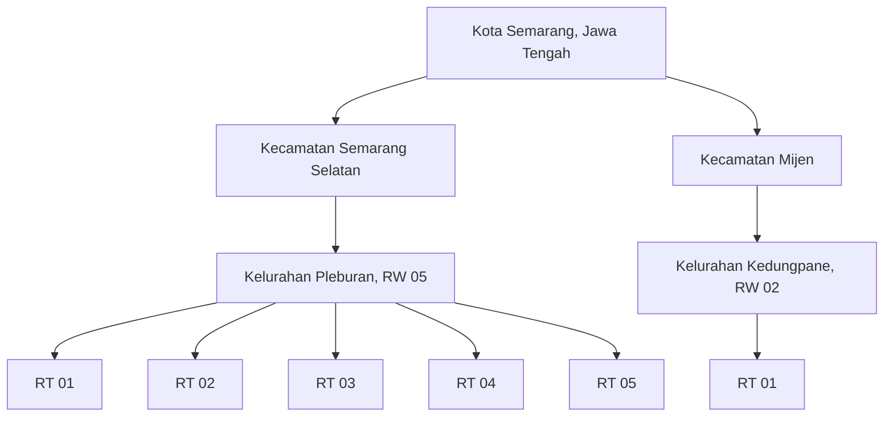

# Panduan Demo Rangkul

Dokumen ini memetakan persona, wilayah, profil lansia, status khusus, dan skenario yang dibentuk oleh `supabase/seed.sql`. Semua data di bawah fiktif dan hanya untuk pengujian.

## Ringkasan

| Jenis data | Jumlah fixture utama |
| --- | ---: |
| Akun Keluarga | 5 |
| Akun Helper | 10 |
| Akun Koordinator | 6 |
| Akun Admin | 1 |
| Profil lansia | 5 |
| Area demo | 2 kelurahan |

Password seluruh akun:

```text
Rangkul2026*
```

Login menerima username atau email. Jangan memakai password ini pada akun produksi.

## Peta area demo



Titik Helper, Koordinator, dan lansia dapat dibuka melalui [locations.geojson](locations.geojson). Unggah file tersebut ke geojson.io, QGIS, atau aplikasi GIS lain untuk melihat sebaran marker.

Koordinat seed berfungsi sebagai titik demo pencocokan jarak. Koordinat tersebut bukan sumber batas administratif resmi.

## Akun utama untuk presentasi

| Urutan | Peran | Username | Kegunaan |
| ---: | --- | --- | --- |
| 1 | Keluarga | `ratnakeluarga` | Memperlihatkan lansia Giorno, booking, status kunjungan, dan Riwayat Rangkul |
| 2 | Helper | `andihelper` | Memperlihatkan profil verified, radius 5 km, tugas, dan penghasilan |
| 3 | Koordinator | `wagimankoordinator` | Memperlihatkan cakupan RT 03 dan proses keputusan wilayah |
| 4 | Admin | `demoadmin` | Memperlihatkan pengelolaan platform, laporan, banding, wallet, dan audit |

Keempat akun berada dalam satu skenario Pleburan agar perpindahan role saat demo mudah diikuti.

## Akun Keluarga

| Username | Nama | Email | Domisili akun | Status atau skenario khusus |
| --- | --- | --- | --- | --- |
| `ratnakeluarga` | Ratna Wulandari | `ratnakeluarga@rangkul.id` | Pleburan RT 02/RW 05, Jl. Pleburan Barat No. 10 | Persona utama, pemilik Giorno dan fixture Riwayat Rangkul |
| `mayakeluarga` | Maya Lestari | `mayakeluarga@rangkul.id` | Pleburan RT 03/RW 05, Jl. Pleburan Barat No. 11 | Akun restricted dengan banding yang sudah ditolak |
| `rintokeluarga` | Rinto Prabowo | `rintokeluarga@rangkul.id` | Pleburan RT 04/RW 05, Jl. Pleburan Timur No. 12 | Demo Wallet Rp1.000 untuk skenario saldo tidak cukup |
| `dewikeluarga` | Dewi Kartika | `dewikeluarga@rangkul.id` | Pleburan RT 05/RW 05, Jl. Pleburan Timur No. 13 | Demo Wallet Rp200.000, akun restricted, banding menunggu |
| `suryakeluarga` | Surya Wijaya | `suryakeluarga@rangkul.id` | Kedungpane RT 01/RW 02, Jl. Kedungpane Raya No. 8 | Persona pembanding area Mijen |

Alamat akun Keluarga dan alamat lansia tidak selalu sama. Pencocokan tugas memakai lokasi lansia pada booking, bukan sekadar alamat akun Keluarga.

## Profil lansia

| Keluarga | Lansia | Usia | Mobilitas | Kebutuhan yang disampaikan keluarga | Lokasi |
| --- | --- | ---: | --- | --- | --- |
| Ratna Wulandari | Giorno | 77 | Mandiri dengan pengawasan | Pengingat rutinitas keluarga dan teman berbicara | Pleburan RT 03/RW 05 |
| Maya Lestari | Mbah Demo Dua | 72 | Perlu pendampingan ringan | Pengingat jadwal makan dan minum, pegangan saat berpindah | Pleburan RT 02/RW 05 |
| Rinto Prabowo | Mbah Demo Tiga | 81 | Mandiri dengan pengawasan | Pengingat jadwal makan dan bantuan membuka panggilan video | Pleburan RT 03/RW 05 |
| Dewi Kartika | Mbah Demo Empat | 68 | Mandiri | Teman membaca dan pengingat membawa kacamata | Pleburan RT 04/RW 05 |
| Surya Wijaya | Bu Sulastri | 76 | Perlu pendampingan ringan | Waktu istirahat dan air minum saat berkebun | Kedungpane RT 01/RW 02 |

Catatan kondisi pada fixture adalah konteks yang disampaikan keluarga dan pengamatan pendamping, bukan diagnosis. Pendamping tidak mengubah rutinitas keluarga, tidak menafsirkan keluhan, dan hanya melaporkan perubahan yang terlihat.

### Narasi profil yang dapat dipresentasikan

- **Giorno:** masih mandiri untuk aktivitas dasar, tetapi lebih tenang jika ada teman berbicara. Helper dapat menemani percakapan atau mengambil barang ringan, lalu menyampaikan perubahan suasana kepada Ratna.
- **Mbah Demo Dua:** lebih nyaman berjalan pelan di halaman dan membutuhkan pegangan saat berpindah dari kursi ke teras. Helper cukup menemani aktivitas ringan dan mengabari Maya bila rutinitas berubah.
- **Mbah Demo Tiga:** dapat beraktivitas sendiri, tetapi keluarga ingin ada teman berbicara pada siang hari. Helper mengikuti catatan keluarga, membantu membuka panggilan video, dan tidak mengubah rutinitas tanpa persetujuan.
- **Mbah Demo Empat:** menikmati koran pagi dan cerita tentang kebun. Helper membantu mengambil bacaan dari rak rendah dan menulis ringkasan singkat kegiatan hari itu.
- **Bu Sulastri:** masih senang menyiram tanaman, tetapi lebih cepat lelah setelah berdiri lama. Helper menjaga jalur tetap aman, menyiapkan kursi dan air yang sudah disediakan keluarga, lalu mencatat apakah kegiatan berlangsung nyaman.

## Akun Koordinator

| Username | Nama | Email | Tingkat | Cakupan | Koordinat demo | Status |
| --- | --- | --- | --- | --- | --- | --- |
| `budikoordinator` | Budi Santoso | `budikoordinator@rangkul.id` | RT | Pleburan RT 01/RW 05 | `-7.0045, 110.4375` | verified |
| `sulikoordinator` | Suli Hartini | `sulikoordinator@rangkul.id` | RT | Pleburan RT 02/RW 05 | `-7.0048, 110.4378` | verified |
| `wagimankoordinator` | Wagiman Popo | `wagimankoordinator@rangkul.id` | RT | Pleburan RT 03/RW 05 | `-7.0051, 110.4381` | verified |
| `aguskoordinator` | Agus Salim | `aguskoordinator@rangkul.id` | RT | Pleburan RT 04/RW 05 | `-7.0061, 110.4391` | verified |
| `rahmatkoordinator` | Rahmat Hidayat | `rahmatkoordinator@rangkul.id` | RW | Seluruh Pleburan RW 05 | `-7.0050, 110.4380` | verified |
| `darmokoordinator` | Darmo Prasetyo | `darmokoordinator@rangkul.id` | RT | Kedungpane RT 01/RW 02 | `-7.0762, 110.3273` | verified |

Koordinator tingkat RT diprioritaskan untuk RT yang sama. Koordinator tingkat RW menjadi fallback ketika Koordinator RT yang tepat tidak tersedia sesuai aturan approval.

## Akun Helper

| Username | Nama | Email | Wilayah | Radius | Koordinator fixture | Status | Tier |
| --- | --- | --- | --- | ---: | --- | --- | --- |
| `fajarhelper` | Fajar Nugroho | `fajarhelper@rangkul.id` | Pleburan RT 01/RW 05 | 2 km | Budi Santoso | verified, tersedia | terpercaya |
| `rinihelper` | Rini Kurniasih | `rinihelper@rangkul.id` | Pleburan RT 02/RW 05 | 2 km | Suli Hartini | verified, tersedia | terpercaya |
| `dewihelper` | Dewi Anggraini | `dewihelper@rangkul.id` | Pleburan RT 02/RW 05 | 2 km | Suli Hartini | verified, tersedia | probation |
| `andihelper` | Andi Sudarto | `andihelper@rangkul.id` | Pleburan RT 03/RW 05 | 5 km | Wagiman Popo | verified, tersedia | probation |
| `dedihelper` | Dedi Setiawan | `dedihelper@rangkul.id` | Pleburan RT 03/RW 05 | 3 km | Wagiman Popo | verified, tersedia | terpercaya |
| `arifhelper` | Arif Pratama | `arifhelper@rangkul.id` | Pleburan RT 03/RW 05 | 3 km | Wagiman Popo | verified, tersedia | probation, 4 tugas bersih |
| `sarihelper` | Sari Wulandari | `sarihelper@rangkul.id` | Pleburan RT 04/RW 05 | 4 km | Agus Salim | verified, tersedia | terpercaya |
| `linahelper` | Lina Kurniawan | `linahelper@rangkul.id` | Pleburan RT 04/RW 05 | 4 km | Agus Salim | under review, tidak tersedia | probation |
| `yusufhelper` | Yusuf Maulana | `yusufhelper@rangkul.id` | Pleburan RT 05/RW 05 | 5 km | Admin fallback pada fixture | verified, tersedia | terpercaya |
| `bagushelper` | Bagus Santoso | `bagushelper@rangkul.id` | Kedungpane RT 01/RW 02 | 5 km | Darmo Prasetyo | verified, tersedia | terpercaya |

Catatan tentang Yusuf: fixture mempertahankan contoh `verified_by_admin_fallback`. Keberadaan Koordinator RW aktif setelah fixture dibuat berarti kondisi tersebut bukan contoh fresh approval yang seharusnya dipakai untuk menguji eligibility baru.

### Pengalaman Helper

Narasi ini sengaja menjelaskan pengalaman pendampingan yang bisa dibuktikan lewat perilaku sehari-hari, bukan kredensial klinis fiktif.

- **Rini:** tiga tahun mendampingi tetangga lanjut usia, menjemput kebutuhan yang sudah disiapkan keluarga, menemani percakapan sore, dan menulis kabar kunjungan.
- **Dedi:** pernah menjadi relawan karang taruna dan mendampingi orang tuanya saat pemulihan aktivitas harian. Ia terbiasa membantu belanja ringan dan menghubungi keluarga bila catatan kunjungan berubah.
- **Sari:** mendampingi neneknya dan warga RT 04, menemani membaca, merapikan ruang ringan, dan membantu video call. Catatannya memisahkan apa yang dilihat dari pesan keluarga.
- **Yusuf:** berpengalaman di layanan pelanggan dan kegiatan relawan komunitas. Ia berkomunikasi tenang, mengulang penjelasan, dan meminta persetujuan keluarga sebelum bantuan di luar layanan.
- **Dewi:** baru beberapa bulan membantu bibinya mengatur belanja dan rutinitas rumah. Status probation memperlihatkan proses belajar mencatat waktu dan menutup kunjungan dengan rapi.
- **Arif:** pernah menjadi pengurus kegiatan warga dan menyelesaikan empat kunjungan tanpa laporan terlewat. Ia mengabari Koordinator ketika jadwal berubah.
- **Lina:** berpengalaman mendampingi percakapan singkat di rumah lansia. Dua laporan komunitas membuat statusnya under review, sehingga ketersediaan dimatikan sampai klarifikasi selesai.
- **Fajar:** lima kali mendampingi tetangga RT 01, membantu belanja harian atau jalan di halaman, mengulang detail permintaan keluarga, dan menulis ringkasan setelah kunjungan.
- **Bagus:** tinggal dekat Kedungpane dan membantu orang tuanya mengatur belanja, percakapan, serta penggunaan ponsel sederhana. Ia menjaga radius agar dapat datang tepat waktu.
- **Andi:** beberapa tahun membantu keluarga di sekitar Pleburan mengantar kebutuhan harian dan menemani penggunaan ponsel. Ia selalu mengonfirmasi permintaan dan mengirim kabar singkat setelah kunjungan.

## Akun Admin

| Username | Nama | Email | Scope |
| --- | --- | --- | --- |
| `demoadmin` | Admin Demo Rangkul | `demoadmin@rangkul.id` | Operasional global |

Admin bukan Koordinator super dan tidak boleh masuk workspace Keluarga, Helper, atau Koordinator. Gunakan panel `/admin/*` untuk pengujian Admin.

## Skenario tugas canonical

Seeder memakai marker pada `tasks.catatan` agar fixture dapat dipulihkan tanpa bergantung pada UUID tetap.

| Marker | Keluarga atau lansia | Helper | State yang dituju | Tujuan demo |
| --- | --- | --- | --- | --- |
| `[DEMO_MATRIX] Task diajukan marketplace` | Ratna atau Giorno | Belum ditugaskan | `diajukan` | Peluang tugas terbuka |
| `[DEMO_MATRIX] Task dikonfirmasi` | Maya atau Mbah Demo Dua | Rini | `dikonfirmasi` | Kunjungan dikonfirmasi sebelum mulai |
| `[DEMO_MATRIX] Task dikerjakan` | Rinto atau Mbah Demo Tiga | Dedi | `dikerjakan` | Chat aktif, escrow held, dan SOS aktif |
| `[DEMO_MATRIX] Task menunggu Koordinator` | Ratna atau Giorno | Andi | menunggu keputusan Koordinator | Approval berbasis layanan |
| `[DEMO_MATRIX] Task menunggu Keluarga` | Maya atau Mbah Demo Dua | Rini | menunggu keputusan Keluarga | Layanan tambahan 30 menit senilai Rp10.000 |
| `[DEMO_MATRIX] Task selesai` | Dewi atau Mbah Demo Empat | Sari | `selesai` | Laporan dan payment released |
| `[DEMO_MATRIX] Task dibatalkan` | Ratna atau Giorno | Lina | `dibatalkan` | Riwayat pembatalan |

Empat fixture Riwayat Rangkul untuk Giorno memakai skor 5, 4, 3, dan 2 agar ringkasan tren dapat diuji secara deterministik.

## Skenario Sprint 6

Skenario berikut hanya relevan ketika `FLEXIBLE_ASSIGNMENT_ENABLED=true` dan database telah diseed dengan benar:

| Marker | Mode | Isi fixture |
| --- | --- | --- |
| `[DEMO_SPRINT6] Task pelamar terbuka` | Pelamar | Task Giorno dengan Rini, Dedi, dan Sari sebagai pelamar pending |
| `[DEMO_SPRINT6] Task pelamar terpilih` | Pelamar | Rini dipilih dan Dedi ditolak |
| `[DEMO_SPRINT6] Task cepat aktif` | Cari Cepat | Task terbuka pada hari server yang sama dengan expiry singkat |
| `[DEMO_SPRINT6] Task cepat kedaluwarsa` | Cari Cepat | Contoh task yang telah kedaluwarsa dan dibatalkan |

Waktu fixture dihitung relatif terhadap `NOW()` database saat seed dijalankan. Jangan menulis tanggal statis pada materi demo.

## Walkthrough presentasi

### Cerita 1: keluarga tetap dekat dari jauh

1. Login sebagai `ratnakeluarga`.
2. Tunjukkan profil Giorno dan perbedaan alamat Keluarga dengan lokasi lansia.
3. Buka katalog layanan dan Helper yang lolos radius.
4. Tunjukkan detail kunjungan serta pemisahan status kunjungan dan status pembayaran.
5. Buka Riwayat Rangkul untuk memperlihatkan Health Snapshot dan Memory Capsule.

### Cerita 2: Helper bekerja dalam jangkauan yang jelas

1. Login sebagai `andihelper`.
2. Tunjukkan radius 5 km, kategori layanan, dan availability.
3. Buka Cari Tugas dan jelaskan bahwa peluang disaring oleh status, kategori, radius, dan jadwal.
4. Tunjukkan tugas aktif dan halaman penghasilan.

### Cerita 3: Koordinator menjaga kepercayaan wilayah

1. Login sebagai `wagimankoordinator`.
2. Tunjukkan bahwa scope utamanya RT 03/RW 05.
3. Buka antrean verifikasi atau persetujuan.
4. Jelaskan fallback RW melalui `rahmatkoordinator` ketika Koordinator RT yang sesuai tidak tersedia.

### Cerita 4: tata kelola Admin

1. Login sebagai `demoadmin`.
2. Tunjukkan akun `linahelper` yang under review karena dua laporan aktif.
3. Tunjukkan akun `dewikeluarga` dengan banding menunggu dan `mayakeluarga` dengan banding ditolak.
4. Tunjukkan Demo Wallet, kategori, dan audit log.

## Dokumen dan foto demo

Seeder asset mengunggah empat file ke bucket privat `dokumen`:

| Jenis | Object path |
| --- | --- |
| Gambar identitas lansia | `demo/identitas_lansia/identitas-lansia-demo.png` |
| PDF hubungan keluarga | `demo/hubungan_keluarga/hubungan-keluarga-demo.pdf` |
| PDF dokumen Koordinator | `demo/dokumen_koordinator/dokumen-koordinator-demo.pdf` |
| Foto bukti kunjungan | `demo/foto_bukti/bukti-kunjungan-demo.jpg` |

Bucket harus privat. Preview diperoleh melalui signed URL yang dibuat server. Jangan mengubah object tersebut menjadi public hanya untuk mempermudah demo.

## Catatan validasi seed

Audit source tanggal 6 September 2026 menemukan dan menutup dua regresi:

1. assignment `expires_at` ganda pada pemulihan marker `[DEMO_MATRIX] Task diajukan marketplace` telah dihapus;
2. fixture payment telah dikoreksi menjadi Helper 90%, Platform 7%, dan Koordinator 3%.

Test regresi pada `tests/demo-seed-matrix.test.mjs` memeriksa keunikan kolom dalam statement pemulihan dan nominal split kedua fixture payment. Test source tidak menggantikan uji database bersih.

Verifikasi minimum pada environment lokal:

```bash
npx supabase start
npx supabase db reset
npm run seed
npm run test
```

Setelah itu, login minimal dengan satu akun dari setiap role dan pastikan task marker, laporan, wallet, serta asset privat tersedia.

Untuk Supabase cloud tanpa Docker, set `SUPABASE_DEMO_PROJECT_REF` sama dengan `supabase/.temp/project-ref` dan hostname `NEXT_PUBLIC_SUPABASE_URL`, lalu jalankan `npm run seed:cloud` dua kali. Migration cloud diperiksa dengan `npx supabase migration list --linked`; jangan memakai `db reset` pada project cloud.

## Aturan penggunaan data demo

- Jangan mencampur data demo dengan data pengguna nyata.
- Jangan mengirim dokumen demo sebagai bukti identitas sungguhan.
- Jangan memakai koordinat demo untuk keputusan lapangan.
- Jangan membagikan service role key, token, cookie, atau signed URL dalam screenshot.
- Reseed hanya pada environment yang sudah dipastikan sebagai environment demo.
- Angka saldo dan penghasilan adalah simulasi, bukan janji pendapatan.
